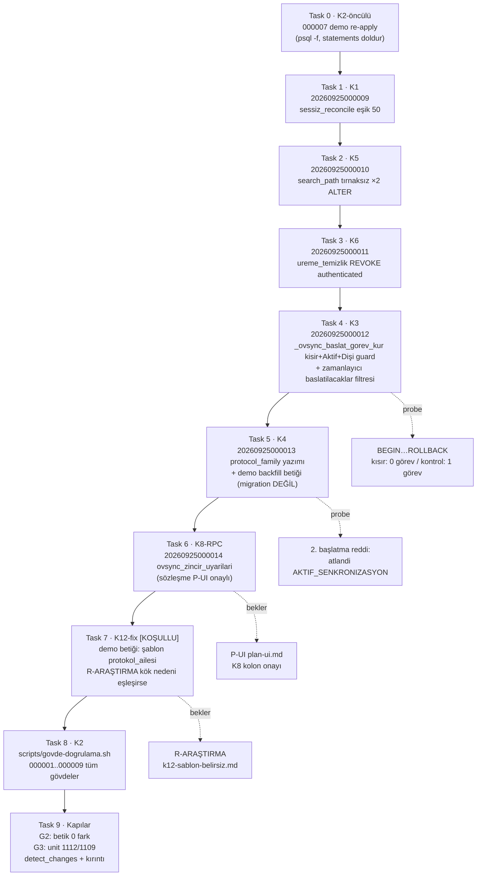

# Cila-Onarım DB Kulvarı (P-DB) — Implementation Plan

> **REQUIRED SUB-SKILL:** Use the executing-plans skill to implement this plan task-by-task.
> **Skill'ler:** db-validation (her taslak+final migration'da), code-change-precheck (gövde değişen fonksiyonlarda — SQL semboller gitnexus indeksinde YOK, JS etki yarıçapı bu planda ölçüldü), test-driven-development (probe önce: her davranış değişikliğinde BEGIN…ROLLBACK probe).

**Goal:** `ovysch-feature-cila-turu` dalındaki 6 DB kusurunu (K1 eşik regresyonu, K2 demo drift, K3 kısır zincir açığı, K4 protocol_family ölü guard'ları, K5 search_path, K6 açık GRANT) yeni migration'larla onarmak, K8 için RPC sözleşmesini kurmak, K12 dar fix'ini koşullu uygulamak ve K2 gövde-doğrulama betiğini teslim etmek.

**Architecture:** Her onarım ayrı bir `20260925000009+` migration'ıdır; hiçbir `000001..000008` dosyası düzenlenmez. Gövde değiştiren her migration **canlı demo gövdesinden** başlar (pg_get_functiondef) ve önceki TÜM migration değişikliklerini korur (000008 tuzağı). Demo'ya özel veri düzeltmeleri (K4 backfill, K12) migration DEĞİL, `scripts/cila-onarim/` altında tek-seferlik betiktir. K2 betiği dosya↔canlı gövde eşitliğini sürdürülebilir kılar.

**Tech Stack:** PostgreSQL 15 (Supabase demo), psql (pooler 6543), bash + python3 (repo'da `scripts/veri-eslesme-kontrol.py` örneği var), `scripts/db-validate.sh` doğrulama kapısı.

---

## 0. BAĞLAMA — ÖLÇÜLMÜŞ GERÇEKLER (kanıt etiketli, 2026-09-25, P-DB)

Tüm ölçümler demo psql ile alındı (ref `vtzqjmazsvurxdeondmi` doğrulandı; bağlantı deseni §1'de). Bunlar planın KABUL ölçütlerinin "önce" değerleridir.

| # | Kalem | Ölçüm (kanıt) |
|---|---|---|
| M1 | K1 | Canlı `sessiz_hayvanlar_reconcile`: `>= 55` **×2** (satç 34=ÜRET, 73=KAPAT karşılığı), `>= 50` ×0, `protocol_family` guard'ı **VAR**. Canlı gövde = `20260925000008` dosya gövdesi birebir. `v_eligible` canlı görünüm `- 50` eşiğinde. [OBSERVED psql] |
| M2 | K2 | `_acik_disi_hedef_ic(text)` canlı gövdesinde `senkron` **YOK** (000007 kayıtlı ama canlı değil; canlı = 000001 gövdesi). `supabase_migrations.schema_migrations`'da 20260925 serisinin 8 kaydının **hepsinde** `statements` ve `created_by` NULL; 20260923/24 ovsync-pg serisinin hiç kaydı yok (2026092% toplam = 8). [OBSERVED psql] |
| M3 | K5 | `protokol_ayar_guncelle(text,numeric)` proconfig = `search_path="public, pg_temp"` (tırnaklu TEK değer → C1). `gorev_tamamla(text,text,boolean)` proconfig = **NULL** (C3). Karşılaştırma: `sessiz_hayvanlar_reconcile` ve `ureme_temizlik_reconcile` canlıda doğru biçimde `search_path=public, pg_temp` (tırnaksız CREATE kaynaklı). [OBSERVED psql] |
| M4 | K6 | `has_function_privilege('authenticated','public.ureme_temizlik_reconcile(boolean,text[])','EXECUTE')` = **t**; `service_role` = t. [OBSERVED psql] |
| M5 | K3 | Zincir halkalarında `kisir` geçmiyor: `_ovsync_baslat_gorev_kur` **f**, `_ilk_tohumlama_rota_kur` **f**, `dogum_kaydet` **f**, `tohumlama_abort` **f** (`ilk_tohumlama_zamanlayici` gövdesi kisir içeriyor ama yalnız tarama bacağında; `baslatilacaklar` SELECT'i filtresiz — B2 dosyada CONFIRMED `20260925000001:350-361`). Probe adayları: kisir+Aktif+Dişi+açık OVSYNC_BASLAT'sız **4 hayvan**; kontrol (kisir-değil+Aktif+Dişi+kural tarihi VAR+açık BASLAT'sız) **63 hayvan**. [OBSERVED psql] |
| M6 | K4 | Aktif Ovsync vakası **12**, `protocol_family` NULL **12/12**. `start_first_service_protocol` canlı gövdesi: KISIR muafiyeti VAR, `UPDATE public.cases` YOK (yani yazmıyor), `protocol_family` yalnız guard'larda okunuyor. Aktif vakaların `source_template_id`'si de NULL (K4 kapsamı yalnız protocol_family). [OBSERVED psql] |
| M7 | K8 | Aktif Üreme-kategorili vakalı hayvanlarda açık görevler: gecikmiş (`hedef_tarih < bugün`) TEDAVI_SEANS **10**, TEDAVI_GUN **10**; yaklaşan (≤2g) 4+4. **Mimar raporundaki "8" bayat** — kabul ölçütü sabit sayı DEĞİL, RPC↔SQL probe eşitliği olur. [OBSERVED psql] |
| M8 | K12 | `tedavi_sablonu`'nda `protokol_ailesi='OVSYNC'` **0 satır** → guard `v_n=0 ≠ 1` → `OVSYNC_SABLON_BELIRSIZ`. Kök: tek aktif şablon `a152f7fe-e1d5-4de4-8157-344f1bffbaf7` ('Sağmal inek: Ovsynch-56 + çift PGs', aktif=t) **protokol_ailesi NULL** (tüm 11 şablonda NULL). Şablon→hastalık eşlemesi **tam 1**: 'Ovsync Protokol' → aile fix'i HER İKİ guard'ı da geçirir (OVSYNC_SABLON_BELIRSIZ + OVSYNC_HASTALIK_BELIRSIZ). [OBSERVED psql] |
| M9 | JS etki yarıçapı | `gorev_tamamla` çağrıları: `js/forms.js:3076`, `js/ui.js:610`, `js/ui.js:926` (ALTER-only, imza değişmez → JS etkisi 0). `start_first_service_protocol`: `js/ui.js:1218` (imza değişmez). `ovsync_baslat_uyarilari`: `js/ui.js:431,1263` (K8 RPC bu deseni izler). `ureme_temizlik_reconcile`, `sessiz_hayvanlar_reconcile`, `_acik_disi_hedef_ic` JS çağrıcısı YOK (cron/iç). `protokol_ayar_guncelle`: `js/forms.js:2870` (ALTER-only). [CONFIRMED grep] |

### 0.1 KRİTİK — K1 canlı gövde ↔ hedef diff (000008 tuzağı kapanı)

Canlı gövde = `20260925000008` dosyası **birebir** (M1). Geçmiş zincir: `20260625000020` (55, guardsız) → `20260925000002` (50, guardsız) → `20260925000008` (55'e GERİ DÖNDÜ + protocol_family guard EKLEDİ). 000009 = canlı 000008 gövdesi üzerinde **yalnızca** şu değişiklikler:

```diff
--- CANLI (pg_get_functiondef, demo 2026-09-25) ---  20260925000009 HEDEF ---
     WHERE e.sessiz_gun >= 55              →          WHERE e.sessiz_gun >= 50          -- ÜRET bacağı
       WHERE e.id = g.hayvan_id AND e.sessiz_gun >= 55 →  ... AND e.sessiz_gun >= 50      -- KAPAT bacağı
-- Başlık: "önceki gövde 20260625000020'den" yanlış iddiası → düzeltilir (önceki = 000002 ve 000008;
-- 000008, 000002'nin 50 eşiğini kaybetmiştir; 000009 guard'ı KORUR)
```
Başka HİÇBİR satır değişmez: protocol_family NOT EXISTS bloğu (000008'in katkısı) aynen kalır; ACL'e dokunulmaz (CREATE OR REPLACE ACL korur; 000002'nin `GRANT authenticated, service_role`'ü yaşamaya devam eder).

### 0.2 KRİTİK — K2 taban doğrulaması (000007 re-apply öncülü)

`_acik_disi_hedef_ic` canlı gövdesi 000001 gövdesidir (senkron yok, M2). Seride onu tanımlayan son dosya 000007'dir (sonra gelen hiçbir migration dokunmaz). Yani 000007 dosya içeriği **olduğu gibi** yeniden uygulanabilir — yeni bir migration GEREKMEZ; uygulanacak olan yine `20260925000007` dosyasının kendisidir (CREATE OR REPLACE + COMMENT + REVOKE + NOTIFY; idempotent).

### 0.5 Gramer notu (K5, varsayım + kapı)

`ALTER FUNCTION ... SET search_path = public, pg_temp` (tırnaksız liste) CREATE FUNCTION ile aynı `func_set` gramer üretimini paylaşır (PostgreSQL gram.y; repo'daki tüm cila CREATE'leri bu biçimde canlıda `search_path=public, pg_temp` üretir — M3 karşılaştırması). Yerel Postgres'te yazma izni olmadığından **canlı doğrulama kabul ölçütüne bağlandı**: apply sonrası `array_to_string(proconfig,'|') = 'search_path=public, pg_temp'` değilse migration başarısız sayılır ve `SET search_path TO 'public','pg_temp'` (iki ayrı tırnaklı değer) alternatifi denenir [kırıntı: assumption].

---

## 0.9 Süreç diyagramı



---

## 1. ZORUNLU KURALLAR (her task'ta geçerli; ihlal = reddi)

1. **PROD YASAK.** tools-bank `supabase_*` / `supabase_migrate` araçları PROD'dur — ASLA kullanma. Tüm DB erişimi:
   ```bash
   bash -c 'set -a; source /home/melik/egesut-erp1/.env; set +a; \
     PGPASSWORD="$SUPABASE_DEMO_DB_PASSWORD" psql \
     "postgresql://postgres.${SUPABASE_DEMO_REF}:${SUPABASE_DEMO_DB_PASSWORD}@${SUPABASE_DEMO_POOLER}:6543/postgres" -X ...'
   ```
   **Yazmadan önce ref doğrula:** `echo $SUPABASE_DEMO_REF` → `vtzqjmazsvurxdeondmi` olmalı (prod `zqnexqbdfvbhlxzelzju` YASAK).
2. Her yeni migration: **taslakta VE final dosyada** `bash scripts/db-validate.sh <dosya>` PASS; kendi `BEGIN;…COMMIT;` bloğu; SECURITY DEFINER'da tırnaksız `SET search_path = public, pg_temp`; `TO anon`/`TO PUBLIC` GRANT YOK.
3. Demo'ya uygulanan her migration → `supabase_migrations.schema_migrations` kaydı **statements dolu** (dosya içeriği) + apply sonrası canlı gövde dosyayla karşılaştırılır.
4. Gövde yeniden tanımında önce `pg_get_functiondef` ile canlıyı ÇEK, dosya diff'ini kırıntıya `measurement` olarak yaz.
5. `git add` yalnız açık dosya yoluyla; commit mesajı sonu `Co-Authored-By: Claude Code <noreply@anthropic.com>`; push YOK, merge YOK.
6. Her anlamlı adım → `/home/melik/egesut-erp1/.crumbs/cila-onarim.jsonl` tek satır JSON (`"role":"P-DB"` → uygulama aşamasında uygulayıcının rol etiketi).
7. Unit kapısı: `cd /home/melik/.herdr/worktrees/egesut-erp1/ovysch-feature-cila-turu && NODE_PATH=/home/melik/egesut-erp1/node_modules npm run test:unit` — baz 1112/1109, yeni fail 0.
8. Playwright KOŞMA; demo sahip şifresine dokunma.

---

## Task 0 — K2 öncülü: 000007'yi demo'ya yeniden uygula

**K-ref:** K2 (öncül) · **TDD:** probe önce (uygulama öncesi/sornası gövde kanıtı).

**Files:**
- Değiştirme YOK; `supabase/migrations/20260925000007_cila_t1_acik_disi_senkron_muafiyet.sql` olduğu gibi demo'ya koşulur.

**Step 0.1:** Öncül doğrulama (canlı = 000001 gövdesi):
```sql
SELECT (pg_get_functiondef(p.oid) LIKE '%senkron%') AS has_senkron,      -- beklenen: f
       (pg_get_functiondef(p.oid) ILIKE '%kisir%') AS has_kisir          -- beklenen: t (000001 katkısı)
FROM pg_proc p JOIN pg_namespace n ON n.oid=p.pronamespace
WHERE n.nspname='public' AND p.proname='_acik_disi_hedef_ic';
```
`has_senkron=f` değilse DUR — canlı durum bu planın varsayımından sapmış; kırıntıya `type:"open_item"` yaz, Task'ı atla.

**Step 0.2:** Uygula (dosyanın yürütülebilir ifadeleri: CREATE OR REPLACE + COMMENT + REVOKE + NOTIFY):
```bash
bash -c 'set -a; source /home/melik/egesut-erp1/.env; set +a; \
  PGPASSWORD="$SUPABASE_DEMO_DB_PASSWORD" psql \
  "postgresql://postgres.${SUPABASE_DEMO_REF}:${SUPABASE_DEMO_DB_PASSWORD}@${SUPABASE_DEMO_POOLER}:6543/postgres" \
  -X -v ON_ERROR_STOP=1 -f supabase/migrations/20260925000007_cila_t1_acik_disi_senkron_muafiyet.sql'
```

**Step 0.3:** `schema_migrations` kaydını statements ile güncelle (mevcut kayıt statements NULL, M2):
```sql
UPDATE supabase_migrations.schema_migrations sm
   SET statements = pg_read_file_abs_placeholder  -- UYGULAMA: dosya içeriği psql değişkeniyle taşınır (aşağıda pratik yöntem)
 WHERE version='20260925000007';
```
Pratik yöntem (pg_read_file izinli değilse): dosyayı `psql -v mig="$(cat <dosya>)"` ile geçip `SET statements=:'mig'` kullan; ya da python betiğiyle INSERT/UPDATE et. Kayıt sonrası `statements IS NOT NULL` doğrulanır.

**KABUL ÖLÇÜTÜ (Task 0):**
```sql
SELECT (pg_get_functiondef(p.oid) LIKE '%senkron%') AS t1_canli,        -- = t
       (pg_get_functiondef(p.oid) ILIKE '%kisir%') AS kisir_korunur,    -- = t
       (SELECT statements IS NOT NULL FROM supabase_migrations.schema_migrations WHERE version='20260925000007') AS stmt_dolu  -- = t
FROM pg_proc p JOIN pg_namespace n ON n.oid=p.pronamespace
WHERE n.nspname='public' AND p.proname='_acik_disi_hedef_ic';
-- beklenen satır: t | t | t
```

**Step 0.4:** Kırıntı (`measurement`) + commit (dosya değişmediği için yalnız kırıntı; yeni dosya yoksa commit atlanır, adım kırıntıyla kapanır).

---

## Task 1 — K1: 000009 sessiz reconcile eşiği 50 (guard korunarak)

**K-ref:** K1 · **TDD:** probe önce — uygulanmadan önce M1 ölçümünü tekrar al (canlı yine 55×2 + guard olmalı).

**Files:**
- Create: `supabase/migrations/20260925000009_sessiz_reconcile_esik50.sql`

**Step 1.1:** Canlı gövdeyi çek ve §0.1 diff'ini doğrula:
```sql
SELECT pg_get_functiondef(p.oid) FROM pg_proc p JOIN pg_namespace n ON n.oid=p.pronamespace
WHERE n.nspname='public' AND p.proname='sessiz_hayvanlar_reconcile';
```
Beklenen: `>= 55` ×2, `>= 50` ×0, `protocol_family` VAR. Farklıysa gövdeyi bu çekime göre yeniden türet (000008 tuzağı).

**Step 1.2:** Migration taslağını yaz (tam içerik):

```sql
-- ============================================================================
-- Migration: 20260925000009_sessiz_reconcile_esik50
-- Tarih: 2026-09-25 · Cila-onarım K1 (mimar incelemesi A1: eşik 55'e geri dönme)
-- Etkiler: public.sessiz_hayvanlar_reconcile() gövdesi (CREATE OR REPLACE, imza değişmez)
--
-- HATA: 20260925000008, sessiz_hayvanlar_reconcile'ı BAYAT 20260625000020
--   gövdesinden yeniden yazdı; 20260925000002'nin sahibin onaylı 50 günlük
--   eşiğini (spec-s2 §5A) üret ve kapat bacaklarında 55'e GERİ DÖNDÜRDÜ
--   (listele/stat/v_eligible 50'de kalınca tutarsızlık; KAPAT bacağı 50–54 gün
--   sessiz hayvanın meşru görevini 'sessiz-noteligible' diye iptal etti).
--   000008 başlığındaki "önceki gövde 20260625000020" iddiası da yanlıştı
--   (önceki gövde = 20260925000002; 000008 onun üzerine değil bayat gövde
--   üzerine yazmıştı).
-- ONARIM: 000008'İN protocol_family guard'ı (R1 sonsuz döngü kesintisi)
--   KORUNARAK yalnızca üret+kapat eşikleri 50'ye çekilir. Gövde zinciri:
--   20260625000020 (55) → 20260925000002 (50) → 20260925000008 (55 + guard)
--   → 20260925000009 (50 + guard). ACL dokunulmaz; anon GRANT yazılmaz.
-- Geri alınabilir: evet — önceki canlı gövde (000008) CREATE OR REPLACE ile
--   geri yazılır.
-- ============================================================================

BEGIN;

SET LOCAL lock_timeout = '5s';
SET LOCAL statement_timeout = '30s';

CREATE OR REPLACE FUNCTION public.sessiz_hayvanlar_reconcile()
RETURNS jsonb
LANGUAGE plpgsql
SECURITY DEFINER
SET search_path = public, pg_temp
AS $function$
DECLARE
  v_uretilen  integer := 0;
  v_kapatilan integer := 0;
  v_rec       record;
BEGIN
  -- 1) ÜRET: eligible + açık SESSIZ görevi yok + son 30 günde kullanıcı-tamamlaması yok
  --    + aktif protocol_family vakası YOK (20260925000008: vakalı hayvana SESSIZ
  --    görev üretilmez — aksi halde R1 temizliği cron ile dirilip sonsuz döngü kurar)
  FOR v_rec IN
    SELECT e.id, e.kupe_no, e.sessiz_gun
    FROM public.v_eligible e
    WHERE e.sessiz_gun >= 50
      AND NOT EXISTS (
        SELECT 1 FROM public.gorev_log g
        WHERE g.hayvan_id = e.id
          AND g.kaynak = 'SESSIZ-' || e.id
          AND g.tamamlandi = false AND g.iptal = false
      )
      AND NOT EXISTS (
        SELECT 1 FROM public.gorev_log g
        WHERE g.hayvan_id = e.id
          AND g.kaynak = 'SESSIZ-' || e.id
          AND g.tamamlandi = true
          AND g.tamamlanma_tarihi >= (CURRENT_DATE - 30)
      )
      AND NOT EXISTS (
        SELECT 1 FROM public.cases c
        WHERE c.animal_id = e.id
          AND c.status = 'active'
          AND c.protocol_family IS NOT NULL
      )
  LOOP
    INSERT INTO public.gorev_log
      (id, hayvan_id, gorev_tipi, aciklama, hedef_tarih, tamamlandi, iptal, kaynak)
    VALUES (
      gen_random_uuid(), v_rec.id, 'VETERINER_KONTROL',
      format('Sessiz hayvan: %s gündür üreme aktivitesi yok (%s)', v_rec.sessiz_gun, v_rec.kupe_no),
      CURRENT_DATE, false, false, 'SESSIZ-' || v_rec.id
    );
    v_uretilen := v_uretilen + 1;
  END LOOP;

  -- 2) KAPAT: açık SESSIZ görevi var ama artık eligible değil (auto-close, cooldown SAYMAZ)
  UPDATE public.gorev_log g
  SET iptal = true, kapatan_ref = 'sessiz-noteligible'
  WHERE g.gorev_tipi = 'VETERINER_KONTROL'
    AND g.kaynak LIKE 'SESSIZ-%'
    AND g.tamamlandi = false AND g.iptal = false
    AND NOT EXISTS (
      SELECT 1 FROM public.v_eligible e
      WHERE e.id = g.hayvan_id AND e.sessiz_gun >= 50
    );
  GET DIAGNOSTICS v_kapatilan = ROW_COUNT;

  RETURN jsonb_build_object('uretilen', v_uretilen, 'kapatilan', v_kapatilan, 'zaman', now());
END;
$function$;

NOTIFY pgrst, 'reload schema';

COMMIT;

-- EOF 20260925000009_sessiz_reconcile_esik50 (K1)
```

**Step 1.3:** `bash scripts/db-validate.sh supabase/migrations/20260925000009_sessiz_reconcile_esik50.sql` → PASS beklenir (FAIL ise raporu düzelt, tekrar koş).

**Step 1.4:** Demo'ya uygula (§1 psql deseni, `-v ON_ERROR_STOP=1 -f`) + `schema_migrations` INSERT (version=20260925000009, name=sessiz_reconcile_esik50, statements=dosya içeriği).

**KABUL ÖLÇÜTÜ (Task 1 / K1):**
```sql
WITH d AS (SELECT pg_get_functiondef(p.oid) AS def FROM pg_proc p
           JOIN pg_namespace n ON n.oid=p.pronamespace
           WHERE n.nspname='public' AND p.proname='sessiz_hayvanlar_reconcile')
SELECT (length(def)-length(replace(def,'>= 50','')))/7 AS esik50,        -- = 2
       (length(def)-length(replace(def,'>= 55','')))/7 AS esik55,        -- = 0
       (def LIKE '%protocol_family%') AS guard_korunur                   -- = t
FROM d;
```

**Step 1.5:** Kırıntı (`gate`: K1 kabul çıktısı) + commit:
```bash
git add supabase/migrations/20260925000009_sessiz_reconcile_esik50.sql
git commit -m "onarim(db): K1 sessiz reconcile esigi 50'ye — 000008 protocol_family guard'i korunarak (mimar A1)"
```

---

## Task 2 — K5: 000010 search_path tırnaksız ×2 (ALTER-only, gövde değişmez)

**K-ref:** K5 · **TDD:** M3 ölçümü önce-kanıtıdır; sonrası proconfig sorgusu.

**Files:**
- Create: `supabase/migrations/20260925000010_search_path_tirnaksiz.sql`

**Step 2.1:** Tam içerik:

```sql
-- ============================================================================
-- Migration: 20260925000010_search_path_tirnaksiz
-- Tarih: 2026-09-25 · Cila-onarım K5 (mimar incelemesi C1 + C3)
--
-- DÜZELTME NOTU: 20260925000004:25-26'daki "değer tırnaklı TEK string'tir —
-- ALTER FUNCTION SET grameri tek-değer alır; semantik CREATE FUNCTION'daki
-- list biçimiyle aynıdır" iddiası YANLIŞTIR. Tırnaklı 'public, pg_temp'
-- TEK, var olmayan "public, pg_temp" adlı şema olarak saklanır (canlı kanıt:
-- proconfig = search_path="public, pg_temp" ve current_schemas={pg_catalog},
-- mimar C1). Doğru biçim tırnaksız listedir: SET search_path = public, pg_temp
-- (CREATE ile ALTER aynı func_set gramer üretimini paylaşır). Bu migration
-- o iddiayı düzeltir; gövde değişmez, yalnızca proconfig düzelir.
--
-- Kapsam:
--   (a) protokol_ayar_guncelle(text,numeric): 000004'ün tırnaklı değeri tırnaksıza çevrilir.
--   (b) gorev_tamamla(text,text,boolean): 000006 SECDEF gövdesine SET search_path eklenir
--       (gövde tam-nitelikli, pratik risk düşük — mimar C3; ACL değişmez).
-- Geri alınabilir: ALTER FUNCTION ... SET search_path TO DEFAULT.
-- Anon GRANT yazılmaz; ACL'ye dokunulmaz.
-- ============================================================================

BEGIN;

SET LOCAL lock_timeout = '5s';
SET LOCAL statement_timeout = '30s';

ALTER FUNCTION public.protokol_ayar_guncelle(text, numeric)
SET search_path = public, pg_temp;

ALTER FUNCTION public.gorev_tamamla(text, text, boolean)
SET search_path = public, pg_temp;

NOTIFY pgrst, 'reload schema';

COMMIT;

-- EOF 20260925000010_search_path_tirnaksiz (K5)
```

Not: apply sırasında tırnaksız `ALTER` grameri hata verirse (bkz. §0.5 varsayım), eşdeğer iki-değerli `SET search_path TO 'public','pg_temp'` biçimine geçilir ve gerekçe kırıntıya `decision` yazılır. Kabul ölçütü aynıdır.

**Step 2.2:** db-validate (taslak) → PASS. **Step 2.3:** demo'ya uygula + schema_migrations kaydı (statements dolu).

**KABUL ÖLÇÜTÜ (Task 2 / K5):**
```sql
SELECT p.proname, array_to_string(p.proconfig, '|') AS sp
FROM pg_proc p JOIN pg_namespace n ON n.oid=p.pronamespace
WHERE n.nspname='public'
  AND (p.proname='protokol_ayar_guncelle' OR p.proname='gorev_tamamla');
-- beklenen: her iki satırda sp = 'search_path=public, pg_temp'
-- (tırnak/" karakteri OLMAMALI; ÖNCE: protokol_ayar_guncelle='search_path="public, pg_temp"', gorev_tamamla=NULL)
```

**Step 2.4:** Kırıntı + commit (`git add supabase/migrations/20260925000010_search_path_tirnaksiz.sql`; mesaj: `onarim(db): K5 search_path tirnaksiz — protokol_ayar_guncelle + gorev_tamamla (mimar C1/C3, 000004 notu duzeltildi)`).

---

## Task 3 — K6: 000011 ureme_temizlik_reconcile EXECUTE yalnız service_role

**K-ref:** K6 · **TDD:** M4 önce-kanıtı.

**Files:**
- Create: `supabase/migrations/20260925000011_ureme_temizlik_revoke.sql`

**Step 3.1:** Tam içerik:

```sql
-- ============================================================================
-- Migration: 20260925000011_ureme_temizlik_revoke
-- Tarih: 2026-09-25 · Cila-onarım K6 (mimar incelemesi C2)
--
-- HATA: 20260925000005, "tek-seferlik DEMO aracı, prod'a uygulanmaz" başlıklı
--   ureme_temizlik_reconcile'a authenticated'a EXECUTE vermişti (000005:185-186).
--   Tek REST çağrısıyla p_dry_run=false toplu iptal; her çağrıda o an kurala
--   uyanları yeniden kapatır. Gövde değişmez; yalnız ACL daraltılır.
-- ONARIM: authenticated'dan REVOKE; service_role açık kalır (koşum psql/MCP
--   service_role bağlamıyla yapılır). Anon/PUBLIC zaten kapalı (000005).
-- Geri alınabilir: GRANT EXECUTE ... TO authenticated;
-- ============================================================================

BEGIN;

SET LOCAL lock_timeout = '5s';
SET LOCAL statement_timeout = '30s';

REVOKE EXECUTE ON FUNCTION public.ureme_temizlik_reconcile(boolean, text[]) FROM authenticated;
GRANT EXECUTE ON FUNCTION public.ureme_temizlik_reconcile(boolean, text[]) TO service_role;

NOTIFY pgrst, 'reload schema';

COMMIT;

-- EOF 20260925000011_ureme_temizlik_revoke (K6)
```

**Step 3.2:** db-validate → PASS. **Step 3.3:** demo'ya uygula + schema_migrations kaydı.

**KABUL ÖLÇÜTÜ (Task 3 / K6):**
```sql
SELECT has_function_privilege('authenticated','public.ureme_temizlik_reconcile(boolean,text[])','EXECUTE') AS auth_exec,  -- = f
       has_function_privilege('service_role','public.ureme_temizlik_reconcile(boolean,text[])','EXECUTE') AS svc_exec   -- = t
```
Ek güvence (JS etkisi): `grep -rn "ureme_temizlik" js/ index.html` → 0 satır (M9; UI kopmaz).

**Step 3.4:** Kırıntı + commit (`onarim(db): K6 ureme_temizlik_reconcile authenticated'a kapali — yalniz service_role (mimar C2)`).

---

## Task 4 — K3: 000012 kısır/Aktif/Dişi zincir guard'ı (en alt ortak halkada) + dry-run listesi filtresi

**K-ref:** K3 · **TDD:** probe önce (Step 4.4 BEGIN…ROLLBACK davranış testi migration'dan ÖNCE kısmen kanıtlanamaz — guard yok; bu yüzden probe SONRA koşulur; önce-kanıt M5'in gövde taramasıdır).

**Files:**
- Create: `supabase/migrations/20260925000012_kisir_zincir_guard.sql`

**Step 4.1:** İki fonksiyonun canlı gövddesini ÇEK (000008 tuzağı):
```sql
SELECT pg_get_functiondef(p.oid) FROM pg_proc p JOIN pg_namespace n ON n.oid=p.pronamespace
WHERE n.nspname='public' AND p.proname IN ('_ovsync_baslat_gorev_kur','ilk_tohumlama_zamanlayici');
```
Beklenen tabanlar: `_ovsync_baslat_gorev_kur` = `20260924000001:116-193` gövdesi; `ilk_tohumlama_zamanlayici` = `20260925000001` M3 gövdesi (kisir tarama filtresi VAR, `baslatilacaklar` SELECT'i filtresiz). Sapma varsa tabanı çekime göre güncelle; migration tam gövdeleri bu tabanlar + aşağıdaki diff'ler olarak yazılır.

**Step 4.2:** Migration — gövde değişiklikleri (tam dosya = canlı taban gövdeleri + bu iki diff + başlık):

(a) `_ovsync_baslat_gorev_kur(text,date,text,date)` — bayrak ve parametre kontrollerinin ARASINA, tek nokta:
```diff
   IF NOT public._ovsync_pg_aktif() THEN
     RETURN NULL;
   END IF;

+  -- K3 (2026-09-25): kısır/Aktif değil/Dişi değil hayvana zincir görevi AÇILMAZ.
+  -- En alt ortak halka: dogum_kaydet/tohumlama_abort kancaları _ilk_tohumlama_rota_kur
+  -- sarmalayıcısı üzerinden buraya iner; açık-dişi üretimi (_acik_disi_gorev_kur) de
+  -- aynı çekirdeği kullanır. Mimar B1: 000001:17-19 yorumunun düzeltmesi — olay
+  -- kancaları artık bu gövdenin guard'ından beslenir. Sessiz NULL (bayrak-kapalı deseni).
+  DECLARE taşınmaz; blok:
+  SELECT durum, cinsiyet, COALESCE(kisir, false) AS kisir
+    INTO v_h FROM public.hayvanlar WHERE id = p_hayvan_id;
+  IF NOT FOUND OR v_h.durum IS DISTINCT FROM 'Aktif'
+     OR v_h.cinsiyet IS DISTINCT FROM 'Dişi' OR v_h.kisir THEN
+    RETURN NULL;
+  END IF;
```
(v_h record DECLARE bloğuna eklenir; başlık yorumundaki "Kapsam" satırına K3 notu düşülür, COMMENT ON FUNCTION güncellenir: `... Kısır/Aktif değil/Dişi değil → NULL (K3).`)

(b) `ilk_tohumlama_zamanlayici(boolean)` — yalnız dry-run `baslatilacaklar` SELECT'ine satır filtresi (M5/B2):
```diff
       FROM public.gorev_log g
       JOIN public.hayvanlar h ON h.id = g.hayvan_id
      WHERE g.gorev_tipi = 'OVSYNC_BASLAT'
+       AND NOT COALESCE(h.kisir, false)   -- K3 (B2): dry-run raporu kısır hayvanı listelemesin;
+                                          -- gerçek-dal başlatma start_first_service_protocol
+                                          -- muafiyetlerine (KISIR S1) zaten yaslanır.
        AND COALESCE(g.tamamlandi, false) = false
```
(gerçek-dal (b) FOR-LOOP'una DOKUNULMAZ — davranış guard'ları taşır; yorum zaten 000001'de gerekçeli.)

Dosya başlığı: K3, mimar B1+B2, geri dönüş = bu task'ın apply-öncesi çekilmiş canlı gövdeleri. `BEGIN;…COMMIT;`, db-validate, statements dolu apply — şablon Task 1/2 ile aynı.

**Step 4.3:** db-validate → demo'ya uygula → schema_migrations.

**Step 4.4:** Probe (BEGIN…ROLLBACK; davranış testi):
```sql
BEGIN;
-- KISIR taraf: kisir+Aktif+Dişi, açık OVSYNC_BASLAT'sız (aday havuzu M5: 4 hayvan; eşik tarih = bugün)
SELECT public.dogum_kaydet('<kisir_hayvan_id>', CURRENT_DATE, 'PROBE-K3', 'Dişi', 'Normal');
SELECT count(*) FROM public.gorev_log
WHERE hayvan_id='<kisir_hayvan_id>' AND gorev_tipi='OVSYNC_BASLAT'
  AND COALESCE(tamamlandi,false)=false AND COALESCE(iptal,false)=false;   -- BEKLENEN: 0
ROLLBACK;

BEGIN;
-- KONTROL taraf: kisir-değil + Aktif + Dişi + _ovsync_kural_tarihi NOT NULL + açık BASLAT'sız
-- (aday havuzu M5: 63 hayvan; seçim sorgusu plan dışı bırakılamaz — sorgu aşağıda)
SELECT public.dogum_kaydet('<kontrol_hayvan_id>', CURRENT_DATE, 'PROBE-K3', 'Dişi', 'Normal');
SELECT count(*) FROM public.gorev_log
WHERE hayvan_id='<kontrol_hayvan_id>' AND gorev_tipi='OVSYNC_BASLAT'
  AND COALESCE(tamamlandi,false)=false AND COALESCE(iptal,false)=false;   -- BEKLENEN: 1
ROLLBACK;
```
Aday seçim sorguları (probe anında koş; veri drift'e açık):
```sql
-- kısır aday:
SELECT h.id, h.kupe_no FROM public.hayvanlar h
WHERE h.durum='Aktif' AND h.cinsiyet='Dişi' AND h.kisir IS TRUE
  AND NOT EXISTS (SELECT 1 FROM public.gorev_log g WHERE g.hayvan_id=h.id
                  AND g.gorev_tipi='OVSYNC_BASLAT' AND COALESCE(g.tamamlandi,false)=false AND COALESCE(g.iptal,false)=false)
LIMIT 1;
-- kontrol aday ("açık OVSYNC_BASLAT'sız + uygunluk-yeterli"):
SELECT h.id, h.kupe_no FROM public.hayvanlar h
WHERE h.durum='Aktif' AND h.cinsiyet='Dişi' AND NOT COALESCE(h.kisir,false)
  AND public._ovsync_kural_tarihi(h.id) IS NOT NULL
  AND NOT EXISTS (SELECT 1 FROM public.gorev_log g WHERE g.hayvan_id=h.id
                  AND g.gorev_tipi='OVSYNC_BASLAT' AND COALESCE(g.tamamlandi,false)=false AND COALESCE(g.iptal,false)=false)
ORDER BY h.kupe_no LIMIT 1;
```

**KABUL ÖLÇÜTÜ (Task 4 / K3):**
1. Probe çıktısı: kısır hayvan → **0** açık OVSYNC_BASLAT; kontrol hayvanı → **1**.
2. Dry-run raporu: `SELECT public.ilk_tohumlama_zamanlayici(true)` → `baslatilacaklar` içinde kisir=true hayvan yok:
   ```sql
   SELECT count(*) FROM jsonb_array_elements((SELECT public.ilk_tohumlama_zamanlayici(true)->'baslatilacaklar')) b
   JOIN public.hayvanlar h ON h.id = (b->>'hayvan_id')
   WHERE h.kisir IS TRUE;   -- BEKLENEN: 0
   ```
3. Canlı gövde taraması: `_ovsync_baslat_gorev_kur` def'inde `kisir` VAR (M5 önce-kanıt: f idi).

**Step 4.5:** Kırıntı + commit (`onarim(db): K3 kisir/Aktif/Disi zincir guard'i _ovsync_baslat_gorev_kur'da + dry-run baslatilacaklar filtresi (mimar B1/B2)`).

---

## Task 5 — K4: 000013 protocol_family yazımı + demo backfill (betik, migration DEĞİL)

**K-ref:** K4 · **TDD:** probe önce (M6: 12/12 NULL) → fix → probe.

**Files:**
- Create: `supabase/migrations/20260925000013_ovsync_protocol_family.sql`
- Create: `scripts/cila-onarim/2026-09-25-k4-backfill.sql` (DEMO'ya özel, tek-seferlik)

**Step 5.1:** Canlı `start_first_service_protocol(uuid)` gövdesini ÇEK (beklenen taban: `20260925000001` M2 gövdesi — M6 yapısal kontrolleriyle doğrula: KISIR VAR, UPDATE cases YOK). Migration = bu taban + aşağıdaki tek diff:

```diff
   v_case_id := (v_res->>'case_id')::uuid;
+
+  -- K4 (2026-09-25, mimar yan bulgu): zincirin açtığı vaka aile damgasını taşır.
+  -- Buna dayanan TÜM guard'lar (start_first AKTIF_SENKRONIZASYON, 000008 reconcile
+  -- guard'ı, ureme_temizlik R1, _acik_disi_hedef_ic) bu yazımla canlanır.
+  -- Şablona değil zincirin kendisine yazılır (sablon guard'ı zaten aile=OVSYNC
+  -- geçmeden buraya ulaşmayı engeller → sabit 'OVSYNC' güvenli).
+  UPDATE public.cases
+     SET protocol_family = 'OVSYNC'
+   WHERE id = v_case_id
+     AND protocol_family IS NULL;
```
Başlık: K4, geri dönüş = apply-öncesi canlı gövde. `BEGIN;…COMMIT;`, db-validate, statements dolu apply.

**Step 5.2:** Backfill betiği — `scripts/cila-onarim/2026-09-25-k4-backfill.sql`:
```sql
-- DEMO'YA ÖZEL tek-seferlik backfill (cila-onarım K4) — MIGRATION DEĞİL, prod'a uygulanmaz.
-- Aktif Ovsync vakalarına protocol_family='OVSYNC' yazar (M6: 12/12 NULL, 2026-09-25).
BEGIN;
UPDATE public.cases c
   SET protocol_family = 'OVSYNC'
 WHERE c.status = 'active'
   AND c.protocol_family IS NULL
   AND EXISTS (SELECT 1 FROM public.diseases d
               WHERE d.id = c.disease_id AND d.name ILIKE '%ovsync%');
COMMIT;
```

**Step 5.3:** 000013'ü uygula, sonra backfill betiğini uygula (bağımlılık sırası: migration önce).

**Step 5.4:** AKTIF_SENKRONIZASYON reddi probe'u (BEGIN…ROLLBACK):
```sql
BEGIN;
-- backfill'li aktif vakalı bir hayvan (12'den biri):
SELECT c.animal_id FROM public.cases c JOIN public.diseases d ON d.id=c.disease_id
WHERE c.status='active' AND d.name ILIKE '%ovsync%' AND c.protocol_family='OVSYNC' LIMIT 1;
-- aynı hayvana yapay bir açık OVSYNC_BASLAT aç:
INSERT INTO public.gorev_log (id, hayvan_id, gorev_tipi, aciklama, hedef_tarih, tamamlandi, kaynak)
VALUES (gen_random_uuid(), '<hayvan_id>', 'OVSYNC_BASLAT', 'K4 probe', CURRENT_DATE, false, 'K4-PROBE');
SELECT public.start_first_service_protocol('<gorev_id>');  -- BEKLENEN: {"ok":true,"atlandi":"AKTIF_SENKRONIZASYON",...}
ROLLBACK;
```

**KABUL ÖLÇÜTÜ (Task 5 / K4):**
```sql
SELECT count(*) AS aktif_ovsync,
       count(*) FILTER (WHERE c.protocol_family IS NULL) AS pf_null   -- BEKLENEN: 0
FROM public.cases c JOIN public.diseases d ON d.id=c.disease_id
WHERE c.status='active' AND d.name ILIKE '%ovsync%';
```
+ probe çıktısında `atlandi` = `AKTIF_SENKRONIZASYON`.

**Step 5.5:** Kırıntı + commit (`onarim(db): K4 ovsync vakasina protocol_family yazimi + demo backfill betigi`).

---

## Task 6 — K8-RPC: 000014 ovsync_zincir_uyarilari (SÖZLEŞME TASLAĞI — P-UI onayına tabi)

**K-ref:** K8 (DB tarafı; UI tarafı P-UI planında). **K8 RPC GEREKTİRİYOR** (mevcut iki kaynak — `protokol_eksik_tara`, `ovsync_baslat_uyarilari` — başlamış zincirin seanslarını görmüyor; mimar E/BUG-PROTOKOL-OVSYNC-AYRIK). **Bağımlılık:** K4 (protocol_family veri kaynağı) bitmiş olmalı; kolon seti P-UI `plan-ui.md` ile hizalanır — uyuşmazlıkta kolonlar P-UI lehine değişir, kırıntıya `decision` yazılır.

**Files:**
- Create: `supabase/migrations/20260925000014_ovsync_zincir_uyarilari.sql`

**Step 6.1 — SÖZLEŞME (taslak):**

| Öğe | Değer |
|---|---|
| Ad | `public.ovsync_zincir_uyarilari()` |
| İmza | `()` — parametresiz |
| Dönüş | `jsonb` |
| Özellikler | `LANGUAGE sql`, `STABLE`, `SECURITY DEFINER`, `SET search_path = public, pg_temp` (tırnaksız) |
| ACL | `REVOKE ALL ... FROM PUBLIC, anon;` + `GRANT EXECUTE ... TO authenticated, service_role;` (ovsync_baslat_uyarilari deseni) |
| Mantık | Hayvan başına AKTİF vaka filtresi: `EXISTS (cases c JOIN diseases d: c.animal_id=g.hayvan_id AND c.status='active' AND d.category='Üreme' AND c.protocol_family IS NOT NULL)` — K4 damgası anahtar, kategori ikinci koşul. Görev kümesi: `gorev_tipi IN ('TEDAVI_SEANS','TEDAVI_GUN')` + açık (`tamamlandi=false, iptal=false`) + `hedef_tarih <= bugün+2`. |
| Dönen kolonlar (satır) | `gorev_id, hayvan_id, kupe_no, kategori (COALESCE(h.kategori,h.grup)), gorev_tipi, hedef_tarih, hedef_saat (COALESCE(g.hedef_saat, planned_time)), aciklama, gecikme_gun (bugün−hedef_tarih, negatifse 0), case_id (aktif Üreme vakası), vaka (hastalık adı), durum ('gecikmis' \| 'yaklasan')` |
| Üst düzey şekil | `{'ok':true, 'uyarilar':[...], 'sayi':N}` — tek liste `durum` alanıyla sıralı (`ORDER BY hedef_tarih, id`); panel+rozet+`bildirimKontrol` aynı kaynaktan filtreler |

**Step 6.2:** Migration taslağı — tam SQL gövdesi sözleşmeye göre yazılır (ovsync_baslat_uyarilari gövde deseni birebir uygulanır; üstteki kolon listesi `jsonb_build_object`'e taşınır). Başlıkta: K8, P-UI bağımlılığı, geri dönüş = DROP FUNCTION.

**Step 6.3:** db-validate → demo'ya uygula → schema_migrations.

**KABUL ÖLÇÜTÜ (Task 6 / K8-DB):** RPC çıktısı ile bağımsız SQL probe eşit:
```sql
-- RPC:
SELECT jsonb_array_length((SELECT public.ovsync_zincir_uyarilari()->'uyarilar')) AS rpc_n;
-- probe (aynı filtre, bağımsız):
SELECT count(*) FROM public.gorev_log g
WHERE g.gorev_tipi IN ('TEDAVI_SEANS','TEDAVI_GUN')
  AND COALESCE(g.tamamlandi,false)=false AND COALESCE(g.iptal,false)=false
  AND g.hedef_tarih <= CURRENT_DATE + 2
  AND EXISTS (SELECT 1 FROM public.cases c JOIN public.diseases d ON d.id=c.disease_id
              WHERE c.animal_id=g.hayvan_id AND c.status='active'
                AND d.category='Üreme' AND c.protocol_family IS NOT NULL);
-- BEKLENEN: rpc_n = probe sayısı (plan anı referansı: K4 backfill sonrası gecikmiş SEANS=10, GUN=10; M7).
-- Sabit "8" YOK — rapor değeri bayattı; eşitlik ölçüt.
```
Ek: `bildirimKontrol`'ün okuyacağı `hedef_saat` kolonu NULL dönmüyorsa (planned_time fallback) en az bir örnek satırda dolu.

**Step 6.4:** Kırıntı + commit (`ozellik(db): K8 ovsync_zincir_uyarilari RPC — baslamis zincir seanslari panel kaynagi (P-UI sozlesmesi)`).

---

## Task 7 — K12-fix [KOŞULLU]: demo şablon ailesi damgası (betik, migration DEĞİL)

**K-ref:** K12 (dar-fix değerlendirmesi). **GATE:** R-ARAŞTIRMA'nın `k12-sablon-belirsiz.md` kök neden raporu M8 ölçümüyle EŞLEŞMELİ (tek aktif şablon `a152f7fe-…`, protokol_ailesi NULL, guard v_n=0). Eşleşmezse → UYGULAMA, yalnız rapor (zarf K12 kabulü "kök neden raporu + varsa probe").

**Dar-fix değerlendirmesi (P-DB, kanıtlı):** Fix = tek satır veri düzeltmesi (`UPDATE tedavi_sablonu SET protokol_ailesi='OVSYNC'` guarded) — kod değişikliği yok, idempotent, yalnız demo, geri dönüş `SET protokol_ailesi=NULL WHERE id=…`. Şablon→hastalık eşleşmesi 1:1 olduğundan (M8) ikinci guard da geçer. **SONUÇ: dar ve güvenli → uygula** (gate geçerse). Prod'a dokunulmaz; prod şablon durumu apply anında ayrıca ölçülür (§Prod sırası).

**Files:**
- Create: `scripts/cila-onarim/2026-09-25-k12-sablon-ailesi.sql`

**Step 7.1:** Betik:
```sql
-- DEMO'YA ÖZEL tek-seferlik fix (cila-onarım K12) — MIGRATION DEĞİL.
-- Kök neden (M8, 2026-09-25): tek aktif Ovsync şablonu 'Sağmal inek: Ovsynch-56 + çift PGs'
-- protokol_ailesi NULL → start_first_service_protocol guard'ı v_n=0 → OVSYNC_SABLON_BELIRSIZ.
-- (20260923000002 S-3 backfill'i 'Ovsynch' adını bulamadı; şablon adı farklı.)
BEGIN;
UPDATE public.tedavi_sablonu
   SET protokol_ailesi = 'OVSYNC'
 WHERE id = 'a152f7fe-e1d5-4de4-8157-344f1bffbaf7'
   AND protokol_ailesi IS NULL
   AND aktif IS TRUE;
COMMIT;
```

**Step 7.2:** Uygula (gate geçtiyse).

**KABUL ÖLÇÜTÜ (Task 7 / K12):**
```sql
SELECT count(*) FROM public.tedavi_sablonu WHERE protokol_ailesi='OVSYNC' AND aktif IS TRUE;  -- BEKLENEN: 1
-- guard probe (aynı koşul, hata üretmez):
SELECT (SELECT count(*) FROM public.tedavi_sablonu WHERE protokol_ailesi='OVSYNC' AND aktif IS TRUE) = 1
   AND (SELECT count(DISTINCT disease_id) FROM public.sablon_hastalik_eslem
        WHERE sablon_id='a152f7fe-e1d5-4de4-8157-344f1bffbaf7') = 1 AS her_iki_guard_gecer;    -- BEKLENEN: t
```

**Step 7.3:** Kırıntı (`gate`: R-ARAŞTIRMA eşleşmesi kararı) + commit.

---

## Task 8 — K2: gövde-doğrulama betiği (scripts/) + statements doluluk

**K-ref:** K2 · **TDD:** betiğin kendi çıktısı ölçüttür (0 fark); hata enjeksiyonu ile test edilir (Step 8.4).

**Files:**
- Create: `scripts/govde-dogrulama.sh` (girdi: psql bağlantısı env'den; çıktı: fonksiyon başına OK/DIFF + toplam fark)
- Create: `scripts/lib/govde_karsilastir.py` (gövde çıkarıcı + normalizer + karşılaştırıcı)

**Step 8.1 — Betik tasarımı:**

1. **Kapsam:** `supabase/migrations/20260925*.sql` (seri 000001..000009) içindeki TÜM `CREATE OR REPLACE FUNCTION public.<ad>(…)` ifadeleri. Aynı fonksiyon birden fazla dosyada tanımlıysa **sıra numarasına göre SON tanım** beklenen gövdedir (bugün: `_acik_disi_hedef_ic` → 000007; `sessiz_hayvanlar_reconcile` → 000009).
2. **Dosya tarafı çıkarım (python):** dosya metninde `CREATE OR REPLACE FUNCTION public.<ad>(<args>)` başlığından sonra gelen dollar-quote bloğu (`$function$`/`$fn$`/`$$`) `;`'ye kadar → ham tanım. Öznitelik satırları (RETURNS/LANGUAGE/VOLATILE/STABLE/SECURITY DEFINER/SET search_path) tanımın parçası.
3. **Canlı tarafı:** her fonksiyon için `SELECT pg_get_functiondef(p.oid) FROM pg_proc p JOIN pg_namespace n … WHERE p.proname=$1` (overload riski: seride imzalar ad başına tektir; birden çok dönerse hepsi raporlanır).
4. **Normalizasyon:** tüm boşluk dizilerini tek boşluğa indir; dollar-quote etiketlerini kanonikleştir (`$fn$`/`$$` → `$function$`); satır sonları. Yorumlar KORUNUR (guard'lar yorumlarla belgeli — fark yorumlarda da yakalanmalı).
5. **Karşılaştırma:** normalize dosya tanımı ⊆ karşılaştırma için pg_get_functiondef normalize çıktısıyla birebir `==` → OK; değilse ilk fark satırı bağlamıyla yazılır, fark sayacı artar.
6. **DROP kontrolü:** 000006'nın `DROP FUNCTION IF EXISTS public.gorev_tamamla(text, text)` sonrası için `gorev_tamamla(text,text)` canlıda YOK olmalı (varsa fark).
7. **Bonus görünüm kontrolü:** `v_eligible` — `pg_get_viewdef` normalize, son tanım (000003) ile karşılaştır.
8. **statements doluluk kontrolü:** `supabase_migrations.schema_migrations`'da 20260925% kayıtlarında `statements IS NULL` → her biri fark sayar (K2 kabulünün ikinci yarısı).
9. **Çıkış:** `GOVDE_FARK: <n>` son satırı; exit 0 yalnız n=0.

**Step 8.2:** Uygula — betik `GOVDE_FARK: 0` dönmeli (Task 0..7 doğruysa tüm gövdeler son dosya tanımıyla eşit).

**Step 8.3:** Kalan statements boşluklarını doldur (Task 0'daki yöntemle; yalnız 20260925 serisi).

**Step 8.4 — Negatif test:** geçici olarak live'dan bir fonksiyonun COMMENT'ini boz (`COMMENT ON FUNCTION … IS 'x'` — COMMENT tanımın parçası değildir, FARK ÜRETMEMELİ; sonra geri yaz), sonra betiği geçici tek-dosyalık kısa gövdeyle besleyerek DIFF ürettiğini gör (temp dosyayla, repo kirletilmeden) — betiğin gerçekten yakaladığı kanıtlanır.

**KABUL ÖLÇÜTÜ (Task 8 / K2):**
```
bash scripts/govde-dogrulama.sh   → son satır "GOVDE_FARK: 0", exit 0
```
+ `SELECT (pg_get_functiondef(...) LIKE '%senkron%')` = t (Task 0 kanıtı betik kapsamında görünür) + `SELECT count(*) FROM supabase_migrations.schema_migrations WHERE version LIKE '20260925%' AND statements IS NULL` = **0**.

**Step 8.5:** Kırıntı + commit (`arac(db): K2 govde-dogrulama betigi — dosya<->canli govde 0-fark kapisi + statements doluluk`).

---

## Task 9 — Kapılar + teslim (I-DB)

**Step 9.1 — G2 (db):** `bash scripts/govde-dogrulama.sh` → 0 fark; tüm yeni migration'lar db-validate PASS (Task içi kanıtlar).
**Step 9.2 — G3 (unit):** `cd /home/melik/.herdr/worktrees/egesut-erp1/ovysch-feature-cila-turu && NODE_PATH=/home/melik/egesut-erp1/node_modules npm run test:unit` — 1112/1109, yeni fail 0 (DB kulvarı JS değiştirmez; baz korunur).
**Step 9.3:** `mcp__gitnexus__detect_changes` (repo=worktree yolu) — beklenen: yalnız supabase/migrations/20260925000009-14 + scripts/ yeni dosyaları.
**Step 9.4:** Kırıntı `gate` girdileri (G2/G3 çıktıları) + teslim tablosu kırıntı `measurement`.

---

## PROD UYGULAMA SIRASI (DONE dosyası için şablon — bu turda YALNIZ KAYIT, prod dokunulmaz)

0. Sahip kapısı: prod pre-check (mimar R8 §1: `gorev_tamamla` imzası, cron job'ları, değişecek gövdelerin canlı yedeği).
1. `20260923000002 … 20260924000002` (ovsync-pg serisi, R8 sırası) — tek tek, her dosya sonrası gövde doğrula.
2. `20260925000001 … 20260925000008` (cila serisi) — tek tek; her dosyadan sonra `pg_get_functiondef` imza kontrolü (A2 tekrarlanmaz).
3. `20260925000009 … 20260925000014` (bu plan) — aynı disiplin.
4. K4 backfill + K12 fix: **prod'a otomatik girmez** — prod verisi ölçülüp sahip onayıyla ayrı koşulur (K12'de prod şablon durumu muhtemelen farklıdır).
5. `scripts/govde-dogrulama.sh` prod bağlantısıyla ÇALIŞTIRILMAZ (prod yasak) — prod doğrulaması Mgmt API salt-okuma sorgularıyla ayrı zarfta.

## Açık varsayımlar / sahip kapısı adayları
- §0.5 ALTER grameri (kapıya bağlı; alternatif biçim hazır).
- K8 RPC kolon seti P-UI onayına tabi (Task 6).
- K12 fix R-ARAŞTIRMA kök- neden eşleşmesine tabi (Task 7 gate).
- M7'deki "8 gecikmiş seans" rapor değeri bayat (canlı 10+10) — kabul ölçütü eşitlik-based yazıldı; zarfın "8"i fiilen karşılanır durumda.
