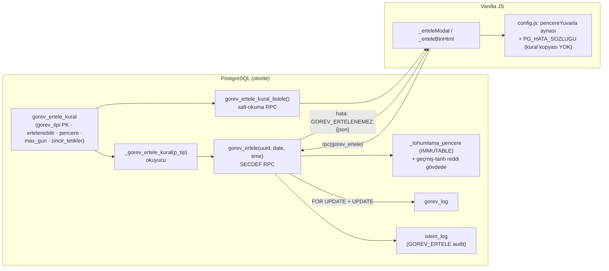
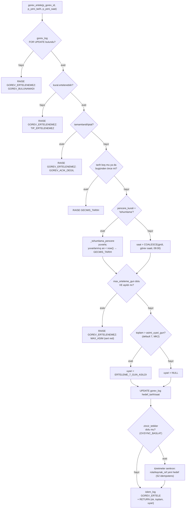
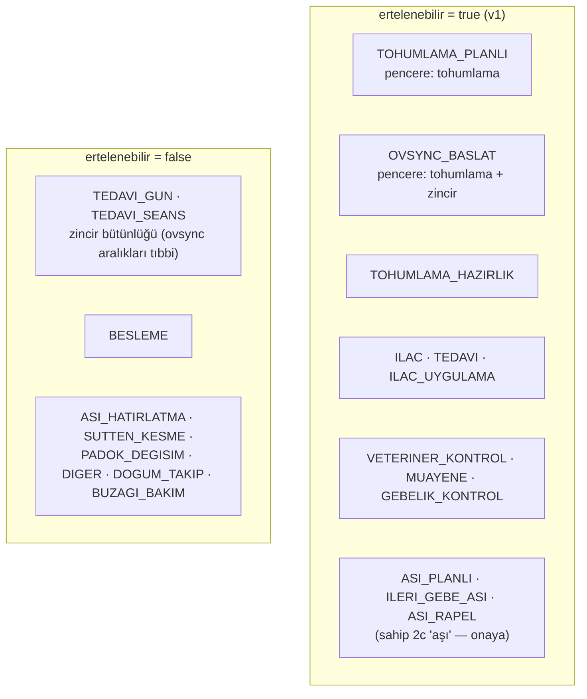
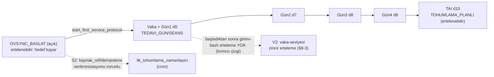

# Genel Görev Erteleme (tohumlama/aşı/tedavi + UI) — Tasarım Planı [K11]

> **REQUIRED SUB-SKILL:** Uygulama turu `executing-plans` ile bu planı görev-görev işler.
> **DURUM: SADECE PLAN — IMPLEMENTASYON YOK (K11 kabul ölçütü: bu dosya).** Sahip onayı öncesinde
> tek satır ürün kodu/migration yazılmaz.
> ROL: R-ARAŞTIRMA (F1) · 2026-09-25 · Kalem: **K11 / talimat 2c**
> Sahip onayına sunulacak karar noktaları: §8 (Riskler/Alternatifler).

**Goal:** Ertelemeyi tek tip görevden (TOHUMLAMA_PLANLI) çıkarıp kural-tabanlı, DB-ağırlıklı,
tüm uygun görev tiplerinde (tohumlama/aşı/tedavi-türevi/muayene) UI'dan tek akışla çalışır hale
getirmek.

**Architecture:** Hibrit, ağırlık DB'de — davranış kuralları yeni `gorev_ertele_kural` tablosunda
(`protokol_ayar` deseni), pencere yuvarlama + geçmiş-tarih reddi RPC gövdesinde kalır, yeni genel
`gorev_ertele` RPC'si mevcut `tohumlama_gorev_ertele` sözleşmesine DOKUNMAZ, JS'e kural kopyası
YAZILMAZ (UI kuralı canlı okur RPC'den, hataları `GOREV_ERTELENEMEZ:<json>` sözleşmesiyle alır).

**Tech Stack:** PostgreSQL/Supabase RPC (SECDEF + `SET search_path = public, pg_temp` +
BEGIN/COMMIT + REVOKE PUBLIC/anon), Vanilla JS (`js/ui.js`, `js/config.js`, `js/api.js`), Node unit
(NODE_PATH ana checkout), db-validation kapısı (`scripts/db-validate.sh`).

---

## 1. Girdi ve otorite zinciri

| Kaynak | Ne diyor |
|---|---|
| Sahip talimatı 2c (`~/Masaüstü/EGESUT-ERP1 NOTLARI/yurutme-haritasi-ss-research-2026-09-23.md` madde 2) | "dileğim onu tüm işlerde kullanabilmek **tohumlama aşı tedavi etc hepsinde**" (UI üzerinden) |
| `BUGS.md → BUG-ERTELEME-KURAL-GENEL` [open/borç] | `tohumlama_gorev_ertele` yalnız TOHUMLAMA_PLANLI; **sahip kararı 2026-09-24: bu turda tam fix BEKLESİN**; hedef tasarım: hibrit, ağırlık DB'de; kurallar `gorev_ertele_kural` tablosu (protokol_ayar deseni); pencere/geçmiş kontrolü RPC gövdesinde; JS kopyası YASAK |
| `reports/plans/ovsync-cila-plan-2.md` §4.2 (tasarım taslağı) + §5A (araştırma sonucu KARAR, 2026-09-24) | §5A: (1) davranış kuralları → `gorev_ertele_kural` tablosu + `_gorev_ertele_kural(p_tip)` okuyucu; (2) güvenlik-kritik sabitler RPC gövdesinde + config.js aynası durur; (3) JS'e kural kopyası yazılmaz. §4.2: yeni genel RPC (eskisi dokunulmaz), kırmızı çizgiler BESLEME/TEDAVI_GUN/TEDAVI_SEANS, hata sözlüğü + `toplam_erteleme_gun` gösterimi, test matrisi |
| K10 envanteri (`k10-envanter.md`, bu dizin) | Tip kilidinin somut bedeli: 16 gecikmiş ovsync zincir görevi bugün ertelenemiyor; zincir ertelemesi biriminin "vaka" olması gerektiği; `add_treatment_day_with_sessions` update modunun üst görevi bayat bıraktığı |

## 2. Bugünkü durum (kanıtlar, 2026-09-25)

- RPC: `tohumlama_gorev_ertele(uuid, date, time)` — tip kilidi `TIP_UYGUN_DEGIL`
  (`supabase/migrations/20260923000003_ovsync_pg_yardimcilar.sql:562`); pencere `_tohumlama_pencere`
  (:34, IMMUTABLE); MK2 ">7 gün → `uyari`" (:596); geçmiş-tarih reddi gövde içi. Canlı demo'da
  yalnız İKİ erteleme RPC'si var: bu ve `hayvan_tohumlama_ertele(hayvan_id, ay)` (hayvan/ay bazlı
  plan kaydırıcı — SK3 gereği DOKUNULMAZ) [OBSERVED pg_proc].
- UI: `_erteleModal` aynı kilit (`js/ui.js:1042` `gorev_tipi !== 'TOHUMLAMA_PLANLI'` → "Görev
  ertelenemez"); [🗓️ Ertele] butonu yalnız TOHUMLAMA_PLANLI kartında (`_tohErteleBtnHtml`,
  `js/ui.js:1205-1208`); pencere önizleme JS aynası `pencereYuvarla` (`js/config.js:193-221`,
  birim testle DB'ye bağlı).
- Hata sözlüğü: `GOREV_ERTELENEMEZ` / `GECMIS_TARIH` `PG_HATA_SOZLUGU`'de YOK (review D18) —
  jenerik metne düşüyorlar.
- Tedavi zinciri: tarih taşıyan RPC yok; `add_treatment_day_with_sessions` update modu
  `treatment_days.treatment_date` taşır ama üst `TEDAVI_GUN.hedef_tarih`'ini taşımaz
  (`20260611000002_bug059_rpcs.sql:118-131` vs INSERT dalı :134-141) [CONFIRMED kod].
- Ovsync zincir yapısı (demo [OBSERVED]): Gün1(d0) → Gün2(d7) → Gün3(d8) → Gün4(d9) → TAI(d10,
  TOHUMLAMA_PLANLI, `kaynak='TEDAVI_SABLON_TOHUMLAMA:<case>:<sablon>'`); başlangıç görevi
  `OVSYNC_BASLAT` + `protokol_instance.kaynak_ref` idempotens anahtarı
  (`20260924000001:299-334`).

## 3. Tasarım (spec)

### 3.1 DB — `gorev_ertele_kural` tablosu (protokol_ayar deseni)

```sql
CREATE TABLE public.gorev_ertele_kural (
  gorev_tipi        text PRIMARY KEY,          -- gorev_log.gorev_tipi sözlüğü
  ertelenebilir     boolean NOT NULL,
  pencere_kurali    text    NOT NULL DEFAULT 'yok',  -- 'tohumlama' | 'yok' (gelecek: 'asi' vb.)
  max_erteleme_gun  integer,          -- NULL = sert sınır YOK (MK2 "sınır yok" korunur);
                                      -- doluysa aşım sert red: GOREV_ERTELENEMEZ:MAX_ASIM
  asimi_uyari_gun   integer NOT NULL DEFAULT 7,      -- MK2 kalıbı: aşınca uyari alanı (red değil)
  zincir_tetikler   jsonb   NOT NULL DEFAULT '{}'::jsonb, -- örn. OVSYNC_BASLAT: {"tai_ofset_gun":10}
  guncellendi       timestamptz NOT NULL DEFAULT now()
);
REVOKE ALL ON public.gorev_ertele_kural FROM PUBLIC, anon;
-- yazma yalnız service_role (kural değişimi sahip işlemi; UI yazamaz)
```

**Tohum davranışı:** `pencere_kurali='tohumlama'` olan tipler `_tohumlama_pencere` yuvarlamasından
geçer (MK1); diğerleri verilen saatle birlikte kabul. Geçmiş-tarih reddi ve "bugünün geçmiş saati"
kontrolü TÜM tipler için RPC gövdesinde kalır (§5A madde 2 — sözleşme, tenant ayarı değil).

**Seed matrisi (sahip onayı §8-1'e tabu):**

| gorev_tipi | ertelenebilir | pencere | gerekçe / not |
|---|---|---|---|
| TOHUMLAMA_PLANLI | t | tohumlama | mevcut davranışın birebir taşınması (S-6) |
| OVSYNC_BASLAT | t | tohumlama | hedef kayar; **TAI = yeni hedef + tai_ofset_gun yeniden hesaplanır; `protokol_instance.kaynak_ref` güncellenmezse cron çift üretir (plan-2 S2 — zorunlu kabul testi)** |
| TOHUMLAMA_HAZIRLIK | t | tohumlama | §4.2 ilk seti |
| ILAC | t | yok | §4.2 ilk seti |
| TEDAVI, ILAC_UYGULAMA | t | yok | sahip 2c "tedavi" — tekil/serbest tedavi görevleri |
| VETERINER_KONTROL | t | yok | §4.2 ilk seti |
| MUAYENE, GEBELIK_KONTROL | t | yok | §4.2 ilk seti |
| ASI_PLANLI, ILERI_GEBE_ASI, ASI_RAPEL | t | yok | **sahip 2c "aşı" — §4.2 ilk setine EK (uzatma, onaya)**; rapel türetmesi v1'de kaymaz (yalnız uyarı) |
| ASI_HATIRLATMA | f | — | hatırlatma görevi; kaynak kaydı zaten ayrı (onaya) |
| TEDAVI_GUN, TEDAVI_SEANS | **f** | — | **kırmızı çizgi (§4.2): zincir bütünlüğü — seans saatleri şablondan; ovsync aralıkları tıbbi sabit. Zincir erteleme = V2 (§8-3)** |
| BESLEME | **f** | — | kırmızı çizgi (§4.2) |
| SUTTEN_KESME, PADOK_DEGISIM, DIGER, DOGUM_TAKIP, BUZAGI_BAKIM | f | — | v1 dışı (talep gelirse kural satırı eklenir — kod değişmez) |

### 3.2 DB — `_gorev_ertele_kural(p_tip)` yardımcı + genel `gorev_ertele` RPC

```sql
CREATE OR REPLACE FUNCTION public._gorev_ertele_kural(p_tip text)
 RETURNS jsonb LANGUAGE sql STABLE SET search_path = public, pg_temp AS $$
  SELECT coalesce((SELECT jsonb_build_object(
                    'ertelenebilir', k.ertelenebilir, 'pencere_kurali', k.pencere_kurali,
                    'max_erteleme_gun', k.max_erteleme_gun, 'asimi_uyari_gun', k.asimi_uyari_gun,
                    'zincir_tetikler', k.zincir_tetikler)
                   FROM public.gorev_ertele_kural k WHERE k.gorev_tipi = p_tip),
                  jsonb_build_object('ertelenebilir', false, 'pencere_kurali', 'yok',
                    'max_erteleme_gun', 0, 'asimi_uyari_gun', 7, 'zincir_tetikler', '{}'::jsonb));
 $$;
```

```sql
CREATE OR REPLACE FUNCTION public.gorev_ertele(
  p_gorev_id uuid, p_yeni_tarih date, p_yeni_saat time DEFAULT NULL)
 RETURNS jsonb LANGUAGE plpgsql VOLATILE SECURITY DEFINER
 SET search_path = public, pg_temp AS $fn$
 DECLARE ... BEGIN
   -- 1) gorev_log FOR UPDATE; bulunamadı → GOREV_ERTELENEMEZ:GOREV_BULUNAMADI
   -- 2) kural := _gorev_ertele_kural(tip); ertelenebilir değilse
   --      → GOREV_ERTELENEMEZ:TIP_ERTELENEMEZ (tip + kural kaynağı payload'da)
   -- 3) tamamlandi/iptal → GOREV_ERTELENEMEZ:GOREV_ACIK_DEGIL; p_yeni_tarih NULL → YENI_TARIH_BOS
   -- 4) p_yeni_tarih < bugun → GECMIS_TARIH  (tüm tipler; tohumlama pencere yuvarlaması SONRASI
   --    yuvarlanmış an < now() kontrolü yalnız pencere_kurali='tohumlama' tipinde — mevcut S-6 kalıbı)
   -- 5) max_erteleme_gun DOLUysa ve aşıldıysa → GOREV_ERTELENEMEZ:MAX_ASIM (sert red;
   --    NULL = sınır yok, MK2 kararı). asimi_uyari_gun aşımı (default 7) → yalnız uyari alanı
   -- 6) UPDATE gorev_log SET hedef_tarih/hedef_saat (+ pencere yuvarlaması pencere kuralına göre)
   -- 7) zincir_tetikler: OVSYNC_BASLAT ertelenirse başlamamış zincirde TAI görevi HENÜZ YOK
   --    (TAI, start_first_service_protocol anında türetilir). Bu yüzden erteleme yalnız başlangıç
   --    hedefini kaydırmaz: protokol_instance.kaynak_ref / açık-dişi rota kaynağı yeni hedefle
   --    senkronize edilir — yoksa cron (ilk_tohumlama_zamanlayici) eski kural-tarihi anahtarıyla
   --    ÇİFT OVSYNC_BASLAT üretir (plan-2 S2; zorunlu kabul testi)
   -- 8) islem_log 'GOREV_ERTELE' audit (mevcut TOHUMLAMA_ERTELE kalıbının geneli;
   --    ilk_hedef/toplam_erteleme_gun hesabı aynen)
   -- 9) RETURN {ok, gorev_id, hedef_tarih, hedef_saat, ilk_hedef_tarih, toplam_erteleme_gun, uyari, zincir}
 END $fn$;
-- REVOKE ALL ... FROM PUBLIC, anon; GRANT EXECUTE ... TO authenticated;  (kapı kuralı)
```

**Dokunulmayanlar:** `tohumlama_gorev_ertele` (S-6 sözleşme, testli — üstüne yenisi), 
`hayvan_tohumlama_ertele` (SK3), `_tohumlama_pencere` (IMMUTABLE, config.js aynası + birim test).

### 3.3 DB — kural okuma RPC'si (UI tek kaynak)

```sql
CREATE OR REPLACE FUNCTION public.gorev_ertele_kural_listele()
 RETURNS TABLE (gorev_tipi text, ertelenebilir boolean, pencere_kurali text, max_erteleme_gun int)
 LANGUAGE sql STABLE SECURITY DEFINER SET search_path = public, pg_temp AS $$
  SELECT k.gorev_tipi, k.ertelenebilir, k.pencere_kurali, k.max_erteleme_gun
    FROM public.gorev_ertele_kural k ORDER BY k.gorev_tipi;
 $$;  -- authenticated'a açık (salt okuma; kural kopyası JS'e YAZILMAZ, canlı okunur)
```

### 3.4 UI (js/ui.js, js/config.js)

- `_erteleModal(gorevId)` tip kilidi kalkar: kural `gorev_ertele_kural_listele()` sonucundan
  (`state`'e cache'lenir, pull ile yenilenir) `ertelenebilir` olmayan tipte erken çıkış aynı
  "Görev ertelenemez" toast'unu verir; pencere önizlemesi yalnız `pencere_kurali='tohumlama'`
  tiplerinde `pencereYuvarla` ile (ayna olduğu gibi).
- `_erteleKaydet` çağrısı `rpc('gorev_ertele', …)`; başlık tipten türkçeleşir
  ("Görevi Ertele"); `toplam_erteleme_gun` + `uyari` gösterimi eklenir (D18 kapanışı).
- Kartlarda [🗓️ Ertele] butonu `_tohErteleBtnHtml` → genel `_erteleBtnHtml(t)` olur; kural
  `ertelenebilir` tiplerine çizilir (OVSYNC_BASLAT kartında [Başlat] yanında; TEDAVI_GUN/SEANS
  kartına ÇİZİLMEZ — kural f).
- Hata sözlüğü (`PG_HATA_SOZLUGU`, js/config.js): `GOREV_ERTELENEMEZ:TIP_ERTELENEMEZ`,
  `GOREV_ERTELENEMEZ:GOREV_ACIK_DEGIL`, `GECMIS_TARIH` türkçe mesajları.
- `?v=` damgası TEK değer güncellenir (damga-izleyen testlerle birlikte).

### 3.5 Testler (TDD — uygulama turunda)

- **SQL kabul (probe önce):** her ertelenebilir tip için ertele/ret çifti; TEDAVI_SEANS/TEDAVI_GUN/
  BESLEME → `TIP_ERTELENEMEZ`; OVSYNC_BASLAT ertelemesi sonrası cron idempotens (aynı gün
  `ilk_tohumlama_zamanlayici` çift görev ÜRETMEZ — S2 zorunlu kabulü); geçmiş tarih reddi ×2 tip.
- **Unit (node):** kural-cache davranışı; `_erteleModal` tip kilidi kural tablosundan; hata sözlüğü
  eşleşmeleri; `toplam_erteleme_gun`/`uyari` gösterimi; pencere önizlemesi yalnız tohumlama
  tiplerinde.
- **UI yürüyüşü:** sahibin Tur-2 tarayıcı checklist'ine madde (üç farklı kategoriden erteleme +
  bir ret toast'u).

## 4. Diyagramlar

### 4.1 Mimari — kural nerede durur, kim okur (K11)



### 4.2 `gorev_ertele` karar akışı



### 4.3 Görev tipi evreni ve v1 kapsam (seed matrisi görsel)



### 4.4 Ovsync zinciri ve erteleme birimleri (K10 bulgusundan)



## 5. Görev dökümü (uygulama turu — her adım K11'e bağlı, TDD)

> Sıra bağımlılıklı; her görevin sonunda commit (açık dosya listesiyle). Migration numarası:
> cila-onarım turunun son numarasından sonraki ilk değer (K-DB kulvarıyla eşgüdüm — 000009+ sonrası).
> Her migration: taslak db-validate → demo apply + schema_migrations(statements dolu) → canlı gövde
> kontrolü → commit.

- **G1 (K11) SQL:** `gorev_ertele_kural` DDL + seed (tablo + REVOKE). Kırmızı test: tablo yokken
  `_gorev_ertele_kural` → hata; sonra DDL → PASS. Kabul: `\d gorev_ertele_kural` + seed sayısı =
  matris satır sayısı; anon SELECT yok.
- **G2 (K11) SQL:** `_gorev_ertele_kural` + `gorev_ertele` + `gorev_ertele_kural_listele` (tek
  migration; SECDEF + search_path + BEGIN/COMMIT + REVOKE/GRANT). Kırmızı: RPC yok → çağrı hatası.
  Kabul: §3.5 SQL kabul seti (ertele/ret çiftleri + S2 cron idempotens probe'u) demo'da PASS.
- **G3 (K11) UI-api:** `js/api.js` pull haritasına `gorev_ertele_kural_listele` ekle
  (RPC_TABLES ↔ RPC_MAP senkronizasyonu — SMELL-002'ye düşme).
- **G4 (K11) UI-modal:** `_erteleModal`/`_erteleKaydet` genelleştirme + kural cache + başlık/özet.
  Önce unit kırmızı: TOHUMLAMA_PLANLI dışı tip kural cache'iyle açılır; f tipi reddedilir.
- **G5 (K11) UI-buton:** `_erteleBtnHtml` genel buton + kartlara bağlanma (OVSYNC_BASLAT dâhil);
  `?v=` tek değer. Unit: f tiplerinde buton üretilmez.
- **G6 (K11) UI-sözlük:** `PG_HATA_SOZLUGU` kayıtları + `toplam_erteleme_gun`/`uyari` gösterimi.
  Unit: hata metinleri eşleşir.
- **G7 (K11) kabul:** `NODE_PATH=/home/melik/egesut-erp1/node_modules npm run test:unit` yeni fail 0
  (baz 3 bilinen) + sahibin yürüyüş maddeleri listesi DONE'a.

## 6. Kabul ölçütleri (K11, uygulama turu için)

1. Demo'da TOHUMLAMA_PLANLI DIŞI en az üç kategoriden (aşı/tedavi-türevi/muayene) görev UI'dan
   ertelenir; `GOREV_ERTELE` islem_log audit satırları oluşur.
2. TEDAVI_GUN/TEDAVI_SEANS/BESLEME erteleme denemesi `GOREV_ERTELENEMEZ:TIP_ERTELENEMEZ` ile
   reddedilir; UI türkçe mesaj gösterir.
3. OVSYNC_BASLAT ertelenmesi sonrası `ilk_tohumlama_zamanlayici` çift görev üretmez (S2 probe).
4. Mevcut `tohumlama_gorev_ertele` testleri DEĞİŞMEDEN geçer (S-6 sözleşme korunur).
5. Unit: yeni fail 0 (baz 1112/1109, 3 bilinen).
6. db-validation PASS; demo gövde-doğrulama betiği (K2) yeni RPC'leri de kapsar (0 fark).

## 7. Kapsam dışı (v1)

- `hayvan_tohumlama_ertele` (SK3) ve `_tohumlama_pencere` gövdesi — dokunulmaz.
- `tohumlama_gorev_ertele`'in kaldırılması/birleştirilmesi — eski sözleşme yaşar.
- Zincir (vaka-seviyesi) erteleme — V2 (§8-3).
- Kural yönetim UI'sı (kural satırları DB'den sahip/service_role işlemiyle değişir; v1'de arayüz yok).
- Offline kuyruk erteleme (erteleme online-only; SMELL-002 disiplinine uygun).

## 8. Sahip onayına sunulan riskler / alternatifler (K11 kapısı)

1. **Seed matrisi (§3.1):** §4.2'nin ilk setine sahip 2c gereği AŞI üçlüsü ve tekil tedavi tipleri
   EKLENDİ; ASI_HATIRLATMA + işletme tipleri (SUTTEN_KESME…) v1'de kapalı önerildi. Onay/ret: her
   satır tek tek onaylanabilir (kod etkisi yok — kural satırı).
2. **TEDAVI_GUN/TEDAVI_SEANS kırmızı çizgisi:** sahibin 2c'deki "tedavi" sözü zincir görevlerini
   kapsamıyor yorumu yapıldı (tıbbi aralıklar + şablon kaynaklı seans saatleri). Alternatif:
   görev-bazlı zincir ertelemeyi açmak — Ovsynch-56 aralıklarını bozar, önerilmez.
3. **V2 — vaka-seviyesi zincir erteleme:** "bir vakanın tüm açık günleri + türetilmiş TAI" tek
   işlemde kaydırılır (K10 §4-A'daki bakımın ürünleşmiş hali; `zincir_tetikler` alanının v2'de
   vaka-türü tanıması). v1'de YOK; sahibin "ovsync zincirini UI'dan kaydır" talebi bu maddeyle
   karşılanır — onaylanırsa ayrı tur.
4. **OVSYNC_BASLAT ertelemesinin cron etkisi (S2):** `protokol_instance.kaynak_ref` senkronu
   yapılmazsa çift görev üretimi kanıtlanmış risk; zorunlu kabul testi olarak kondu. Alternatif:
   OVSYNC_BASLAT'ı v1'de kapalı bırakmak (kural satırı f) — basit ama sahibin 2b talebini UI
   tarafında karşılamaz.
5. **`add_treatment_day_with_sessions` üst-görev bayatlığı:** genel RPC bu boşluğu kapatırken
   mevcut RPC'nin onarılması (update dalında TEDAVI_GUN hedef_tarih'i de taşınmalı) ayrı küçük
   madde — v1'e dâhil EDİLMEDİ; istenirse G2'ye ek satır.
6. **Kural okumanın offline davranışı:** UI kural cache'i offline'da eski kalabilir; erteleme
   zaten online-only (rpc çağrısı) — tutarsızlık yalnız buton görünürlüğünde. Kabul edilebilir
   yorumu; alternatif offline'da buton gizleme.

## 9. Kanıt / yeniden üretim

- Mevcut durum sorguları: `k10-envanter.md` §3 tablosundaki RPC imzaları (canlı pg_proc) +
  `20260923000003:540-625` gövde okuması.
- UI kilitleri: `js/ui.js:1042` (modal), `js/ui.js:1205-1208` (buton), `js/config.js:193-221` (ayna).
- Sahip karar zinciri: BUGS.md BUG-ERTELEME-KURAL-GENEL (2026-09-24) + plan-2 §5A (aynı gün araştırma
  kararı) — bu planın hiçbir maddesi o kararın ÜSTÜNE yazmaz; yalnız 2c'in "aşı/tedavi" genişletmesi
  ve K10 bulguları ekleme olarak işaretlendi.
