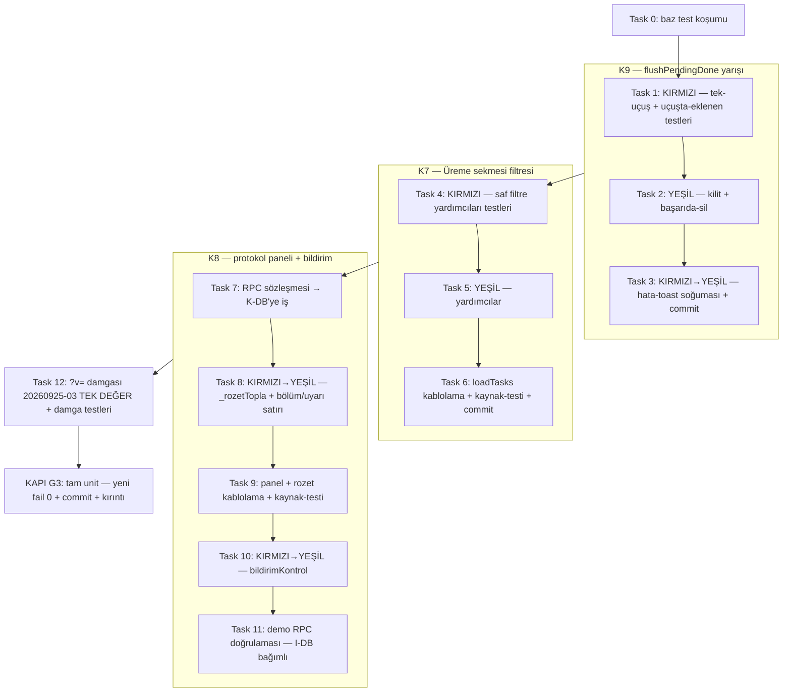

# Cila Onarım — UI Kulvarı (K9, K7, K8) Implementation Plan

> **REQUIRED SUB-SKILL:** Use the executing-plans skill to implement this plan task-by-task.

**Goal:** `js/ui.js` üzerinde üç kanıtlanmış kusuru onar — flushPendingDone yarışı (K9), Üreme sekmesi filtresi (K7), başlamış ovsync zincirinin protokol panelinde görünürlüğü (K8) — TDD ile, mevcut test altyapısını (`tests/unit/support/loadModule.js`) kullanarak.

**Architecture:** K9 mevcut snapshot+clear+restore kalıbını tek-uçuş kilidi + başarıda-silme kalıbıyla değiştirir. K7, `loadTasks` içindeki kategori/tarih süzgeçlerini saf yardımcılara çeker (`_kategoriFiltreUygun`, `_bugunFiltreUygun`, `_uremeGorevMi`) ve IDB haritalarını süzgeçlerden önce yükseltir. K8, panel+rozet+bildirim üçgenine üçüncü veri kaynağı (`ovsync_seans_uyarilari` RPC — sözleşme bu belgede, gövde K-DB kulvarı) ekler. `?v=` damgası tüm işler bittikten sonra TEK SEFER bump edilir.

**Tech Stack:** Vanilla JS (browser-global modüller), node:test + vm tabanlı `loadExtractedFunction`/`extractFunctionSource` (js/ koduna dokunulmadan test), Supabase RPC (salt-okuma), demo psql (yalnız doğrulama).

---

## Zarf kuralları (ihlal = teslim reddi)

- Çalışma ağacı: `/home/melik/.herdr/worktrees/egesut-erp1/ovysch-feature-cila-turu`. Tüm yazmalar bunun altında.
- **PROD YASAK.** DB erişimi yalnız demo psql (ref `vtzqjmazsvurxdeondmi`; yazmadan önce `echo $SUPABASE_DEMO_REF` ile doğrula). Bu planın DB adımlarının TAMAMI salt-okunur SELECT'tir; migration I-DB kulvarınındır.
- Playwright KOŞMA. Push YOK, main merge YOK. Demo sahip şifresine dokunma.
- Git: yalnız açık dosya yollarıyla `git add` (`git add -A` YASAK). Commit mesajı sonu `Co-Authored-By: Claude Code <noreply@anthropic.com>`. Anlamlı her adım sonrası commit. `index.lock` hatasında 5 sn bekle, en çok 3 dene.
- JS/SQL sembol değişikliği öncesi gitnexus impact — **bilinen sınırlama:** `js/ui.js` 512 KB'ı aştığı için analizörce atlanır (2026-09-25 analyze çıktısıyla teyitli); impact boş döner. Bu dosya için blast-radius = aşağıdaki grep-kanıtlı çağıran listesi + commit öncesi `mcp__gitnexus__detect_changes` (repo mutlaka yol: `/home/melik/.herdr/worktrees/egesut-erp1/ovysch-feature-cila-turu`).
- Unit kapısı: `NODE_PATH=/home/melik/egesut-erp1/node_modules npm run test:unit` — baz 1112/1109, 3 bilinen fail (bc-tarih ×2, LUNA-3); yeni fail 0.
- Kırıntı: her karar/kapımda `/home/melik/egesut-erp1/.crumbs/cila-onarim.jsonl` tek satır JSON (role `I-UI`, bu planı yazan için `P-UI`).

## Blast radius (grep-kanıtlı, 2026-09-25 @d6fe66c)

| Sembol | Çağıranlar | Not |
|---|---|---|
| `flushPendingDone` | `js/ui.js:625` (recoverPendingDone), `js/ui.js:631` (loadTasks — await), `js/app.js:81` (sayfa terk — beklemeden) | Tek-yazıcı ui.js |
| `loadTasks` | ~20 çağrı: `js/app.js:93,199`; `js/forms.js:3236,3254,3299,4043`; `js/ui.js:66,574,931,1093,1153,1227,1239,1379,1440,1470,1547,2551,6723,6792` | Filtre değişikliği tüm sekmelere tek noktadan uygulanır |
| `bildirimKontrol` | `js/app.js:685` (saatlik interval), `js/ui.js:10580` (bildirimAc) | Dedup anahtarı localStorage'da |
| `_rozetTopla` | `js/ui.js:435` (rozet taraması) | İmza genişletme geriye uyumlu |
| `_showProtokolEkran` | `index.html:575` (zil), `js/ui.js:2603` (dismiss sonrası yeniden aç) | Yeni bölüm boşken görünmez |

## Doğrulanmış kök nedenler (P-UI gelen-iş denetimi, demo nokta-kontrolüyle)

1. **K9** `js/ui.js:601-616`: uçuş başında kopya (`items`), sonda `_pendingDone.clear()` + `kalan` anlık görüntüsünü geri yükleme → await penceresinde eklenen kalem silinir; kilit yok (loadTasks:631 + app.js:81 çift gönderim); kalıcı hata her flush'ta tekrar toast.
2. **K7** `js/ui.js:56` TEDAVI_SEANS/TEDAVI_GUN `tedavi` kategorisinde; `js/ui.js:696` tarih süzmesi kategoriden önce; `index.html:692` varsayılan filtre "Bugün". Demo (salt-okuma SELECT, 2026-09-25): `diseases.category='Üreme'` sütunu mevcut ("Ovsync Protokol" kategorisi Üreme); açık TEDAVI_SEANS'lardan 8'i 2026-09-24 10:00 hedefli gecikmiş (Buserin gün-1 seansları).
3. **K8** `js/ui.js:1851-1905` panel yalnız `protokol_eksik_tara` + `ovsync_baslat_uyarilari` okur; `js/ui.js:425-440` rozet aynı iki kaynak; `js/ui.js:10553` `bildirimKontrol` `!g.parent_id` ile seansları eler, gecikme kolu yok, `js/ui.js:10558` `T08:00:00` sabit. Demo: 13 aktif Üreme vakasının `protocol_family`'si tümü NULL (K4 backfill'i bekler).

---

## Akış



Sıra zorunlu: **K9 → K7 → K8**. K8, K-DB kulvarının `ovsync_seans_uyarilari` migration'ını demo doğrulama için bekler; UI kodu ve unit testleri sözleşmeye karşı beklemesiz yazılır (RPC yoksa sessiz boş bölüm — geriye uyumlu).

---

# FAZ K9 — flushPendingDone yarışı (K-numarası: K9)

Kabul ölçütü (zarf): *eşzamanlı iki çağrı tek gönderim; uçuşta eklenen kalem korunur; kalıcı hatada tekrar toast yok.*

**Files:**
- Modify: `js/ui.js:560` (modül değişkeni ekle), `js/ui.js:601-619` (flushPendingDone gövdesi)
- Test: `tests/unit/cila-tutarlilik.test.js` (mevcut T4/U4 bloğunun bitişiği, ~satır 24-73)

### Task 1: KIRMIZI — tek-uçuş ve uçuşta-eklenen testleri yaz

**K9 · Kabul ölçütü:** yeni testler MEVCUT kodda FAIL eder (çift gönderim kanıtlanır), mevcut T4/U4 testi hâlâ derlenir.

`tests/unit/cila-tutarlilik.test.js` içinde mevcut `loadFlushPendingDone` factory'sini kullanan (bloğun hemen sonrasına) ekle — ctx'e iki yeni üye şart: `_flushInFlight:false`, `_flushHataToast:new Map()`:

```js
// ── K9: flushPendingDone tek-uçuş + uçuşta-eklenen koruma ──────────────────
function _k9Ctx(pending, rpcImpl, toastSink){
  const calls={ toasts:[] };
  const ctx={
    console, Date, Math, JSON, Map, Set, Promise,
    navigator:{ onLine:true },
    toast:(m,e)=>{ calls.toasts.push(String(m)); if(toastSink) toastSink(m,e); },
    rpc: rpcImpl, rpcSeansTamamla: async()=>({ok:true}),
    pullTables: async()=>{}, updateTaskBadge: ()=>{}, updatePendingFab: ()=>{},
    _savePending: ()=>{}, _pendingDone: pending,
    _flushInFlight: false, _flushHataToast: new Map(),
  };
  ctx.globalThis=ctx;
  return { ctx, calls };
}

test('K9-a: eşzamanlı iki çağrı — her görev YALNIZ bir kez gönderilir', async () => {
  const pending=new Map([['g1',{type:'gorev',gorevId:'g1',params:{gorevId:'g1'}}]]);
  const sends=[];
  const { ctx } = _k9Ctx(pending, async (name,params)=>{ sends.push(params.p_gorev_id); await new Promise(r=>setTimeout(r,20)); return {ok:true}; });
  const flush=loadFlushPendingDone(ctx);
  const p1=flush(); const p2=flush();      // app.js:81 + loadTasks:631 yarışı
  await Promise.all([p1,p2]);
  assert.deepStrictEqual(sends, ['g1'], 'tek gönderim beklenir, ikinci çağrı uçuş açmaz');
  assert.strictEqual(pending.size, 0);
});

test('K9-b: uçuş sırasında eklenen kalem korunur (silinmez)', async () => {
  const pending=new Map([['g1',{type:'gorev',gorevId:'g1',params:{gorevId:'g1'}}]]);
  let rpcCalled=false;
  const { ctx } = _k9Ctx(pending, async ()=>{
    if(!rpcCalled){ rpcCalled=true; await new Promise(r=>setTimeout(r,20));
      // togglePendingDone:625'in yaptığı şey — await penceresinde yeni kalem
      pending.set('g2',{type:'gorev',gorevId:'g2',params:{gorevId:'g2'}});
    }
    return {ok:true};
  });
  const flush=loadFlushPendingDone(ctx);
  await flush();
  assert.ok(pending.has('g2'), 'uçuşta eklenen g2 silinmemeli');
  assert.ok(!pending.has('g1'), 'başarılı g1 düşmeli');
});
```

Ayrıca mevcut T4/U4 testinin ctx'ine (satır ~34-58) `_flushInFlight:false, _flushHataToast:new Map(),` ekle.

**Step 1.1:** Testleri yaz.
**Step 1.2:** Koş ve KIRMIZI doğrula:

```bash
NODE_PATH=/home/melik/egesut-erp1/node_modules npm run test:unit -- --test-name-pattern='K9'
```
Beklenen: `K9-a` FAIL (`sends` = `['g1','g1']`), `K9-b` FAIL (`g2` kayboldu).

### Task 2: YEŞİL — tek-uçuş kilidi + başarıda-silme

**K9 · Kabul ölçütü:** K9-a, K9-b, mevcut T4/U4 PASS; `flushPendingDone`'un çağıranları (`loadTasks:631`, `recoverPendingDone:625`, `app.js:81`) imza değişikliği olmadan çalışır.

`js/ui.js:560` yanına modül değişkeni:

```js
let _flushHataToast = new Map();   // K9: key → {msg,ts} — kalıcı hatada tekrar toast soğuması (5 dk)
```

`js/ui.js:601-619` gövdesini değiştir (snapshot/clear/restore kalıbı kalkar; `rpcSeansTamamla`/`rpc` çağrıları ve satır içi yorumlar aynen kalır):

```js
async function flushPendingDone(){
  if(!_pendingDone.size) return;
  if(_flushInFlight) return;               // K9: tek-uçuş — eşzamanlı çağrı (app.js:81 + loadTasks) ikinci gönderim açmaz
  if(!navigator.onLine){ toast('⚠️ Çevrimiçi olunca uygulanacak'); return; }
  _flushInFlight=true;
  try {
    const items=[..._pendingDone.values()];
    for(const it of items){
      try {
        if(it.type==='seans') await rpcSeansTamamla(it.params.seansId, it.params.uygulanmadi, null);
        else if(it.type==='besleme') await rpc('besleme_tamam', {p_gorev_id:it.params.gorevId});
        else if(it.type==='gorev') await rpc('gorev_tamamla', {p_gorev_id:it.params.gorevId, p_padok_hedef:it.params.padok||null});
        _pendingDone.delete(it.type==='seans'?it.params.seansId:it.params.gorevId);   // K9: yalnız BAŞARILI op düşer; uçuşta eklenenlere dokunulmaz
        _flushHataToast.delete(it.type==='seans'?it.params.seansId:it.params.gorevId);
      } catch(e){ /* K9: kalıcı hatada tekrar toast bastırma — Task 3 */ }
    }
    _savePending(); updatePendingFab();
    try { await pullTables(['gorev_log','treatment_days','treatment_day_uygulamalar','drug_administrations','stok','stok_hareket','cases']); } catch(e){}
    if(typeof updateTaskBadge==='function') updateTaskBadge();
  } finally { _flushInFlight=false; }
}
```

`let _flushInFlight = false;   // K9: tek-uçuş kilidi` satırını `_pendingDone` bildiriminin (ui.js:560) hemen altına ekle.

RPC satırlarındaki parametre ifadeleri mevcut gövdeyle BİREBİR aynı korunur (`it.params.gorevId`, `it.params.padok||null`, `it.params.seansId`, `it.params.uygulanmadi`) — yalnız kalan-yönetimi (snapshot/clear/restore → başarıda-delete) ve kilit değişir.

**Step 2.1:** Uygula (taşıma yok; yalnız 601-619 bloğu + 560 yanı değişkenler).
**Step 2.2:** `--test-name-pattern='K9|flush|U4'` → hepsi PASS.
**Step 2.3:** Tam paket: `npm run test:unit` → 1112+2 yeni geçen / aynı 3 bilinen fail (yeni fail 0).

### Task 3: KIRMIZI→YEŞİL — kalıcı hata toast soğuması + commit

**K9 · Kabul ölçütü:** aynı hata ikinci flush'ta tekrar toast basmaz; FARKLI mesaj veya 5 dk sonra tekrar basar; op pending'de kalır.

**Step 3.1 (KIRMIZI):** `_k9Ctx` kullanarak ekle:

```js
test('K9-c: kalıcı hata — aynı mesaj ikinci flush\'ta tekrar toast basmaz', async () => {
  const pending=new Map([['g2',{type:'gorev',gorevId:'g2',params:{gorevId:'g2'}}]]);
  let msg='sunucu hatası';
  const { ctx, calls } = _k9Ctx(pending, async ()=>{ throw new Error(msg); });
  const flush=loadFlushPendingDone(ctx);
  await flush(); await flush();                    // iki loadTasks turu
  const hataToastlari=calls.toasts.filter(t=>t.includes('Görev uygulanamadı'));
  assert.strictEqual(hataToastlari.length, 1, 'aynı kalıcı hata bir kez toastlanır');
  assert.ok(pending.has('g2'), 'hatalı op pending\'de kalır');
  msg='farklı hata';                               // yeni hata → tekrar bildir
  await flush();
  assert.strictEqual(calls.toasts.filter(t=>t.includes('Görev uygulanamadı')).length, 2);
});
```
Koş → FAIL (mevcut kod her flush'ta toast basar; Task 2 catch bloğu boş olduğundan bu kez 0 toast — her iki durumda da kırmızı).

**Step 3.2 (YEŞİL):** Task 2'deki catch bloğunu doldur:

```js
      } catch(e){
        const _msg=String((e&&e.message)||e);
        const _key=it.type==='seans'?it.params.seansId:it.params.gorevId;
        const _prev=_flushHataToast.get(_key);
        const _now=Date.now();
        if(!_prev||_prev.msg!==_msg||_now-_prev.ts>5*60*1000){
          toast('❌ Görev uygulanamadı: '+_msg, true);
          _flushHataToast.set(_key,{msg:_msg,ts:_now});
        }
        /* op pending'de kalır */
      }
```

**Step 3.3:** `--test-name-pattern='K9'` → 3/3 PASS; tam paket yeni fail 0.
**Step 3.4:** detect_changes + commit:

```bash
git add js/ui.js tests/unit/cila-tutarlilik.test.js
git commit -m "onarim(ui): K9 flushPendingDone tek-uçuş kilidi + uçuşta-eklenen koruma + hata-toast soğuması

Co-Authored-By: Claude Code <noreply@anthropic.com>"
```

---

# FAZ K7 — Üreme sekmesi filtresi (K-numarası: K7 / BUG-UREME-SEKMESI-FILTRE)

Kabul ölçütü (zarf): *fixture'da Üreme+Bugün en az bir ovsync seansı + yaklaşan OVSYNC_BASLAT gösterir; Tedavi sekmesi bu seansları çift saymaz.*

**Files:**
- Modify: `js/ui.js:52-60` (`_planliUremeTipler` sabiti), `js/ui.js:653-705` arası (harita yükseltme + süzgeçler), `js/ui.js:664-665` (done sekmesi paritesi)
- Create: `tests/unit/gorev-kat-filtre.test.js`

Tasarım kararı: hastalık kategorisi DB otoritesidir (`diseases.category`, demo'da dolu — nokta-kontrol 2026-09-25). `config.js` `HASTALIK_KAT` geri-arama fallback'i YAZILMAZ (YAGNI; category NULL özel hastalıklar kapsam dışı kalır — kırıntıya `type:"assumption"` notu).

### Task 4: KIRMIZI — saf filtre yardımcıları testleri

**K7 · Kabul ölçütü:** yeni dosya MEVCUT kodda FAIL eder (`_uremeVakaCaseIds` yok → ReferenceError).

`tests/unit/gorev-kat-filtre.test.js` oluştur:

```js
// tests/unit/gorev-kat-filtre.test.js — K7: Üreme sekmesi kategori/tarih filtresi (BUG-UREME-SEKMESI-FILTRE)
'use strict';
const test = require('node:test');
const assert = require('node:assert');
const { loadExtractedFunction } = require('./support/loadModule.js');

const _katTipMap = {
  asi:['ASI_PLANLI'], vitamin:[], muayene:[],
  tedavi:['TEDAVI','ILAC_UYGULAMA','TEDAVI_GUN','TEDAVI_SEANS'],
  ureme:['TOHUMLAMA_PLANLI','OVSYNC_BASLAT'], bakim:[], diger:null
};
const _allKatTips = Object.values(_katTipMap).filter(Boolean).flat();
const _planliUremeTipler = ['OVSYNC_BASLAT','TOHUMLAMA_PLANLI'];
const ortak = { _katTipMap, _allKatTips, _planliUremeTipler };

// fixture: bir Ovsync (Üreme) vakası + bir Mastit (Meme) vakası
const diseases=[
  {id:'dOv', name:'Ovsync Protokol', category:'Üreme'},
  {id:'dMast', name:'Mastit', category:'Meme'},
];
const cases=[ {id:'cOv', disease_id:'dOv', status:'active'}, {id:'cMast', disease_id:'dMast', status:'active'} ];
const tdays=[ {id:'tdOv', case_id:'cOv', day_no:1}, {id:'tdMast', case_id:'cMast', day_no:1} ];
const seanslar=[ {id:'sOv', treatment_day_id:'tdOv'}, {id:'sMast', treatment_day_id:'tdMast'} ];
const tdById=Object.fromEntries(tdays.map(x=>[x.id,x]));
const seansById=Object.fromEntries(seanslar.map(x=>[x.id,x]));
const gSeansOv={id:'gS1', gorev_tipi:'TEDAVI_SEANS', seans_admin_id:'sOv', parent_id:'gP1', hedef_tarih:'2026-09-25', tamamlandi:false, iptal:false};
const gGunOv={id:'gG1', gorev_tipi:'TEDAVI_GUN', parent_id:null, hedef_tarih:'2026-09-25', aciklama:JSON.stringify({day_id:'tdOv'}), tamamlandi:false, iptal:false};
const gSeansMast={id:'gS2', gorev_tipi:'TEDAVI_SEANS', seans_admin_id:'sMast', parent_id:'gP2', hedef_tarih:'2026-09-25', tamamlandi:false, iptal:false};

const _uremeVakaCaseIds=loadExtractedFunction('js/ui.js','_uremeVakaCaseIds',{extra:ortak});
const _uremeGorevMi=loadExtractedFunction('js/ui.js','_uremeGorevMi',{extra:ortak});
const _kategoriFiltreUygun=loadExtractedFunction('js/ui.js','_kategoriFiltreUygun',{extra:ortak});
const _bugunFiltreUygun=loadExtractedFunction('js/ui.js','_bugunFiltreUygun',{extra:ortak});

test('K7-1: üreme vaka kümesi yalnız category=Üreme vakalarını toplar', () => {
  const s=_uremeVakaCaseIds(cases, diseases);
  assert.ok(s.has('cOv')&&!s.has('cMast'));
});

test('K7-2: ovsync seansı/günü Üreme\'de; Mastit seansı Tedavi\'de kalır (çift sayım yok)', () => {
  const uremeCaseIdler=new Set(['cOv']);
  assert.strictEqual(_uremeGorevMi(gSeansOv, uremeCaseIdler, tdById, seansById), true, 'ovsync seansı üreme');
  assert.strictEqual(_uremeGorevMi(gGunOv, uremeCaseIdler, tdById, seansById), true, 'ovsync tedavi günü üreme');
  assert.strictEqual(_uremeGorevMi(gSeansMast, uremeCaseIdler, tdById, seansById), false, 'mastit seansı üreme değil');
  assert.strictEqual(_kategoriFiltreUygun(gSeansOv,'ureme',uremeCaseIdler,tdById,seansById), true);
  assert.strictEqual(_kategoriFiltreUygun(gSeansOv,'tedavi',uremeCaseIdler,tdById,seansById), false, 'Tedavi sekmesi ovsync seansını ÇİFT SAYMAZ');
  assert.strictEqual(_kategoriFiltreUygun(gSeansMast,'tedavi',uremeCaseIdler,tdById,seansById), true, 'mastit Tedavi\'de kalır');
  assert.strictEqual(_kategoriFiltreUygun({gorev_tipi:'OVSYNC_BASLAT'},'ureme',uremeCaseIdler,tdById,seansById), true);
});

test('K7-3: yaklaşan planlı üreme görevi Bugün penceresinde (ASI_PLANLI benzeri istisna)', () => {
  const today='2026-09-25', d7='2026-10-02';
  const baslat={gorev_tipi:'OVSYNC_BASLAT', hedef_tarih:'2026-09-28'};
  const planli={gorev_tipi:'TOHUMLAMA_PLANLI', hedef_tarih:'2026-10-02'};
  const uzak={gorev_tipi:'OVSYNC_BASLAT', hedef_tarih:'2026-10-06'};
  assert.strictEqual(_bugunFiltreUygun(baslat,today,d7), true, 'OVSYNC_BASLAT +3g Bugün\'de görünür');
  assert.strictEqual(_bugunFiltreUygun(planli,today,d7), true, 'pencere sınırı dahil');
  assert.strictEqual(_bugunFiltreUygun(uzak,today,d7), false, '7 günden öte Bugün\'de değil');
  assert.strictEqual(_bugunFiltreUygun({gorev_tipi:'TEDAVI_GUN',hedef_tarih:'2026-09-28'},today,d7), false, 'istisna yalnız planlı üreme+ASI tiplerine');
  assert.strictEqual(_bugunFiltreUygun({gorev_tipi:'ASI_PLANLI',hedef_tarih:'2026-09-28'},today,d7), true, 'mevcut ASI davranışı korunur');
});
```

**Step 4.1:** Yaz. **Step 4.2:** `npm run test:unit -- --test-name-pattern='K7'` → FAIL (ReferenceError: _uremeVakaCaseIds is not defined).

### Task 5: YEŞİL — saf yardımcıları ui.js'e ekle

**K7 · Kabul ölçütü:** K7 testleri PASS; hiçbir çağıran bozulmaz (yeni fonksiyonlar, yalnız yeni çağrılar).

`js/ui.js` `_katTipMap` bloğunun altına (satır ~61, `_allKatTips`'ten sonra):

```js
const _planliUremeTipler=['OVSYNC_BASLAT','TOHUMLAMA_PLANLI'];   // K7: planlı üreme görevleri Bugün'de 7-gün pencereyle (ASI_PLANLI örneği)
// K7: hastalık kategorisi 'Üreme' olan vakaların TEDAVI_SEANS/TEDAVI_GUN'leri Üreme sekmesine
// aittir (ovsync zinciri tedavi vakası açar — BUG-UREME-SEKMESI-FILTRE). Kategori DB otoritesi: diseases.category.
function _uremeVakaCaseIds(cases,diseases){
  const _dById=Object.fromEntries((diseases||[]).map(d=>[d.id,d]));
  const s=new Set();
  (cases||[]).forEach(c=>{ const d=c&&_dById[c.disease_id]; if(d&&d.category==='Üreme') s.add(c.id); });
  return s;
}
function _uremeGorevMi(t,uremeCaseIdler,tdById,seansById){
  if(!t) return false;
  if((_katTipMap.ureme||[]).includes(t.gorev_tipi)) return true;
  if(t.gorev_tipi==='TEDAVI_SEANS'){
    const s=seansById&&seansById[t.seans_admin_id];
    const td=s&&tdById&&tdById[s.treatment_day_id];
    return !!(td&&uremeCaseIdler&&uremeCaseIdler.has(td.case_id));
  }
  if(t.gorev_tipi==='TEDAVI_GUN'){
    let a={}; try{ a=JSON.parse(t.aciklama||'{}'); }catch(e){}
    const td=a.day_id&&tdById&&tdById[a.day_id];
    return !!(td&&uremeCaseIdler&&uremeCaseIdler.has(td.case_id));
  }
  return false;
}
function _kategoriFiltreUygun(t,kat,uremeCaseIdler,tdById,seansById){
  if(kat==='all') return true;
  if(kat==='diger') return !_allKatTips.includes(t.gorev_tipi);
  if(kat==='ureme') return _uremeGorevMi(t,uremeCaseIdler,tdById,seansById);
  if(kat==='tedavi') return (_katTipMap.tedavi||[]).includes(t.gorev_tipi)&&!_uremeGorevMi(t,uremeCaseIdler,tdById,seansById);
  return (_katTipMap[kat]||[]).includes(t.gorev_tipi);
}
function _bugunFiltreUygun(t,today,d7){
  if(t.hedef_tarih===today) return true;
  const planli=t.gorev_tipi==='ASI_PLANLI'||t.gorev_tipi==='ILERI_GEBE_ASI'||_planliUremeTipler.includes(t.gorev_tipi);
  return planli&&t.hedef_tarih>today&&t.hedef_tarih<=d7;
}
```

**Step 5.1:** Ekle. **Step 5.2:** `--test-name-pattern='K7'` → 3/3 PASS.

### Task 6: loadTasks kablolama + done-sekmesi paritesi + commit

**K7 · Kabul ölçütü:** kaynak-testi kanıtlar: (a) today/late/all süzgeçleri `_bugunFiltreUygun`/eski koşulları korur; (b) açık + done kategori süzgeçleri `_kategoriFiltreUygun` çağırır; (c) haritalar süzgeçlerden ÖNCE kurulur. Tüm unit yeni fail 0.

**Step 6.1 (KIRMIZI önce):** `tests/unit/gorev-kat-filtre.test.js` sonuna kaynak-kablolama testi (repo pratiği: manifest-içi metin denetimi):

```js
test('K7-4: loadTasks kablolaması — yardımcılar çağrılıyor (kaynak kanıtı)', () => {
  const src=require('fs').readFileSync('js/ui.js','utf8');
  // loadTasks 628'de başlar, sonraki üst-seviye fonksiyon _stokAdi'dir (850) — recoverPendingDone (620) ÖNCEDİR, çapa olmaz
  const lt=src.slice(src.indexOf('async function loadTasks'), src.indexOf('function _stokAdi'));
  assert.ok(lt.includes('_bugunFiltreUygun(t,today,_d7)'), 'today süzgeci yardımcıdan');
  assert.ok((lt.match(/_kategoriFiltreUygun\(/g)||[]).length>=2, 'açık + done kategori süzgeçleri yardımcıdan');
  const ixHarita=lt.indexOf('_uremeVakaCaseIds(');
  const ixFiltre=lt.indexOf('_kategoriFiltreUygun(');
  assert.ok(ixHarita>-1&&ixFiltre>-1&&ixHarita<ixFiltre, 'üreme vaka kümesi süzgeçlerden ÖNCE kurulmalı');
});
```
Koş → FAIL (kablolama yok). **Step 6.2 (YEŞİL):** `js/ui.js` loadTasks içinde:

1. **Harita yükseltme** — satır 653 `const all=await idbGetAll('gorev_log');` ile satır 654 `if(f==='done')` ARASINA taşı (satır 727-738'den KES): `_allTDays`, `_allTaskCases`, `_allTaskDiseases`, `_caseById`, `_diseaseById`, `_allSeans`, `_seansById`, `_tdById` bildirimleri (gövde aynen; `await idbGetAll('treatment_days')` vb. zaten satır 652'de pull edilen tablolar) + yeni iki satır:

```js
  const _uremeCaseIdler=_uremeVakaCaseIds(_allTaskCases,_allTaskDiseases);   // K7
```

   Satır 727-738'de kalan `_dayDiseaseMap`, `_caseDayCount`, `_seansDayStat` blokları yerinde kalır (artık yukarıda tanımlı haritalara referans verir; mükerrer `const` bildirimlerini SİL).

2. **Bugün süzgeci** — satır 696:

```js
    if(f==='today') data=data.filter(t=>_bugunFiltreUygun(t,today,_d7));
```

   (`late` ve `all` satır 697-703 aynen.)

3. **Açık kategori süzgeci** — satır 704-705 yerine:

```js
    data=data.filter(t=>_kategoriFiltreUygun(t,_taskKategori,_uremeCaseIdler,_tdById,_seansById));
```

4. **Done sekmesi paritesi** — satır 664-665 yerine:

```js
      if(_taskKategori!=='all') done=done.filter(t=>_kategoriFiltreUygun(t,_taskKategori,_uremeCaseIdler,_tdById,_seansById));
```

**Step 6.3:** `--test-name-pattern='K7'` → 4/4 PASS.
**Step 6.4:** Tam paket: yeni fail 0. `diger` davranışı değişmez (`_kategoriFiltreUygun` `diger` kolunu birebir eski koşul).
**Step 6.5:** Kırıntı `type:"assumption"`: category NULL özel hastalıklar Üreme'ye düşmez (DB otoritesi). detect_changes + commit:

```bash
git add js/ui.js tests/unit/gorev-kat-filtre.test.js
git commit -m "onarim(ui): K7 Üreme sekmesi — vaka kategorili seans/gün eşlemesi + planlı üreme 7-gün Bugün penceresi

Co-Authored-By: Claude Code <noreply@anthropic.com>"
```

---

# FAZ K8 — Protokol panelinde ovsync zinciri (K-numarası: K8 / BUG-PROTOKOL-OVSYNC-AYRIK)

Kabul ölçütü (zarf): *başlamış ovsync zincirinin gecikmiş/yaklaşan seansları panelde + `_rozetTopla`'da; `bildirimKontrol` parent_id'li seansları ve gecikmeyi kapsar, `hedef_saat` okur; unit test + demo RPC çıktısında 8 gecikmiş Buserin seansı panel kaynağında görünür.*

> **F4 onarım notu (2026-09-25, F4-UI) — K8 sabit-8 ölçütünün sapması.** Zarfın "demo RPC çıktısında
> **8 gecikmiş** Buserin seansı panel kaynağında görünür" ibaresi teslim anında harfiyen ölçülemez
> duruma geldi: aynı turun **K10** adımı (sahip talimatı 2b, k10-sonuc.md / commit 080ee57) aynı
> seanslara +2 gün erteledi — gorev_log.hedef_tarih 64 satır, treatment_days.planned_date 32 satır.
> Canlı demo RPC ölçümü (ref vtzqjmazsvurxdeondmi, salt-okuma): planın sabit-8 spot sorgusu = **0**;
> RPC toplam 11 (gecikmis 0-1 — gün-içi saat-bağımlı, 002'nin gün-2 seansı 10:00'yı geçince gecikmişe döner,
> Buserin değil), **Buserin satırı 9 ve tümü 'yaklasan'** (8× gün-1 2026-09-26 10:00 — K10'un 8 vakasının
> küpeleri 122/144/149/168/186/28/31/Test inek 3 birebir — + 002 gün-4). Kabul bu yüzden eşitlik-tabanlı
> yedekle kanıtlandı: (1) RPC = bağımsız SQL eşitliği (11 = 11; kırıntı #59), (2) Buserin seanslarının
> panel kaynağında görünür olması (9 satır), (3) unit K8-3 sabit-8 fixture'ı test tarafını kapatıyor.
> **DONE dosyasını yazan ajan bu sapmayı K8 kaleminde ve sahip_kapisi altında açıkça listelemelidir**
> ("K8 TAMAM" iddiası harfiyen değil öz itibarıyla karşılandı) — kırıntı type:open_item olarak da düşüldü.

**`k8_needs_rpc = true`.** Yeni RPC `ovsync_seans_uyarilari()` — gövde K-DB/I-DB kulvarı (migration numarası I-DB'nin sırası); P-UI yalnız sözleşme sahibi. K8'in UI bölümü RPC varlığına beklemesiz şipşak (RPC yoksa `rpc()` throw → sessiz boş bölüm).

### Task 7: RPC sözleşmesi — K-DB'ye iş bildirimi

**K8 · Kabul ölçütü:** Sözleşme aşağıda değişmez; I-UI, I-DB'nin migration'ı demoya girmeden Task 11'i koşmaz (kırıntı `type:"open_item"`).

**Sözleşme — `public.ovsync_seans_uyarilari()` RETURNS jsonb, STABLE, SECURITY DEFINER, `SET search_path = public, pg_temp` (tırnaksız), `REVOKE ... FROM PUBLIC, anon`, `GRANT ... TO authenticated, service_role`:**

- Seçim: `gorev_log g` `gorev_tipi='TEDAVI_SEANS'`, `tamamlandi=false`, `iptal=false` → `treatment_day_uygulamalar tua ON tua.id=g.seans_admin_id` → `treatment_days td` → `cases c ON c.id=td.case_id AND c.status='active'` → `hayvanlar h`.
- Filtre: `c.protocol_family IS NOT NULL` (K4'ün alanı — yalnız başlamış ovsync zincirleri; Metrit vb. Üreme vakaları DIŞ) VE `g.hedef_tarih <= (bugün+7)` (geçmiş sınırsız — gecikmişler; gelecek 7 güne kadar — yaklaşanlar).
- `durum`: `(g.hedef_tarih::timestamp + COALESCE(g.hedef_saat,'08:00')::interval) <= (now() AT TIME ZONE 'Europe/Istanbul')` → `'gecikmis'`, değilse `'yaklasan'`.
- Satırlar (jsonb_agg, ORDER BY `hedef_tarih, hedef_saat`): `gorev_id, hayvan_id, kupe_no, grup, case_id, hedef_tarih, hedef_saat, durum, gun_no (td.day_no), toplam_gun ((SELECT count(*) FROM treatment_days x WHERE x.case_id=c.id)), seans_adi (tua üründen ad+doz+route; NULL olabilir)`.
- Dış zarf: `{'ok':true,'uyarilar':[...]}` (`ovsync_baslat_uyarilari` kalıbı — ui.js:1891-1893 `(ov&&ov.uyarilar)||[]` aynı okunur).
- Demo kabul (I-DB): `SELECT count(*) FROM ovsync_seans_uyarilari() r, jsonb_array_elements(r->'uyarilar') e WHERE e->>'durum'='gecikmis' AND e->>'hedef_tarih'='2026-09-24' AND e->>'hedef_saat'='10:00'` → **8** (P-UI demo nokta-ölçümü 2026-09-25: 8 seans 09-24 10:00 hedefli açık; önkoşul K4 backfill — bugün 13 aktif Üreme vakasının protocol_family'si tümü NULL).

**Files (UI tarafı):**
- Modify: `js/ui.js:1209` (`_rozetTopla`), `js/ui.js:424-441` (rozet taraması), `js/ui.js:1887-1905` + `1917` (panel), `js/ui.js:10548-10577` (bildirimKontrol)
- Create: `tests/unit/ovsync-seans-panel.test.js`

### Task 8: KIRMIZI→YEŞİL — `_rozetTopla` 3 argüman + bölüm/satır üreticileri

**K8 · Kabul ölçütü:** `_rozetTopla(n,m,o)` doğru toplar, eski 2-arg testleri bozulmaz; `_ovSeansBolumHtml` boş listede '' döner, 8'lik fixture'ta bölüm başlığı + gecikmiş satır metni üretilir; `_dkInsanOkur(1236)==='20sa 36dk'` (sahibin ekran dökümündeki metin).

**Step 8.1 (KIRMIZI):** `tests/unit/ovsync-seans-panel.test.js`:

```js
// tests/unit/ovsync-seans-panel.test.js — K8: ovsync seans uyarıları panel/rozet/bildirim (BUG-PROTOKOL-OVSYNC-AYRIK)
'use strict';
process.env.TZ = 'Europe/Istanbul';   // K8-5 saat matematiği deterministik — dosya başında, hiçbir Date kullanımından önce (node --test dosya başına süreç açar)
const test = require('node:test');
const assert = require('node:assert');
const fs = require('node:fs');
const { loadExtractedFunction } = require('./support/loadModule.js');

const _rozetTopla=loadExtractedFunction('js/ui.js','_rozetTopla');
const _dkInsanOkur=loadExtractedFunction('js/ui.js','_dkInsanOkur');
const _ovSeansBolumHtml=loadExtractedFunction('js/ui.js','_ovSeansBolumHtml',{extra:{
  esc:s=>String(s), escAttr:s=>String(s), fmtTarih:s=>String(s),
  _ovSeansSatirHtml:u=>`SATIR:${u.kupe_no}:${u.durum}`,
}});

test('K8-1: _rozetTopla 3 kaynak toplar; 2-arg geriye uyumlu', () => {
  assert.strictEqual(_rozetTopla(3,2,4), 9);
  assert.strictEqual(_rozetTopla(3,2,undefined), 5);
  assert.strictEqual(_rozetTopla(0,0,0), 0);
});

test('K8-2: _dkInsanOkur — dakika → insan okuru gecikme metni', () => {
  assert.strictEqual(_dkInsanOkur(1236), '20sa 36dk');   // sahibin dökümü: "20sa 36dk gecikti"
  assert.strictEqual(_dkInsanOkur(30), '30dk');
  assert.strictEqual(_dkInsanOkur(1560), '1g 2sa');
  assert.strictEqual(_dkInsanOkur(0), '0dk');
});

test('K8-3: bölüm — boş liste boş string; 8 gecikmiş Buserin seansı görünür', () => {
  assert.strictEqual(_ovSeansBolumHtml([]), '');
  assert.strictEqual(_ovSeansBolumHtml(null), '');
  const fixture=Array.from({length:8},(_,i)=>({gorev_id:'g'+i,hayvan_id:'h'+i,kupe_no:String(28+i),grup:'Düve (Büyük)',
    hedef_tarih:'2026-09-24',hedef_saat:'10:00',durum:'gecikmis',gun_no:1,toplam_gun:4,gecikme_dk:1236}));
  const html=_ovSeansBolumHtml(fixture);
  assert.ok(html.includes('Ovsync Seansları (8)'), 'başlık + sayı');
  assert.ok(html.includes('8 gecikmiş')||/gecikmis.*8|8.*gecikmiş/s.test(html), 'gecikmiş alt başlığı');
  assert.strictEqual((html.match(/SATIR:/g)||[]).length, 8, '8 satır');
});
```
Koş → FAIL (fonksiyonlar yok).

**Step 8.2 (YEŞİL):** `js/ui.js:1209` değiştir:

```js
function _rozetTopla(n, m, o){ return (n|0) + (m|0) + (o|0); }   // T10/U11 + K8: panelin 3. kaynağı (ovsync seansları)
```

`_ovUyariSatirHtml`'in (ui.js:2004) hemen ardına:

```js
// K8: dakika → "1g 2sa" / "20sa 36dk" / "30dk" (sahip dökümü biçimi)
function _dkInsanOkur(dk){
  dk=Math.max(0, Math.round(Number(dk)||0));
  if(dk<60) return dk+'dk';
  if(dk<1440) return Math.floor(dk/60)+'sa '+(dk%60)+'dk';
  return Math.floor(dk/1440)+'g '+Math.floor((dk%1440)/60)+'sa';
}
// K8: başlamış ovsync zincirinin seans uyarı satırı (ovsync_seans_uyarilari satırı)
function _ovSeansSatirHtml(u){
  const gecikmis=u.durum==='gecikmis';
  return `<div class="arow" style="border-left:3px solid ${gecikmis?'var(--red2)':'#b8860b'};margin-bottom:6px;padding:8px 10px;cursor:pointer" onclick="_protoDetayHayvanGit('${escAttr(u.hayvan_id)}')">
        <div style="flex:1">
          <div style="font-weight:700;font-size:.8rem">${gecikmis?'🔴':'🟡'} ${esc(u.kupe_no||'?')} <span style="font-size:.6rem;opacity:.6">${esc(u.grup||'')}</span></div>
          <div style="font-size:.7rem;color:var(--ink3)">Gün ${u.gun_no!=null?u.gun_no:'?'}/${u.toplam_gun!=null?u.toplam_gun:'?'}${u.seans_adi?' · '+esc(u.seans_adi):''} · ${fmtTarih(u.hedef_tarih)} ${u.hedef_saat?String(u.hedef_saat).slice(0,5):''}</div>
          <div style="font-size:.6rem;opacity:.5">${gecikmis?('⚠ '+_dkInsanOkur(u.gecikme_dk)+' gecikti'):'yaklaşan seans'}</div>
        </div>
      </div>`;
}
// K8: panel bölümü — gecikmiş üstte, yaklaşan altta (protokol paneli 3. kaynak)
function _ovSeansBolumHtml(list){
  if(!Array.isArray(list)||!list.length) return '';
  const gec=list.filter(u=>u.durum==='gecikmis');
  const yak=list.filter(u=>u.durum!=='gecikmis');
  return `<div style="font-weight:800;font-size:.8rem;margin:12px 0 6px;color:var(--red2)">🧪 Ovsync Seansları (${list.length})</div>`
    +(gec.length?`<div style="font-size:.65rem;color:var(--red2);margin-bottom:4px">${gec.length} gecikmiş</div>`:'')
    +gec.map(_ovSeansSatirHtml).join('')
    +(yak.length?yak.map(_ovSeansSatirHtml).join(''):'');
}
```

**Step 8.3:** `--test-name-pattern='K8'` → 3/3 PASS (mevcut `_rozetTopla` testleri cila-tutarlilik'te aynen geçer — 2-arg çağrılar `(o|0)`=0).

### Task 9: Panel + rozet kablolaması

**K8 · Kabul ölçütü:** kaynak-testi: rozet taraması `_rozetTopla(aktif.length, ovSayi, seansSayi)` çağırır ve `ovsync_seans_uyarilari`'yi sorgular; panel `${seansHtml}` basar ve boş-durum koşulu üç kaynağı da içerir; RPC hatası paneli kırmaz (fallback önbellek).

**Step 9.1 (KIRMIZI):** ovsync-seans-panel.test.js'ye:

```js
test('K8-4: rozet + panel kablolaması (kaynak kanıtı)', () => {
  const src=fs.readFileSync('js/ui.js','utf8');
  assert.ok(src.includes("_rozetTopla(aktif.length, ovSayi, seansSayi)"), 'rozet 3. kaynağı toplar');
  const scan=src.slice(src.indexOf('// Protokol uyarı scanner'), src.indexOf('updateTaskBadge();', src.indexOf('// Protokol uyarı scanner')));
  assert.ok(scan.includes("rpc('ovsync_seans_uyarilari'"), 'rozet taraması seans RPC sorgular');
  const panel=src.slice(src.indexOf('async function _showProtokolEkran'), src.indexOf('function _showProtokolDetay'));
  assert.ok(panel.includes('_ovSeansBolumHtml('), 'panel bölüm üreticisini çağırır');
  assert.ok(/if\s*\(!data\.length\s*&&\s*!ovHtml\s*&&\s*!seansHtml\)/.test(panel), 'boş-durum üç kaynakla karar verir');
  assert.ok(panel.includes('${seansHtml}'), 'bölüm HTML içeriğe gömülü');
});
```
Koş → FAIL.

**Step 9.2 (YEŞİL):**

1. Rozet taraması (`js/ui.js:429-435`) — `ovSayi` bloğunun ardına, `_rozetTopla` çağrısından önce:

```js
      let seansSayi = 0;
      try {
        const su = await rpc('ovsync_seans_uyarilari', {});
        window.__ovsyncSeansUyarilar = (su && su.uyarilar) || [];
        seansSayi = window.__ovsyncSeansUyarilar.length;
      } catch(e) { console.warn('ovsync_seans_uyarilari (rozet):', e.message); }
      const toplam = _rozetTopla(aktif.length, ovSayi, seansSayi);
```

   (eski `const toplam = _rozetTopla(aktif.length, ovSayi);` satırı silinir.)

2. Panel (`_showProtokolEkran`) — ovHtml try/catch bloğunun (ui.js:1889-1904) ardına:

```js
  // K8: başlamış ovsync zincirinin gecikmiş/yaklaşan seansları — panelin 3. kaynağı
  let seansHtml = '';
  try {
    const su = await rpc('ovsync_seans_uyarilari', {});
    window.__ovsyncSeansUyarilar = (su && su.uyarilar) || [];
  } catch(e) {
    console.warn('ovsync_seans_uyarilari:', e.message);
  }
  seansHtml = _ovSeansBolumHtml(Array.isArray(window.__ovsyncSeansUyarilar) ? window.__ovsyncSeansUyarilar : []);
```

   Satır 1905: `if (!data.length && !ovHtml) {` → `if (!data.length && !ovHtml && !seansHtml) {`
   Satır 1917 innerHTML şablonunda `${ovHtml}${eksikHtml}` → `${ovHtml}${seansHtml}${eksikHtml}` (seans bölümü İlk Tohumlama'nın altında, genel eksik listesinin üstünde).

**Step 9.3:** `--test-name-pattern='K8'` → 4/4 PASS. **Step 9.4:** tam paket yeni fail 0 + commit:

```bash
git add js/ui.js tests/unit/ovsync-seans-panel.test.js tests/unit/cila-tutarlilik.test.js
git commit -m "onarim(ui): K8 protokol paneli 3. kaynak — ovsync seans uyarıları panel+rozet (RPC sözleşmeli)

Co-Authored-By: Claude Code <noreply@anthropic.com>"
```

### Task 10: KIRMIZI→YEŞİL — bildirimKontrol: seanslar, gecikme, hedef_saat

**K8 · Kabul ölçütü:** parent_id'li TEDAVI_SEANS için gecikmiş bildirimi bir kez çıkar (günlük dedup); hedef saat `hedef_saat`'ten okunur (sabit 08:00 değil); ikinci koşum yeni bildirim üretmez; gecikme bildirimi döngü başına en fazla 5.

**Step 10.1 (KIRMIZI):** ovsync-seans-panel.test.js'ye (FixedDate ile saat sabitleme — mevcut ctx-Date geçme pratiğiyle uyumlu):

```js
test('K8-5: bildirimKontrol — gecikmiş seans bildirir, hedef_saat okur, dedup çalışır', async () => {
  const { loadBrowserModule } = require('./support/loadModule.js');
  const vm=require('node:vm');
  const src=require('./support/loadModule.js').extractFunctionSource('js/ui.js','bildirimKontrol');
  const bildirimler=[];
  class FakeNotif{ constructor(title,opts){ bildirimler.push({title,tag:opts&&opts.tag}); } }
  FakeNotif.permission='granted';
  const storage=(()=>{ const m=new Map(); return {getItem:k=>m.get(k)??null,setItem:(k,v)=>m.set(k,String(v)),removeItem:k=>m.delete(k)}; })();
  class FixedDate extends Date { constructor(...a){ if(a.length===0) super('2026-09-25T09:30:00+03:00'); else super(...a); } }
  const gorevler=[
    {id:'gSeans', hayvan_id:'h1', gorev_tipi:'TEDAVI_SEANS', parent_id:'gP', tamamlandi:false,
     hedef_tarih:'2026-09-24', hedef_saat:'10:00:00', aciklama:'Gün 1/4 Buserin'},          // gecikmiş (dün 10:00)
    {id:'gBugun', hayvan_id:'h1', gorev_tipi:'TEDAVI_SEANS', parent_id:'gP2', tamamlandi:false,
     hedef_tarih:'2026-09-25', hedef_saat:'12:30:00', aciklama:'öğle seansı'},              // 3 saat sonra → erken uyarı (hedef_saat!)
  ];
  const ctx={ console, Date:FixedDate, Math, JSON, Map, Set, Promise, Number,
    Notification:FakeNotif, window:{ Notification:FakeNotif },
    bugun:()=>'2026-09-25', dFwd:(b,n)=>n===1?'2026-09-26':b,
    getData:async(table,fn)=>gorevler.filter(fn),
    getState:()=>({animals:[{id:'h1',kupe_no:'28'}]}),
    localStorage:storage, _istanbulAnIso:null };
  vm.createContext(ctx);
  const bk=vm.runInContext(`(${src})`, ctx, { filename:'js/ui.js#bildirimKontrol' });
  await bk();
  const tags=bildirimler.map(b=>b.tag);
  assert.ok(tags.some(t=>String(t).startsWith('gSeans_gecik_2026-09-25')), 'gecikmiş seans bildirimi + günlük dedup anahtarı');
  assert.ok(bildirimler.some(b=>String(b.tag)==='gBugun_2026-09-25'), '3-saat-erken penceresi hedef_saat=12:30 üzerinden (08:00 sabiti değil)');
  const n1=bildirimler.length;
  await bk();   // ikinci koşum (saatlik interval)
  assert.strictEqual(bildirimler.length, n1, 'dedup — tekrar bildirim yok');
});
```
Koş → FAIL (mevcut kod `!g.parent_id` ikisini de eler).

**Step 10.2 (YEŞİL):** `js/ui.js:10548-10577` bildirimKontrol gövdesi — sorgu ve saat satırları:

```js
async function bildirimKontrol(){
  if(!('Notification' in window)||Notification.permission!=='granted') return;
  const now=new Date();
  const bugunStr=bugun();
  const yarin=dFwd(bugunStr,1);
  // K8: seanslar (parent_id'li TEDAVI_SEANS) dahil + gecikmiş görevler kolu
  const _seansMi=g=>g.gorev_tipi==='TEDAVI_SEANS';
  const gorevler=await getData('gorev_log',g=>!g.tamamlandi&&!g.iptal&&(
    (_seansMi(g)&&(g.hedef_tarih===bugunStr||g.hedef_tarih===yarin||g.hedef_tarih<bugunStr))||
    (!g.parent_id&&(g.hedef_tarih===bugunStr||g.hedef_tarih===yarin))));
  // M-26 fix: localStorage bozuk/eski formatta JSON içerebilir — try/catch yoktu, crash riski.
  let gosterilen; try { gosterilen=JSON.parse(localStorage.getItem('bildirim_gosterilen')||'{}'); } catch(_){ gosterilen={}; }
  const simdi=Date.now();
  let _gecSayi=0;
  for(const g2 of gorevler){
    const hedef=new Date(g2.hedef_tarih+'T'+String(g2.hedef_saat||'08:00').slice(0,5)+':00');   // K8: hedef_saat okunur
    const fark=(hedef-now)/3600000;
    const gecKey=`${g2.id}_gecik_${bugunStr}`;
    if(g2.hedef_tarih<bugunStr&&!gosterilen[gecKey]&&_gecSayi<5){                              // K8: gecikme kolu, döngü başına ≤5
      const hayvan=getState('animals').find(a=>a.id===g2.hayvan_id);
      const kupe=hayvan?(hayvan.kupe_no||hayvan.devlet_kupe):'Genel';
      new Notification(`⚠️ Gecikmiş: ${kupe}`,{body:g2.aciklama||'',tag:gecKey});
      gosterilen[gecKey]=simdi; _gecSayi++;
    }
    const key=`${g2.id}_${g2.hedef_tarih}`;
    if(fark>2.5&&fark<=3.5&&!gosterilen[key]){
      const hayvan=getState('animals').find(a=>a.id===g2.hayvan_id);
      const kupe=hayvan?(hayvan.kupe_no||hayvan.devlet_kupe):'Genel';
      new Notification(`⏰ 3 saat sonra: ${kupe}`,{body:g2.aciklama||'',tag:key});
      gosterilen[key]=simdi;
    }
    const sabahKey=`${g2.id}_sabah`;
    if(g2.hedef_tarih===bugunStr&&fark>=-0.5&&fark<=0.5&&!gosterilen[sabahKey]){
      const hayvan=getState('animals').find(a=>a.id===g2.hayvan_id);
      const kupe=hayvan?(hayvan.kupe_no||hayvan.devlet_kupe):'Genel';
      new Notification(`📋 Bugün: ${kupe}`,{body:g2.aciklama||'',tag:sabahKey});
      gosterilen[sabahKey]=simdi;
    }
  }
  Object.keys(gosterilen).forEach(k=>{ if(simdi-gosterilen[k]>7*86400000) delete gosterilen[k]; });
  localStorage.setItem('bildirim_gosterilen',JSON.stringify(gosterilen));
}
```

Karar (kırıntıya `type:"decision"`): gecikme kolu genel açılır (yalnız ovsync değil) ama günde-görev-başına bir bildirim + döngü başına ≤5 sınırıyla; "Bugün" bildirimi 08:00 sabitinden görevin kendi `hedef_saat`ine kayar.

**Step 10.3:** `--test-name-pattern='K8'` → 5/5 PASS; tam paket yeni fail 0. Commit:

```bash
git add js/ui.js tests/unit/ovsync-seans-panel.test.js
git commit -m "onarim(ui): K8 bildirimKontrol — seanslar + gecikme kolu + hedef_saat okuma

Co-Authored-By: Claude Code <noreply@anthropic.com>"
```

### Task 11: Demo RPC doğrulaması (I-DB bağımlı — salt-okuma)

**K8 · Kabul ölçütü:** demo `ovsync_seans_uyarilari()` çıktısında `durum='gecikmis' AND hedef_tarih='2026-09-24' AND hedef_saat='10:00'` satır sayısı = **8**; kanıt kırıntıya `type:"measurement"`.

Önkoşullar: I-DB, RPC migration'ını demoya uygulamış + K4 backfill çalışmış (aktif Ovsync vakalarında protocol_family NULL = 0). I-UI bekleme durumunu kırıntıya `type:"open_item"` ile yazar; önkoşul yoksa bu görev atlanır ve DONE'da "I-DB bağımlılığı" olarak listelenir — uydurma ölçüm YAZILMAZ.

```bash
bash -c 'set -a; source /home/melik/egesut-erp1/.env; set +a; echo "ref=$SUPABASE_DEMO_REF"; PGPASSWORD="$SUPABASE_DEMO_DB_PASSWORD" psql "postgresql://postgres.${SUPABASE_DEMO_REF}:${SUPABASE_DEMO_DB_PASSWORD}@${SUPABASE_DEMO_POOLER}:6543/postgres" -X -A -t -c "
SELECT count(*) FROM public.ovsync_seans_uyarilari() r, jsonb_array_elements(r->'"'"'uyarilar'"'"') e
WHERE e->>'"'"'durum'"'"'='"'"'gecikmis'"'"' AND e->>'"'"'hedef_tarih'"'"'='"'"'2026-09-24'"'"' AND e->>'"'"'hedef_saat'"'"'='"'"'10:00'"'"';"'
```
(ref çıktısı `vtzqjmazsvurxdeondmi` olmalı; değilse DUR.)

---

# Task 12: `?v=` damgası — TEK DEĞER bump

**K7+K8+K9 · Kabul ölçütü:** `index.html` içinde 26 referansın TAMAMI `20260925-03`; eski `20260925-02` referansı 0; damga-izleyen test güncel; tam unit yeni fail 0. (Mevcut durum: 26 × `?v=20260925-02` — mimar incelemesi F "OK" satırı.)

**Step 12.1:** `index.html` içinde `?v=20260925-02` → `?v=20260925-03` (26 satır; `sed -i 's/?v=20260925-02/?v=20260925-03/g' index.html` — tek değer kuralı sağlanır).
**Step 12.2:** `tests/unit/vaka-toplu-ac.test.js` içindeki damga sabitlerini güncelle (~satır 2286, 2318, 2320, 2655-2662): `20260925-02` → `20260925-03` (ve eski-damga negatif listesine `20260925-02` ekle — mevcut `'\\\\?v=' + eski + '(?![0-9])'` kalıbındaki `eski` dizisine).
**Step 12.3:** `npm run test:unit -- --test-name-pattern='damga|manifest'` → PASS.
**Step 12.4:** Doğrula `grep -c 'v=20260925-03' index.html` → 26; `grep -c 'v=20260925-02' index.html` → 0.
**Step 12.5:** Commit:

```bash
git add index.html tests/unit/vaka-toplu-ac.test.js
git commit -m "chore(ui): cila onarim ui degisiklikleri — v= damgasi 20260925-03 (tek deger)

Co-Authored-By: Claude Code <noreply@anthropic.com>"
```

---

# KAPI G3 — tam unit + teslim

**Kabul ölçütü:** `NODE_PATH=/home/melik/egesut-erp1/node_modules npm run test:unit` — toplam 1112+12 (baz + K9 ×3 + K7 ×4 + K8 ×5 yeni test), geçen ≥ 1109+12=1121; bilinen 3 fail (bc-tarih ×2, LUNA-3) dışında yeni fail 0.

```bash
cd /home/melik/.herdr/worktrees/egesut-erp1/ovysch-feature-cila-turu && NODE_PATH=/home/melik/egesut-erp1/node_modules npm run test:unit
```

- Yeni fail varsa: tek onarım turu (zarf F2/G3 kuralı); ikinci düşüşte DONE'a KISMI + kanıt.
- Commit öncesi her seferinde `mcp__gitnexus__detect_changes` (repo=yol) — ui.js index dışı olsa da diff-tabanlı çalışır.
- Teslim: her K için TAMAM/KISMI + commit sha + kabul kanıtı; kırıntıya `type:"gate"` satırı. K8 için Task 11 önkoşulu karşılanmadıysa K8=KISMI (UI TAMAM, demo ölçümü bekliyor) — dürüst rapor.

## Kapsam dışı (bu plana YAZILMAZ)

- C5 onclick XSS yönü (mimar bulgusu; ayrı borç).
- `ovsync_baslat_uyarilari`/`protokol_eksik_tara` gövdeleri (DB kulvarı).
- TEDAVI_GUN/TEDAVI_SEANS üretim mantığı, erteleme (K10/K11).
- `config.js` HASTALIK_KAT fallback'i (karar: DB otoritesi).
