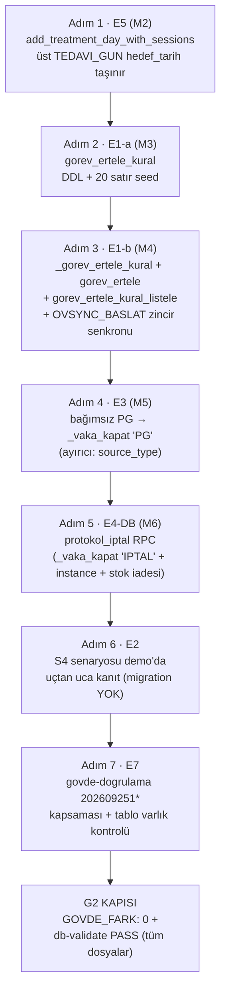
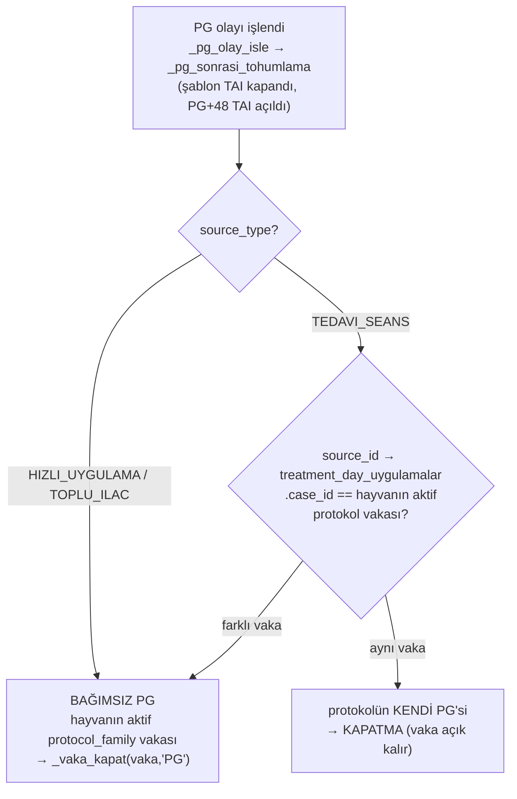

# plan-db — I-DB kulvarı: E5 → E1 → E3 → E4-DB → E2 → E7 [KAPI G1]

> ROL: F2 planlayıcı (bu dosya) · Yürütücü: **I-DB tek yazıcı** · 2026-09-25
> Zarf: `/home/melik/egesut-erp1/.ss/erteleme-genel-GOREV.md` (E1-E7 kalemleri + kabul ölçütleri)
> Tasarım otoritesi: `docs/plans/2026-09-25-cila-onarim/plan-erteleme-genel.md` §3 (spec), §4 (diyagramlar), §8 (riskler/karar noktaları)
> Araştırma kanıtı: `docs/plans/2026-09-25-erteleme/arastirma-e2-e3.md` (E2 tip sözlüğü + E3 VERDICT: IMPLEMENT)
> Desen referansı: `docs/plans/2026-09-25-erteleme/plan-e0.md` (E0 — kırmızı probe → taslak → demo → yeşil probe → commit)
> Çalışma ağacı: `/home/melik/.herdr/worktrees/egesut-erp1/ovysch-feature-erteleme` (dal `ovysch-feature-erteleme`, taban ucu `1fac74a`)

## 0. Mevcut durum (plan yazımı anındaki kanıt tabanı)

- **E0 teslimleri eldedir, DOKUNMA — yalnız çağır/entegre et**: `vaka_kalan_gunleri_kaydir` RPC
  (migration `20260925100001`, demo canlı, authenticated'a açık) + UI "Kalan günleri kaydır"
  butonu (`js/ui.js:7611-7730`; `cdKaydirBtnGuncelle` online/offline dinleyicileri hazır desen).
- Migration serisi **`20260925100002`'den devam** eder (100001 kullanıldı); cila serisi
  `20260925000001..16` ile çakışmaz.
- Demo: ref **`vtzqjmazsvurxdeondmi`** — bağlantı ANINDA doğrulanır; `cron` extension YOK
  [OBSERVED arastirma-e2-e3.md §E3/1] → zamanlayıcı kabul testi ELLE çağrıyla yapılır.
- Çapalar: `_vaka_kapat` gövde-içi kapanış-neden uzayı `('ERKEN_KAPANIS','TOHUMLAMA')`
  [CONFIRMED arastirma-e2-e3.md §E2/6, gövde ~83]; `add_treatment_day_with_sessions` UPDATE
  dalı üst `TEDAVI_GUN.hedef_tarih`'i taşımıyor [CONFIRMED 20260611000002:118-131 vs INSERT
  dalı :134-141]; genel `gorev_ertele` ve `gorev_ertele_kural` tablosu YOK.

## 1. Bağlayıcı ortak kurallar (her adımda geçerli — ihlal = teslim reddi)

1. **PROD YASAK**: tools-bank `supabase_*`/`supabase_migrate` ASLA kullanılmaz. DB erişimi
   yalnız demo psql:
   `bash -c 'set -a; source /home/melik/egesut-erp1/.env; set +a; PGPASSWORD="$SUPABASE_DEMO_DB_PASSWORD" psql "postgresql://postgres.${SUPABASE_DEMO_REF}:${SUPABASE_DEMO_DB_PASSWORD}@${SUPABASE_DEMO_POOLER}:6543/postgres" -X …'`
   — ref bağlantı anında `vtzqjmazsvurxdeondmi` olarak doğrulanır; psql değişken
   interpolasyon tuzaklarına dikkat (tırnaksız `:var` literal dosya üretir); çalışma ağacı
   dışına dosya bırakılmaz.
2. **Migration kalıbı** (her dosyada): kendi `BEGIN;…COMMIT;` bloğu; SECDEF'te tırnaksız
   `SET search_path = public, pg_temp`; `REVOKE … FROM PUBLIC, anon`; `GRANT … TO
   authenticated` **yalnız UI'ın çağırdığı RPC'lere**; `TO anon` YOK; taslakta VE finalde
   `scripts/db-validate.sh <dosya>` → PASS (rapor `reports/db-validation-*.md`).
3. **Fonksiyon yeniden tanımı canlı DEMO gövdesinden başlar** (000008 tuzağı) — önceki tüm
   migration değişiklikleri korunur; `pg_get_functiondef` ile canlı gövde çekilip üzerine yazılır.
4. **Demo apply deseni** (cila deseni): apply + `supabase_migrations.schema_migrations` kaydı
   `statements` DOLU (tam dosya içeriği tek elemanlı dizi) + canlı gövde kontrolü
   (`proconfig`/`pg_get_functiondef`).
5. **gitnexus**: SQL sembol değişikliği ÖNCESİ `impact` (repo: bu worktree); commit ÖNCESİ
   `detect_changes`.
6. **Kırıntı**: her karar/ölçüm/kapıda `/home/melik/egesut-erp1/.crumbs/erteleme-genel.jsonl`
  'ye TEK SATIR JSON — `role:"worker"`, `session:"erteleme-genel/i-db"`,
   `workspace:"erteleme-genel"`.
7. **Unit** (adım sonlarında): `NODE_PATH=/home/melik/egesut-erp1/node_modules npm run
   test:unit` — güncel baz **1132/1135** (bilinen 3 fail: bc-tarih ×2, LUNA-3); hedef yeni
   fail 0.
8. **Commit disiplini**: anlamlı her adımda commit; önce `git status` +
   `git diff --cached --stat` sahiplik doğrulaması (yalnız kendi dosyaların staged);
   `git config user.*` YAZMA; **push YOK, merge YOK**; main'e ve cila dalına yazma.
9. **Dokunulmazlar**: `tohumlama_gorev_ertele` ve `hayvan_tohumlama_ertele` sözleşmeleri
   DEĞİŞMEZ; `_tohumlama_pencere` DOKUNULMAZ. AGENTS.md/CLAUDE.md'ye dokunma. Playwright
   KOŞMA. Alt-ajan yok. `js/` bu kulvarda YASAK (UI = I-UI).

## 2. Migration numaraları (kesinleşti)

| # | Kalem | Dosya (`supabase/migrations/`) | İçerik |
|---|---|---|---|
| M2 | E5 | `20260925100002_add_treatment_day_ust_gorev_tarihi.sql` | `add_treatment_day_with_sessions` UPDATE dalına `hedef_tarih = p_date` |
| M3 | E1-a | `20260925100003_gorev_ertele_kural_tablo_seed.sql` | `gorev_ertele_kural` DDL + 20 satırlık seed + REVOKE |
| M4 | E1-b | `20260925100004_gorev_ertele_rpcs.sql` | `_gorev_ertele_kural` + `gorev_ertele` + `gorev_ertele_kural_listele` |
| M5 | E3 | `20260925100005_bagimsiz_pg_vaka_kapat.sql` | `_vaka_kapat` uzayına 'PG' + bağımsız PG kapatma kancası |
| M6 | E4-DB | `20260925100006_protokol_iptal.sql` | `protokol_iptal` RPC |
| — | E2 | **migration YOK** (RA verdict: dedike tip yok → seed değişikliği gerekmez; yalnız demo senaryo probeleri) | |
| — | E7 | **migration YOK** (yalnız `scripts/govde-dogrulama.sh` + `scripts/lib/govde_karsilastir.py` güncellemesi) | |

Numara çakışması olursa (başka kulvar aralığı aldıysa) sonraki boş slota kaydır +
kırıntı `type:"decision"` ile işaretle.

## 3. Kulvar diyagramı

## 4. Adımlar (sıralı; her adım E-etiketli + kendi kabul ölçütü)

### Adım 1 — E5: `add_treatment_day_with_sessions` üst-görev tarih senkronu (M2)

**Kapsam:** mevcut RPC'nin UPDATE dalı (`p_existing_day_id` dolu) `treatment_days
.treatment_date`'i taşır ve `TEDAVI_GUN` görevinin `aciklama` etiketini tazeler AMA
`gorev_log.hedef_tarih`'i güncellemez [CONFIRMED 20260611000002:118-131; INSERT dalında
`hedef_tarih = p_date` var :134-141]. Yeniden tanım **canlı DEMO gövdesinden başlar**;
UPDATE dalındaki `UPDATE public.gorev_log SET …` bloğuna `hedef_tarih = p_date` eklenir.

- 1a. gitnexus `impact` → `add_treatment_day_with_sessions` çağıranları (UI tedavi günü
  ekle/düzenle akışı) gör, kaydet.
- 1b. **Kırmızı probe** (demo, BEGIN…ROLLBACK): aktif vakada update moduyla gün tarihini
  değiştir → üst `TEDAVI_GUN.hedef_tarih` ESKİde kaldı kanutu.
- 1c. Taslak M2 → db-validate PASS (`reports/db-validation-20260925100002-draft.md`).
- 1d. Demo apply + `schema_migrations` statements DOLU + final db-validate PASS + canlı
  gövde kontrolü (tırnaksız search_path; değişiklik UPDATE dalında).
- 1e. **Yeşil probe** (BEGIN…ROLLBACK): aynı işlem → `TEDAVI_GUN.hedef_tarih = p_date`;
  seans görevleri tutarlı; etiket (zaten mevcut gövde) taze; ROLLBACK temiz.
- 1f. Unit koşumu (baz 1132/1135, yeni fail 0) + kırıntı + commit (migration + plan +
  2 doğrulama raporu).

**Kabul ölçütü (zarf E5):** demo probe kırmızı→yeşil kanıtlanmış; db-validate PASS;
statements dolu; yeni unit fail 0.

**KABUL KANITI (2026-09-25, I-DB):**
- Kırmızı [OBSERVED .probe-e5-kirmizi.sql]: vaka `6bb625d6` gün-2 `e9d7cdb0`, update
  2026-09-24→28: `treatment_date=2026-09-28` + etiket "28.09.2026" AMA üst
  `TEDAVI_GUN.hedef_tarih=2026-09-24` ESKİDE — kırmızı; ROLLBACK temiz.
- Ek bulgu (karar kırıntısı): canlı DELETE `TEDAVI_SEANS AND (aciklama::jsonb…)` tüm
  satırlarda cast yapar; demo'da 1 legacy JSON-dışı satır (`0c211851`,
  'CHILD-TED-CONTAIN', iptal=t) update dalını cast hatasıyla KIRIYORDU → M2 aynı
  ifadedeye `left(aciklama,1)='{'` guard'ı ekledi (E0 deseni).
- M2 = canlı gövde + 4 değişiklik (hedef_tarih=p_date / DELETE guard / tırnaksız
  search_path / pg_catalog-nitelikli jsonb_array_elements+unnest — Faz B çözümü).
- db-validate: taslak+final **PASS** `reports/db-validation-7d66b886.md`.
- Demo apply: CREATE FUNCTION/REVOKE/GRANT/COMMIT; `schema_migrations` 20260925100002
  statements n=1 len=10491 created_by=erteleme-genel-i-db; canlı proconfig
  `search_path=public, pg_temp` (tırnaksız, E0'la birebir), grants
  authenticated/postgres/service_role.
- Yeşil [OBSERVED .probe-e5-yesil.sql, legacy satır VARken]: üst görev
  `hedef_tarih=2026-09-28` + etiket taze; 2 seans `hedef_tarih=2026-09-28`
  `hedef_saat=16:00` korunur; gün satırı + 2 plan satırı 28.09; ROLLBACK temiz.
- Unit: **1138/1141** — fail 3 = tam bilinen baz (bc-tarih ×2, LUNA-3); yeni fail 0.

### Adım 2 — E1-a: `gorev_ertele_kural` tablosu + seed (M3)

**Tasarım (plan-erteleme-genel §3.1 gövdesiyle):** `gorev_tipi text PRIMARY KEY`,
`ertelenebilir boolean NOT NULL`, `pencere_kurali text NOT NULL DEFAULT 'yok'`,
`max_erteleme_gun integer` (NULL = sınır YOK), `asimi_uyari_gun integer NOT NULL DEFAULT 7`,
`zincir_tetikler jsonb NOT NULL DEFAULT '{}'::jsonb`, `guncellendi timestamptz NOT NULL
DEFAULT now()`. **Tablo GLOBAL KATALOG → `farm_id` YOK** (contract §multi-tenancy: katalog
farm_id almaz). `REVOKE ALL … FROM PUBLIC, anon` (yazma yalnız service_role — kural değişimi
sahip işlemi; UI yazamaz). RLS/erişim deseni canlı `protokol_ayar`'dan nokta-doğrulanır.

**Seed matrisi — SAHİP KARARLARI S1+S2, PC5 gerçek sözlük (bağlayıcı):**

| gorev_tipi | ertelenebilir | pencere_kurali | not |
|---|---|---|---|
| ASI_PLANLI | t | yok | sahip 2c "aşı" |
| ASI_RAPEL | t | yok | rapel türetmesi kaymaz (yalnız uyarı) |
| BESLEME | t | yok | S1: teknik engel yoksa tüm tipler açık |
| BUZAGI_BAKIM | t | yok | |
| DIGER | t | yok | |
| GEBELIK_KONTROL | t | yok | |
| ILAC | t | yok | Presynch "25. Gün PG" satırları dahil |
| ILERI_GEBE | t | yok | |
| ILERI_GEBE_ASI | t | yok | |
| MANUEL | t | yok | |
| MUAYENE | t | yok | |
| OVSYNC_BASLAT | t | **tohumlama** | `zincir_tetikler = {"tai_ofset_gun": 10}` |
| PADOK_DEGISIM | t | yok | |
| SUTTEN_KESME | t | yok | |
| TEDAVI | t | yok | tekil/serbest tedavi görevleri |
| TOHUMLAMA_HAZIRLIK | t | **tohumlama** | |
| TOHUMLAMA_PLANLI | t | **tohumlama** | mevcut davranışın birebir taşınması |
| VETERINER_KONTROL | t | yok | |
| TEDAVI_GUN | **f** | yok | S2 kırmızı çizgi: zincir/aralık bütünlüğü |
| TEDAVI_SEANS | **f** | yok | S2 kırmızı çizgi |

= **20 satır** (18 t + 2 f). **Kayıtsız/bilinmeyen tip → fail-closed `ertelenebilir=false`**
(helper'ın `coalesce` default'u kodda AÇIKÇA görünür ve yorumla dokümante — _core
sessiz-varsayım yasağı). Kapsam dışı bırakılan adlar (satır YOK, fail-closed):
`ASI_HATIRLATMA` (demo'da 0 satır), `ILAC_UYGULAMA` (UI kategorisinde var, gorev_log'da 0
satır), `KIZGINLIK_TAKIP`, `DOGUM_TAKIP`. **`<BOS>` legacy tipine satır YOK.**

- 2a. **Kırmızı probe**: tablo yok → `\d gorev_ertele_kural` hata kanutu.
- 2b. Taslak M3 (DDL + seed + REVOKE, kendi BEGIN…COMMIT) → db-validate PASS.
- 2c. Demo apply + statements DOLU + canlı kontrol: seed sayısı = **20**; anon SELECT erişimi
  YOK; `farm_id` kolonu YOK.
- 2d. Unit + kırıntı + commit.

**Kabul ölçütü:** seed satır sayısı 20 (matrisle birebir); anon erişim yok; db-validate
PASS; statements dolu; yeni unit fail 0.

**KABUL KANITI (2026-09-25, I-DB):**
- Kırmızı [OBSERVED]: `\d gorev_ertele_kural` → "Did not find any relation".
- db-validate: taslak+final **PASS** `reports/db-validation-f03f1a95.md` (ilk taslak
  dee50a59: authenticated default-privilege sızıntısı düzeltme ÖNCESİ).
- Demo apply (düzeltilmiş final): CREATE TABLE/COMMENT×4/INSERT 0 20/ALTER/REVOKE/GRANT/
  COMMIT; `schema_migrations` 20260925100003 statements n=1 len=5257.
- Canlı kontrol [OBSERVED .verify-e1a-live.sql]: toplam=20 (18 açık + 2 kapalı);
  pencere: tohumlama×3 (OVSYNC_BASLAT/TOHUMLAMA_HAZIRLIK/TOHUMLAMA_PLANLI), yok×17;
  OVSYNC_BASLAT `zincir_tetikler={"tai_ofset_gun": 10}`, max_erteleme_gun NULL,
  asimi_uyari_gun 7; RLS=t; tablo yetkileri YALNIZ postgres+service_role
  (anon VE authenticated kapalı — ilk apply'da authenticated'ın Supabase
  default-privilege CRUD'u sızdı, REVOKE listesine eklendi, demo'da drop+re-apply);
  farm_id kolonu YOK (7 kolon).
- Unit: 1138/1141 (bilinen 3, yeni fail 0) — M4 sonunda yeniden koşulacak.

### Adım 3 — E1-b: `_gorev_ertele_kural` + `gorev_ertele` + `gorev_ertele_kural_listele` (M4)

**Gövdehtar plan-erteleme-genel §3.2-3.3 (aynen):**

- `_gorev_ertele_kural(p_tip) RETURNS jsonb` — STABLE sql, `SET search_path = public,
  pg_temp`; tablo satırını jsonb yapar, **satır yoksa fail-closed default**
  (`ertelenebilir:false, pencere_kurali:'yok', max_erteleme_gun:0, asimi_uyari_gun:7,
  zincir_tetikler:'{}'`). İç yardımcı → EXECUTE grant'i YOK (yalnız REVOKE PUBLIC/anon).
- `gorev_ertele(p_gorev_id uuid, p_yeni_tarih date, p_yeni_saat time DEFAULT NULL)
  RETURNS jsonb` — VOLATILE **SECDEF**, tırnaksız search_path; karar akışı §3.2/4.2 diyagramı:
  1. `gorev_log FOR UPDATE`; yok → `GOREV_ERTELENEMEZ:GOREV_BULUNAMADI`
  2. kural → `ertelenebilir` değil → `GOREV_ERTELENEMEZ:TIP_ERTELENEMEZ` (tip + kural
     kaynağı payload'da)
  3. `tamamlandi/iptal` → `GOREV_ERTELENEMEZ:GOREV_ACIK_DEGIL`
  4. `p_yeni_tarih < bugün` → `GECMIS_TARIH` (TÜM tipler)
  5. `pencere_kurali='tohumlama'` → `_tohumlama_pencere` yuvarlaması (DOKUNMADAN çağır);
     yuvarlanmış an < now() → `GECMIS_TARIH` (yalnız pencere tiplerinde — mevcut S-6 kalıbı);
     diğerleri saat = COALESCE(girdi, görev saati, 09:00)
  6. `max_erteleme_gun` DOLU ve aşıldı → `GOREV_ERTELENEMEZ:MAX_ASIM` (sert red; NULL =
     sınır yok — MK2); `asimi_uyari_gun` (default 7) aşımı → yalnız `uyari` alanı
  7. `UPDATE gorev_log SET hedef_tarih/hedef_saat`
  8. **`zincir_tetikler` (OVSYNC_BASLAT):** ertelenen açık başlangıç görevinde türetilmiş
     TAI HENÜZ YOK (TAI `start_first_service_protocol` anında türetilir) → senkron iki
     koldan: (a) `tai_ofset_gun` yeniden hesabı (zincir kurulmuşsa türetilmiş TAI'ye
     uygulanır), (b) **`protokol_instance.kaynak_ref` / açık-dişi rota kaynağı tarih
     anahtarı yeni hedefle senkronize edilir** — kaynak formatı `ACIK-DISI-<id>-<YYYY-MM-DD>`
     [OBSERVED demo]; senkron yapılmazsa cron `ilk_tohumlama_zamanlayici` eski
     kural-tarihi anahtarıyla ÇİFT OVSYNC_BASLAT üretir (plan §8-4 — ZORUNLU kabul testi).
     Somut rota tablosu canlı şemadan nokta-doğrulanır (E0 q6 bulgusu: vaka-bağlı
     protokol_instance satırı yok — senkron hayvan-seviyesi kaynak anahtarındadır).
  9. `islem_log` `GOREV_ERTELE` audit (mevcut `TOHUMLAMA_ERTELE` kalıbının geneli;
     `ilk_hedef`/`toplam_erteleme_gun` hesabı aynen) + RETURN `{ok, gorev_id, hedef_tarih,
     hedef_saat, ilk_hedef_tarih, toplam_erteleme_gun, uyari, zincir}`
- `gorev_ertele_kural_listele() RETURNS TABLE(gorev_tipi text, ertelenebilir boolean,
  pencere_kurali text, max_erteleme_gun int)` — STABLE SECDEF salt-okuma → **GRANT
  authenticated** (UI tek kaynak; JS'e kural kopyası YAZILMAZ).
- `gorev_ertele` → **GRANT authenticated** (UI çağırır). Kapı kuralı: REVOKE PUBLIC/anon.

- 3a. **Kırmızı**: RPC yok → çağrı hatası kanutu (üç fonksiyon için).
- 3b. Taslak M4 → db-validate PASS → demo apply + statements DOLU + canlı gövde kontrolü.
- 3c. **Yeşil kabul probeleri** (zarf E1; hepsi BEGIN…ROLLBACK):
  - 18 ertelenebilir tipin HER BİRİNDEN bir AÇIK görev ertele → `ok:true` + `hedef_tarih`
    değişti (demo'da AÇIK satırı olmayan tip için transaction içinde görev satırı kur);
  - geçmiş tarih → `GECMIS_TARIH` (en az 2 farklı tip);
  - `TEDAVI_GUN`/`TEDAVI_SEANS` → `GOREV_ERTELENEMEZ` payload'lı red (`TIP_ERTELENEMEZ`);
  - kayıtsız tip (uydurma `'FOO'`) → fail-closed red;
  - kapalı görev → `GOREV_ACIK_DEGIL`; olmayan id → `GOREV_BULUNAMADI`;
  - pencere davranışı: `TOHUMLAMA_PLANLI` yuvarlanmış, pencere-dışı tip verilen saatte;
  - **OVSYNC_BASLAT çift-görev testi (ZORUNLU)**: ertele → aynı transaction içinde
    `ilk_tohumlama_zamanlayici` **elle çağır** (demo'da cron extension yok [RA bulgusu];
    imza `p_dry_run` parametreli — 20260924000001:855; canlıdan doğrula, dry-run destekliyse
    onu kullan) → ertelenen hayvan için İKİNCİ bir OVSYNC_BASLAT ÜRETİLMEDİĞİ kanıtlanır
    (görev sayımı + kaynak anahtarı benzersizliği sorgusu);
  - `tohumlama_gorev_ertele` mevcut davranış DEĞİŞMEDİ (aynı probede bir TAI ertelesi
    eski RPC ile de çalışır).
- 3d. Unit (baz 1132/1135, yeni fail 0) + kırıntı + commit.

**Kabul ölçütü (zarf E1):** her açık tip için demo probe ertele → hedef değişti; geçmiş
tarih red; kapalı tip `GOREV_ERTELENEMEZ:<json>`; OVSYNC_BASLAT ertelemesi sonrası
zamanlayıcı çağrısı çift görev ÜRETMEZ; `tohumlama_gorev_ertele` sözleşmesi değişmedi;
db-validate PASS; yeni unit fail 0.

### Adım 4 — E3: bağımsız PG aktif protokol vakasını kapatır (M5)

**RA VERDICT: IMPLEMENT (bağlayıcı).** Ayırıcı = `pg_application_event.source_type`
[CONFIRMED `_pg_olay_isle` gövde 39-43 kaynak kısıtı]:

- 4a. **Canlı gövde doğrulaması (uygulama öncesi zorunlu)**: `_vaka_kapat`'ın kapanış-neden
  uzayı NEREDE yaşıyor — CHECK kısıtı mı gövde içi dal mı [RA: gövde içi, ~83; nokta-kontrol
  et]. Aynı şekilde `_pg_olay_isle` + `_pg_sonrasi_tohumlama` + `pg_application_event`
  şeması canlıdan çekilir; **yeniden tanımlar canlı gövdeden başlar** (000008 tuzağı).
- 4b. M5 içeriği:
  1. `_vaka_kapat` yeniden tanımı: kapanış-neden uzayına **'PG'** eklenir (mevcut
     `'ERKEN_KAPANIS' | 'TOHUMLAMA'`); audit tipi `CASE_CLOSED_BY_PG` + `close_reason='PG'`
     (kolon canlı şemadan doğrulanır). Stok iade/seans iptal adımları zaten generic —
     aynen çalışır.
  2. Kapatma kancası: `_pg_olay_isle` içinde `_pg_sonrasi_tohumlama` BAŞARILI döndükten
     SONRA (sıra kritik: PG+48 TAI o ana kadar yazılmış olur; `_vaka_kapat`'ın
     `TEDAVI_SABLON_TOHUMLAMA:<case>:%` 5b filtresi no-op düşer — şablon TAI zaten
     `PG_YERINE` ile kapalı; **PG+48 TAI (`PG_TOHUMLAMA:<event>`) filtreye takılmaz →
     YAŞAR** [CONFIRMED _vaka_kapat 180-188]).
  3. Koşullar: yalnız `protocol_family IS NOT NULL` AKTİF vakaya (tohumlama_kaydet S-7
     deseni, gövde 827-835); Mastit vb. `protocol_family NULL` vakalar dokunulmaz.
- 4c. **Varsayım notu (plan düzeyinde taşınır, RA assumption):** `TEDAVI_SEANS` PG olayı
  hayvanın aktif protokol vakasından FARKLI bir vakadan geliyorsa BAĞIMSIZ sayılır (vaka
  kapatılır). Sahip tersini isterse yalnız karşılaştırma koşulu değişir — mekanizma aynı.
- 4d. Kenar durumlar dokümante (migration başlığına + DONE'a): (i) ILAC "25. Gün PG"
  hatırlatması görev-tamamlama uygulamasıyla kapanırsa `hizli_uygulama`'dan geçtiği için
  bağımsız sınıflanır → aktif ovsync vakasını kapatır (tıbben tutarlı, bilinçli davranış);
  (ii) `geri_al` uyumu: bağımsız PG geri alınınca (`trg_uygulama_log_pg_geri_al`) kapatılan
  vaka geri AÇILMAZ — v1 kararı: kapalı kalır, DONE sahip kapısında listelenir.
- 4e. Kırmızı/taslak/apply/yeşil protokolü (Adım 1-3 deseni) + db-validate + statements.
- 4f. **Yeşil kabul probeleri** (zarf E3; BEGIN…ROLLBACK):
  - **bağımsız PG** (`hizli_uygulama`, PG ürünü, `p_pg_onay/p_pg_gerekce`): aktif ovsync
    vakası KAPANDI (`close_reason='PG'`/audit), kalan TEDAVI_GUN/SEANS görevleri kapandı,
    stok iadesi oluştu, TAI PG+48 AÇIK;
  - **protokol içi PG seansı** (`seans_tamamla`): vaka AÇIK kaldı;
  - **Ovsynch-56 zinciri bozulmadı**: d0→d7=7, d7→d8=1, d8→d9=1, d9→TAI=1 aralık farkları
    değişmedi (sorgu kanıtı);
  - `protocol_family NULL` vaka + bağımsız PG → vaka AÇIK (dokunulmadı).
- 4g. Unit + kırıntı + commit.

**Kabul ölçütü (zarf E3):** bağımsız PG → vaka kapandı + kalan seanslar kapandı + stok
iadesi; protokol içi PG seansı → vaka AÇIK; Ovsynch-56 zinciri bozulmadı.

### Adım 5 — E4-DB: `protokol_iptal` RPC (M6)

**RPC adı KESİNLEŞTİ: `protokol_iptal(p_vaka_id uuid, p_yeniden_baslat boolean DEFAULT
false, p_not text DEFAULT NULL) RETURNS jsonb`** (SECDEF; authenticated'a açık; repo'da ad
çakışması yok [OBSERVED grep: 0 sonuç]).

Gövde (tek transaction):

1. `cases FOR UPDATE`; `status <> 'active'` → `PROTOKOL_IPTAL_EDILEMEZ:VAKA_ACIK_DEGIL`;
   `protocol_family IS NULL` → `PROTOKOL_IPTAL_EDILEMEZ:PROTOKOL_VAKASI_DEGIL` (yalnız
   protokol vakası iptal edilir).
2. `_vaka_kapat(p_vaka_id, 'IPTAL')` — kapanış-neden uzayına **'IPTAL'** eklenir (E3/M5
   sonrası CANLI gövdeden başlayan yeniden tanımla; 'PG' dalı korunur).
3. `protokol_instance` kapanışı (kolonlar canlı şemadan; `kaynak_ref` idempotens deseni
   20260924000001:299-334).
4. Açık `TEDAVI_GUN`/`TEDAVI_SEANS`/seans satırlarının iptali (`_vaka_kapat` generic
   adımlarıyla uyumlu, çift yazma yok).
5. Stok iadesi (iade miktarı RETURN'da raporlanır).
6. `p_yeniden_baslat = true` → `_ovsync_baslat_gorev_kur` ile **TEK** yeni `OVSYNC_BASLAT`
   görevi üretilir (guard'lar 20260925000012/000016'dan gelir; çift görev üretilmez).
7. `islem_log` `PROTOKOL_IPTAL` audit (`ana_hayvan_id = cases.animal_id`,
   `ref_tablo='cases'`).
8. RETURN `{ok, case_id, kapanan_gorev, kapanan_seans, iade, yeni_gorev_id}`.

- 5a-5d. Kırmızı → taslak db-validate → apply + statements → yeşil probe deseni.
- 5e. **Yeşil kabul probeleri** (zarf E4; BEGIN…ROLLBACK): aktif ovsync vakasında iptal →
  instance KAPALI, AÇIK seans/görev 0, stok iade; `p_yeniden_baslat=true` → TEK yeni
  OVSYNC_BASLAT görevi (sayım=1); `p_yeniden_baslat=false` → 0; kapalı vaka → red;
  protocol_family NULL vaka → red.
- 5f. Unit + kırıntı + commit. × butonunun (`ovsyncIptal`, `js/ui.js:1302`) bu RPC'ye
  bağlanması **plan-ui.md E4-UI'dedir** (bu adım yalnız DB).

**Kabul ölçütü (zarf E4):** iptal sonrası instance kapalı, açık seans 0; yeniden başlat
TEK görev üretir; db-validate PASS; yeni unit fail 0.

### Adım 6 — E2: tedavi-sonucu ertelenebilirlik — S4 senaryosu kanıtı (migration YOK)

**RA verdict (bağlayıcı): dedike tip YOK** → E1 seed'ine YENİ satır gerekmez (kontrol
tipleri zaten açık). E2'nin teslimi = demo'da uçtan uca senaryo kanıtı + açık liste.

- 6a. **Kurulum** (BEGIN…ROLLBACK zarfında): test hayvanı; aktif ovsync protokol vakası
  (K10 envanterindeki 8 vakadan biri ya da transaction içinde kurulum) + **paralel normal
  tedavi vakası** (`protocol_family NULL`, 2-3 açık gün).
- 6b. **Adım (1)** — planlı tohumlama günü bağımsız PG (hızlı uygulama yolu):
  `hizli_uygulama` (PG ürünü; PG kapası `p_pg_onay/p_pg_gerekce`) → kanıt: ovsync vakası
  **E3 ile KAPANDI**; TAI **PG+48 AÇIK** (`kaynak='PG_TOHUMLAMA:<event>'`).
- 6c. **Adım (2)** — tedavi 2-3 gün uzar: `vaka_kalan_gunleri_kaydir(paralel_vaka, 2)`
  (E0 RPC — dokunmadan ÇAĞIR) → kanıt: açık günler +2, aralıklar korunur, tamamlananlar
  değişmez.
- 6d. **Adım (3)** — TAI görevi görünür/ertelenebilir: `tohumlama_gorev_ertele` VEYA E1
  `gorev_ertele` ile erteleme kanıtı.
- 6e. ROLLBACK + temiz geri sarma sayım kanıtı; kırıntı `type:"measurement"`.
- 6f. **Eksik parça açık listesi** (RA bulguları; v1 DIŞI → DONE `sahip_kapisi`):
  1. PG olayı `VWP_ICINDE`/`UYGUNSUZ` sonuçlanırsa TAI hiç oluşmaz — kullanıcıya
     görev/bildirim düşmez, senaryo sessizce kırılır [CONFIRMED _pg_sonrasi_tohumlama
     136-151];
  2. tedavi bitişi ↔ TAI senkronu YOK (otomatik öteleme yok; manuel erteleme var).
- 6g. "Gerekirse DB" durumu: senaryo beklenmedik bir DB değişikliği gerektirirse (beklenmiyor)
  sonraki boş numara (`20260925100007`) + kırıntı `type:"decision"`.

**Kabul ölçütü (zarf E2):** senaryo demo'da BEGIN…ROLLBACK ile adım adım kanıtlı; eksik
parça açık listesi çıkarılmış.

### Adım 7 — E7: gövde doğrulama kapsamı (scripts; migration YOK)

- 7a. Doğrula: `scripts/lib/govde_karsilastir.py` varsayılan glob'u
  `supabase/migrations/20260925*.sql` [CONFIRMED lib:335] → `202609251*` dosyaları
  otomatik taranır; `--list-objects` çıktısında `vaka_kalan_gunleri_kaydir` + M2-M6'nın
  tüm yeni/yeniden tanımlı fonksiyonları (`add_treatment_day_with_sessions`,
  `_vaka_kapat`, `_pg_olay_isle`, `_gorev_ertele_kural`, `gorev_ertele`,
  `gorev_ertele_kural_listele`, `protokol_iptal`) görünür.
- 7b. **EKLE**: `gorev_ertele_kural` TABLO varlık kontrolü — mevcut `emit_sql` yalnız
  functions/views/statements sınar [CONFIRMED emit_sql gövdesi]; `to_regclass
  ('public.gorev_ertele_kural')` satırı eklenip karşılaştırma çıktısına tablo satırı
  düşürülür (yok → GOVDE_FARK artar).
- 7c. DROP kontrolü: M2-M6 `CREATE OR REPLACE` kullandığından drops listesi boş beklenir;
  mekanizma hazır [CONFIRMED lib:196-198] — çıktıda DROP ihlali yok = beklenen.
- 7d. `bash scripts/govde-dogrulama.sh` → **GOVDE_FARK: 0** (negatif test `--files` ile
  mekanizmanın hâlâ DIFF üretebildiği istenirse gösterilir).
- 7e. Kırıntı + commit (scripts diff).

**Kabul ölçütü (zarf E7):** `GOVDE_FARK: 0`; 202609251* serisi (vaka_kalan_gunleri_kaydir
dahil) + tablo varlık kontrolü kapsamda.

## 5. G2 kapısı (kulvar çıkışı)

- Tüm migration'lar (`20260925100001` dahil) db-validate **PASS** (raporlar `reports/`).
- `GOVDE_FARK: 0`.
- Unit: 1132/1135 baz + yeni fail 0.
- Kırıntı `type:"gate"` kaydı; teslim özeti DONE akışına (root) bırakılır.

## 6. KAPI G1 kontrolü — E1-E7 kapsam matrisi

| Kalem | plan-db.md | plan-ui.md | Planda yoksa NİYE |
|---|---|---|---|
| E0 | (elde — Adım 6'da ÇAĞRILIR, dokunulmaz) | (elde — E6 deseni olarak kullanılır) | teslim edilmişti |
| E1 | Adım 2 + Adım 3 (M3+M4) | E1-UI (api/modal/buton/sözlük/damga) | — |
| E2 | Adım 6 (senaryo kanıtı + açık liste) | E2-UI koşullu (gerekçeli YOK) | — |
| E3 | Adım 4 (M5) | — | E3 tamamen DB kanca değişikliği; yeni UI yüzeyi üretmez (bağımsız PG mevcut hızlı uygulama akışından girer) |
| E4 | Adım 5 (M6, DB tarafı) | E4-UI (× butonu bağlantısı) | — |
| E5 | Adım 1 (M2) | — | mevcut RPC'nin davranış fix'i; UI zaten update modunu çağırıyor, arayüz değişmiyor |
| E6 | — | E6 (offline kapı — DB'siz bağımsız) | offline davranış UI kulvarının işi; DB tarafı online-only RPC sözleşmesiyle zaten kapalı |
| E7 | Adım 7 | — | gövde doğrulama altyapısı DB yüzeyini doğrular |

**Sonuç: E1-E7'nin her biri en az bir planda adım olarak mevcut.**

## 7. Yürütme notları / varsayımlar (plan düzeyi)

1. E3 farklı-vaka assumption'ı (4c) ve geri-al kararı (4d-ii) DONE `sahip_kapisi`
   listesine girer.
2. E2 açık listesi (6f) aynı listeye girer.
3. `hayvan_tohumlama_ertele` (SK3) ve `_tohumlama_pencere` gövdesi bu kulvarda hiçbir
   adımda değişmez; `tohumlama_gorev_ertele` yalnız ÇAĞRILIR (E0/E2 probeleri).
4. Tüm probeler BEGIN…ROLLBACK zarfında; demo kalıcı veri değişikliği YOK (E0 deseni).
