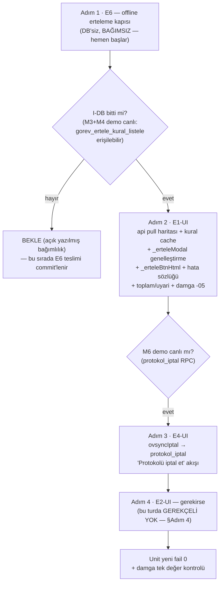

# plan-ui — I-UI kulvarı: E6 → E1-UI → E4-UI → E2-UI [KAPI G1]

> ROL: F2 planlayıcı (bu dosya) · Yürütücü: **I-UI tek yazıcı** (`js/ui.js`, `js/config.js`,
> `js/api.js`, `index.html`, `tests/unit/`) · 2026-09-25
> Zarf: `/home/melik/egesut-erp1/.ss/erteleme-genel-GOREV.md` (E6/E1-UI/E4-UI/E2-UI)
> Tasarım: `docs/plans/2026-09-25-cila-onarim/plan-erteleme-genel.md` §3.4 (UI spec), §8-6 (offline kabulü)
> Kardeş plan: `docs/plans/2026-09-25-erteleme/plan-db.md` (I-DB kulvarı; G1 matrisi orada §6)
> Çalışma ağacı: `/home/melik/.herdr/worktrees/egesut-erp1/ovysch-feature-erteleme` (dal `ovysch-feature-erteleme`, uç `1fac74a`)

## 0. Mevcut durum (plan yazımı anındaki kanıt tabanı — satırlar worktree ucundan)

- `_erteleModal` `js/ui.js:1108`; **tip kilidi** `js/ui.js:1110`
  (`t.gorev_tipi !== 'TOHUMLAMA_PLANLI'` → "Görev ertelenemez").
- `_tohErteleBtnHtml` `js/ui.js:1273` (yalnız TOHUMLAMA_PLANLI kartı; OVSYNC_BASLAT
  kartında [Başlat] yanında `js/ui.js:1380`).
- `ovsyncIptal` `js/ui.js:1302` — × butonları `js/ui.js:1268`, `:2094`, `:2096`; bugün
  yalnız `gorev_log` PATCH'liyor, `protokol_instance` aktif kalıyor.
- **E0 UI eldedir, DOKUNMA — yalnız entegre et**: `caseKalanGunleriKaydir`
  `js/ui.js:7709` (`rpc('vaka_kalan_gunleri_kaydir')` :7722) + `cdKaydirBtnGuncelle`
  `js/ui.js:7621-7627` — **online/offline event dinleyicileriyle görünürlük ZATEN hazır
  desen** (E6 bunu genelleştirir).
- `PG_HATA_SOZLUGU` `js/config.js:183`; `pencereYuvarla` `js/config.js:203` (DB aynası,
  birim testli); `RPC_TABLES` `js/api.js:293` (invariant: her değer dolu dizi; pull istemeyen
  RPC haritaya girmez — :322); `RPC_MAP` `js/ui.js:9629` (offline kuyruk replay);
  `rpcOptimistic` online guard `js/api.js:501-506`.
- `?v=` damgası: 26 referans, tek değer `20260925-04` → kulvar **`20260925-05`**'e yükseltir.
- Unit: `tests/unit/erteleme-kaydir-ui.test.js` (E0 sabitleri), `tests/unit/api.test.js`
  (SMELL-002 izleme adayı), `tests/unit/config.test.js` (sözlük/pencere).
- **`js/ui.js` gitnexus indeksinde YOK (>512KB)** → ui.js araştırması grep/freetext ile;
  diğer dosyalar için LSP/gitnexus kullanılabilir.

## 1. Bağlayıcı ortak kurallar (her adımda — özet; tam çekirdek plan-db.md §1)

- **PROD YASAK**; bu kulvar DB YAZMAZ (demo canlı RPC'ler yalnız kabul smoke'ında çağrılır —
  opsiyonel, BEGIN…ROLLBACK).
- gitnexus `impact` JS sembol değişikliği ÖNCESİ (ui.js indekste yok → grep); commit ÖNCESİ
  `detect_changes`.
- Kırıntı: `/home/melik/egesut-erp1/.crumbs/erteleme-genel.jsonl` tek satır JSON —
  `role:"worker"`, `session:"erteleme-genel/i-ui"`, `workspace:"erteleme-genel"`.
- Unit: `NODE_PATH=/home/melik/egesut-erp1/node_modules npm run test:unit` — baz
  **1132/1135** (bilinen 3: bc-tarih ×2, LUNA-3); yeni fail 0.
- Commit disiplini: `git status` + `git diff --cached --stat` sahiplik doğrulaması;
  `git config user.*` YAZMA; push/merge YOK. Playwright KOŞMA. AGENTS/CLAUDE dokunma.
  Demo sahip şifresine dokunma. Alt-ajan yok.
- **`?v=` damgası TEK DEĞER kuralı**: 26 referansın tamamı her zaman aynı değeri taşır
  (damga-koruma testleri); kulvar hedefi `20260925-05`.
- **JS'e erteleme kural kopyası YAZILMAZ** — kural canlı RPC'den okunur (cache).

## 2. Kulvar diyagramı (DB bağımlılığı açık)

## 3. Adımlar (sıralı; her adım E-etiketli + kendi kabul ölçütü)

### Adım 1 — E6: offline erteleme kapısı (DB'siz, bağımsız — ilk adım)

**Sahip kararı S7 (bağlayıcı):** erteleme/kaydırma butonları `navigator.onLine === false`
iken GİZLİ; yine de tetiklenirse **"İnternet yok — erteleme yapılamadı"** toast'u +
console log; **RPC ÇAĞRILMAZ**.

- 1a. **Yüzey envanteri** (grep; hepsi kapsanır):
  - E0 "Kalan günleri kaydır" butonu + `cdKaydirSheetHtml` içindeki +N butonları
    (`js/ui.js:7631-7638`) — `cdKaydirBtnGuncelle` deseni zaten online/offline dinliyor;
  - `_tohErteleBtnHtml` ürünü [🗓️ Ertele] butonu (`js/ui.js:1273`);
  - `_erteleModal`/`_erteleKaydet` ve `caseKalanGunleriKaydir` çağrı girişleri
    (render sonrası bağlantı düşmesi yarışı için giriş guard'ı).
- 1b. Ortak yardımcı (pattern reuse — `cdKaydirBtnGuncelle` üretimi): tek
  `_ertelemeOnline()` guard + buton üretimlerinde ortak görünürlük koşulu; yeni genel
  buton (Adım 2'de `_erteleBtnHtml`) doğrudan bu koşulla doğar.
- 1c. Davranış: offline → buton çizilmez/gizlenir (`online`/`offline` event'leriyle
  güncellenir); tetiklenirse → `toast('İnternet yok — erteleme yapılamadı', true)` +
  `console.warn('[erteleme] offline — rpc çağrılmadı', …)`; `rpc()` çağrısı OLMADAN erken
  çıkış (`caseKalanGunleriKaydir` ve erteleme kaydet yollarının girişinde).
  Not: `rpcOptimistic`'in genel guard'ı (`js/api.js:501-506`) yeterli DEĞİL — erteleme
  yolları `rpc()`'yi direkt çağırıyor; E6 guard'ı bu yollarda açık olmalı.
- 1d. **Kural cache'i offline'da eski kalabilir** (plan-erteleme-genel §8-6 kabulü) —
  kabul edilir; AMA buton görünürlüğü offline'da yine gizli.
- 1e. **Unit** — `tests/unit/erteleme-offline-ui.test.js` (ya da erteleme-kaydir-ui
  genişletmesi): `navigator.onLine = false` stub (before/after restore) ile:
  (a) kart HTML'inde erteleme/kaydırma butonu ÜRETİLMEZ; (b) `caseKalanGunleriKaydir(1)`
  çağrısı → rpc mock **0 çağrı** + toast çağrıldı + console kaydı atıldı; (c) kontrol:
  `onLine = true` → buton üretilir.
- 1f. Damga: js değişti → `?v=` `20260925-04` → **`20260925-05`** (tek değer, 26 referans).
- 1g. gitnexus `impact` + `detect_changes` + kırıntı + commit.

**Kabul ölçütü (zarf E6):** unit (`onLine=false` stub) kanıtlıyor: buton gizli + tetiklenirse
toast/log + RPC çağrılmaz; yeni fail 0; damga tek değer.

### Adım 2 — E1-UI: genel erteleme UI (ÖNKOŞUL: I-DB M3+M4 demo canlı)

**Önkoşül kontrolü (açık):** `gorev_ertele_kural_listele` demo'da authenticated erişimi
VAR + `gorev_ertele` RPC canlı — yoksa BEKLE (diyagram §2).

- 2a. **api.js pull haritası** (bağlayıcı: RPC_TABLES↔RPC_MAP senkron — SMELL-002'ye düşme):
  - `RPC_TABLES`'a `gorev_ertele: ['gorev_log','islem_log']` (`tohumlama_gorev_ertele`
    deseni, `js/api.js:321`);
  - `gorev_ertele_kural_listele` **salt-okuma** → pull zincirinde çekilip state cache'e
    yazılır (`ovsync_baslat_uyarilari` deseni `js/ui.js:467`/`:1333` — rpc() çağrısı +
    cache; RPC_TABLES invariant'ı `js/api.js:322-323` gereği pull istemeyen RPC haritaya
    girmez, RPC_MAP'e de girmez çünkü erteleme **online-only**'dir);
  - **SMELL-002 denetimi**: `gorev_ertele` RPC_TABLES'ta VAR + kuyruk-dışı (online-only)
    gerekçesi unit testle sabitlenir (`api.test.js` tutarlılık kontrolü eklenir ya da yeni
    test) — iki haritadan yalnız birine eklenip sessiz drift YOK kanıtlanır.
- 2b. **`_erteleModal` genelleştirme** (`js/ui.js:1108-1110` kilidi kalkar):
  - `ertelenebilir` kontrolü kural cache'den (JS'e tip listesi KOPYALANMAZ); f/kayıtsız
    tip → aynı "Görev ertelenemez" toast'u (erken çıkış korunur);
  - başlık tipten türkçeleşir ("Görevi Ertele");
  - **pencere önizleme YALNIZ `pencere_kurali='tohumlama'`** tiplerinde `pencereYuvarla`
    ile (`js/config.js:203` aynası olduğu gibi); diğer tiplerde verilen saat olduğu gibi
    gösterilir;
  - `_erteleKaydet` → `rpc('gorev_ertele', {p_gorev_id, p_yeni_tarih, p_yeni_saat})`.
- 2c. **`toplam_erteleme_gun` + `uyari` gösterimi (D18)**: mevcut desen `js/ui.js:1159`
  (tohumlama için zaten var) genel RPC cevabına bağlanır — her erteleme sonucunda gösterilir.
- 2d. **`_erteleBtnHtml(t)` genel buton**: kural `ertelenebilir` tipteki **AÇIK** görev
  kartlarına çizilir; **TEDAVI_GUN/TEDAVI_SEANS kartına ÇİZİLMEZ** (kural f — cache'den);
  OVSYNC_BASLAT kartında [Başlat] yanında (`js/ui.js:1380` deseni); E6 offline koşuluyla
  doğar; `_tohErteleBtnHtml` bu genel üreticiye iner (eski adı çağıran noktalar güncellenir).
- 2e. **`PG_HATA_SOZLUGU` kayıtları** (`js/config.js:183`; sözlüğün kod/alt-tip eşleşme
  mekanizması canlı koddan doğrulanır — iki nokta ayrımı): `GOREV_ERTELENEMEZ` alt
  tipleri **`TIP_ERTELENEMEZ`, `GOREV_ACIK_DEGIL`, `GOREV_BULUNAMADI`, `MAX_ASIM`** +
  **`GECMIS_TARIH`** türkçe mesajları (jenerik metne düşmezler).
- 2f. **`?v=` damga TEK DEĞER → `20260925-05`** (Adım 1'de yükseltilmemişse burada;
  yükseltilmişse tek değer DOĞRULANIR — 26 referans aynı değer).
- 2g. **Unit** — `tests/unit/erteleme-genel-ui.test.js`:
  - kural cache'ten tip açılımı: t tipi → butonlu; f tipi (`TEDAVI_GUN`/`TEDAVI_SEANS`)
    → butonsuz; **kayıtsız tip → butonsuz** (fail-closed ayna);
  - pencere önizlemesi yalnız `pencere_kurali='tohumlama'` tiplerinde;
  - hata sözlüğü eşleşmeleri (4 alt tip + GECMIS_TARIH);
  - `toplam_erteleme_gun`/`uyari` gösterimi;
  - api tutarlılık (2a SMELL-002 denetimi).
- 2h. impact + detect_changes + kırıntı + commit.

**Kabul ölçütü:** kural yalnız RPC/cache'den (kod incelemesinde JS'te tip kopyası YOK);
f tiplerde buton yok; pencere önizleme koşullu; hata sözlüğü kayıtları eşleşiyor; damga tek
değer ≥ `20260925-05`; unit yeni fail 0.

### Adım 3 — E4-UI: `ovsyncIptal` → `protokol_iptal` (ÖNKOŞUL: M6 demo canlı)

**Önkoşül kontrolü (açık):** `protokol_iptal(p_vaka_id, p_yeniden_baslat, p_not)` demo'da
canlı (I-DB Adım 5 teslimi).

- 3a. `ovsyncIptal` (`js/ui.js:1302`) bugünkü `gorev_log` PATCH yolundan yeni RPC'ye bağlanır:
  - akış: × / "Protokolü iptal et" → **onay** (iptal edilecekler özeti: açık gün/seans
    sayısı + stok iadesi bilgisi) → opsiyonel **"Yeniden başlat görevi oluştur"**
    (`p_yeniden_baslat`) → `rpc('protokol_iptal', {p_vaka_id, p_yeniden_baslat, p_not})` →
    sonuç toast + etkilenen tabloların pull'ı.
  - vaka bağlamı: × butonunun göründüğü noktaların hangisi protokol vakasına bağlı olduğu
    grep ile kesinleştirilir (`js/ui.js:1268` OVSYNC_BASLAT kartı; `:2094`/`:2096` satır
    butonları); protokol dışı kalmak isteyen yüzey varsa gerekçesiyle ayrılır ve eski
    davranışta bırakılır (kırıntı `type:"decision"`).
- 3b. `RPC_TABLES`'a `protokol_iptal` pull seti (etkilenen tablolar canlı TABLES
  sözlüğünden: `gorev_log`, `cases`, `treatment_days`, `treatment_day_uygulamalar`,
  `stok`, `stok_hareket`, `islem_log`…) — SMELL-002 denetimi aynı (online-only gerekçesi).
- 3c. Offline: iptal akışı da E6 guard'ına girer (online-only).
- 3d. **Unit**: onay akışı state'i + `rpc` mock çağrım parametreleri
  (`p_yeniden_baslat` true/false ayrı vaka) + başarılı çağrı sonrası pull tetiklenmesi;
  eski `gorev_log` PATCH yolunun erteleme-iptal akışından kalktığı assert'ü.
- 3e. impact + detect_changes + kırıntı + commit; damga tek değer kontrolü.

**Kabul ölçütü:** × butonu `rpc('protokol_iptal')`'i çağırıyor (mock kanıtı); onay →
iptal → isteğe bağlı yeniden başlat akışı tam; eski PATCH yolu protokol iptalinde yok;
unit yeni fail 0.

### Adım 4 — E2-UI: gerekirse (bu turda GEREKÇELİ YOK)

**Gerekçe (G1 şartı — "planda yoksa NİYE yok"):** RA senaryosu (arastirma-e2-e3.md §E2/3)
mevcut UI yüzeyleriyle uçtan uca kapanıyor: hızlı uygulama (bağımsız PG) + E0 "Kalan
günleri kaydır" butonu + TAI erteleme butonu (Adım 2'de genel `gorev_ertele`'ye bağlanan).
**Yeni UI yüzeyi gerekmiyor; DB kulvarı (plan-db Adım 6) senaryoyu kanıtlar.**

- E2-UI'nin devreye gireceği "gerekirse" tetikleyicileri (sahip isterse, sonraki tur):
  1. `VWP_ICINDE`/`UYGUNSUZ` sessiz kırılma için bildirim yüzeyi (önerilen desen:
     `ovsync_baslat_uyarilari` rozet genişletmesi);
  2. tedavi bitişi ↔ TAI senkron bildirimi.
- Bunlar v1 kapsam DIŞI; DONE dosyasında `sahip_kapisi` açık listesine girer (plan-db §7).

**Kabul ölçütü:** gerekçeli YOK kararı kırıntıda + DONE'da görünür; sahibin yürüyüş
checklist'ine E2 senaryosunun UI adımları (mevcut butonlarla) eklenmiş liste olarak yazılır.

## 4. Kulvar çıkışı (G3'ye giriş)

- Unit: baz 1132/1135 + **yeni fail 0** (G3).
- Damga TEK DEĞER ≥ `20260925-05` — tüm referanslar aynı değerde (damga-koruma testleri
  geçer).
- Kırıntı `type:"gate"`: I-UI teslim özeti (adım başına commit + kanıt yeri).
- Sahibin tarayıcı yürüyüşü (Playwright YASAK — sahibin Tur-2 checklist'ine madde olarak):
  üç farklı kategoriden erteleme + bir ret toast'u + offline buton gizliliği + protokol
  iptal akışı.

## 5. KAPI G1 çapraz referansı

Tam E1-E7 matrisi `docs/plans/2026-09-25-erteleme/plan-db.md` §6'dadır; bu plan E6, E1-UI,
E4-UI, E2-UI adımlarını taşır. E3/E5/E7'nin UI adımı yok — gerekçeleri plan-db §6'da.
