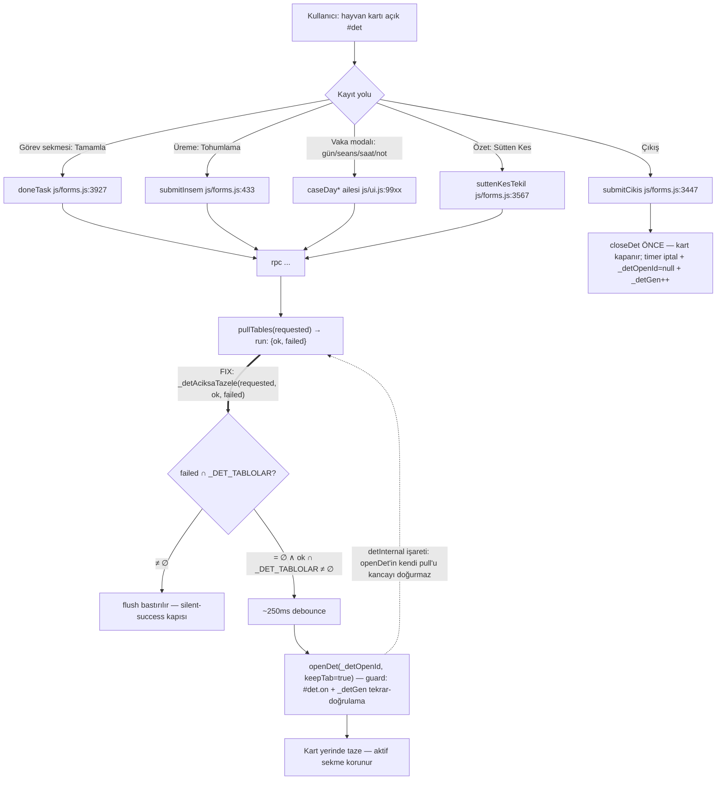

# SPEC — Açık Hayvan Kartı Tazeleme Sözleşmesi (2026-09-29, v6)

Durum: **v6** — v1 sahip onaylı tasarım; R1 (ss-lead-codex, luna/max): 0C/4H/4M/2L → v2;
R2: 0C/1H/3M/1L → v3; R3: 0C/0H/1M/0L → v4; R4: 0C/0H/2M/0L → v5; R5: 0C/0H/1M/0L → v6 (§10).
Döngü sahibi talimatı: luna KABUL'e kadar aynı oturum; RED → dur (R3/R4/R5 RED değildi).
Teslim notu: `docs/plans/` `.gitignore:156` kapsamında — commit'te `git add -f` gerekir.
Kaynak: sahip brainstorm turu 2026-09-29 (§8) + kod denetimi + R1/R2 review raporları
(`runs/2026-09-29-spec-review-lead-codex/`). Dal: minik-fixler @b507645.
Implementasyon mimar dışı kolda (root/lead → glmf worker).

## 1. Problem ve kanıt özeti

Kart (`#det`) açıkken yapılan kayıttan sonra kart bayat kalıyor; kullanıcı geri-ileri yaparak
`openDet`'i yeniden koşturmak zorunda kalıyor.

- Kartın tek giriş/orkestrator yolu `openDet(id, keepTab)` — `js/ui.js:4930-4999` (alt sekme
  çizimleri `_det*` yardımcılarında). Veriyi IndexedDB'den okur; tazeliği kendi
  `pullTables`'inden alır (`js/ui.js:4953`). `keepTab=true` yerinde tazeleme yapar —
  `history.pushState` yalnız `!keepTab` dalında (`js/ui.js:4934`).
- Sayfa listeleri `renderFromLocal` (`js/app.js:231-244`) ile çizilir; `#det` hiçbir dalda yok.
  `pullTables` (`js/api.js:513-518`) veri katmanı primitive'idir; `renderSafe` zinciri
  çağıranlara göredir (`js/api.js:496-499`) — karta **pullTables'a** bağlanır.
- Sonuç: kart tazeleme yol başına elle bırakılmış. 30+ kayıt yolundan 6'sı `openDet` çağırıyor,
  ~20'si unutmuş (doneTask `js/forms.js:3935-3939` dahil), 4'ü kartı `closeDet()` ile kapatarak
  kaçıyor (2'si ölü kod → `BUGS.md` BUG-DEAD-TOHUMLANABILIR-ONAY).

## 2. Sözleşme (davranış kuralları)

- **R1** — Kart açıkken, kartın okuma evrenindeki bir tablo veri katmanına **başarıyla**
  tazelendiyse kart **aktif sekmeyi koruyarak yerinde yeniden çizilir** (`openDet(_detOpenId, true)`).
- **R2** — Tetik kaynağı ayrımı yok: kullanıcının kendi kaydı, senkron, realtime-handler'lı
  tablolarde başka cihaz değişikliği, çevrimdışı→çevrimiçi toparlanma. *Kapsam notu (R1-H03):*
  bugün realtime `.on(...)` aboneliği sınırlıdır (`js/api.js:917-928`); abonelik OLMAYAN
  tablolarda başka-cihaz değişikliği yerel veriye hiç düşmez — R2 ancak "veri katmanına yerleşen
  değişiklik" kadar güçlüdür. Kanal aboneliğini genişletme bu spec'in dışıdır (§9).
- **R3** — Kayıt sonrası kart **kapanmaz**; aynı hayvanda güncel veriyle kalır (sütten kesme
  dahil: `suttenKesTekil`'in `closeDet()`'i `js/forms.js:3567`'de kaldırılır).
- **R4** — Tek istisna **çıkış kaydı** (`submitCikis`, `js/forms.js:3437-3448`): kartı kapatmaya
  devam eder (closeDet pull'dan ÖNCE çalışır → kanca kartı kapalı görür, yeniden açmaz).
- **R5** — Kart kapalıyken yardımcı ilk kontrolle çıkar; fetch/render maliyeti sıfır.
- **R6** — Kartın okuma evreni DIŞINDAKİ tablolar (ör. `protokol_ayar`) kartı çizdirmez.
  *Not (R1-H01): `stok` kart tarafından okunduğu için evren İÇİNDEDİR (zenginleştirme).*

## 3. Mekanizma — Y1: veri katmanı kancası

1. **Kanca kontratı (R2-H01):** `pullTables` run'u tamamlandığında kancaya **üçlü** taşınır:
   `(requestedTables, okTables, failedTables)`. `_pullTablesNow` tablo hatasını reject etmez
   (`js/api.js:753-767`, `hataSayisi` uyarır ve resolve eder) — bu yüzden başarısız set ayrıca
   toplanır ve kancaya aktarılır (API değişikliği geriye dönük uyumlu: mevcut çağırıcılar
   `pullTables(tables)` imzasını kullanmaya devam eder).
   Çağrı: `window._detAciksaTazele?.(requested, ok, failed)` — api.js DOM'a dokunmaz, gevşek bağ.
   - **Bastırma predicate'i:** `failedTables ∩ _DET_TABLOLAR ≠ ∅` → flush YOK (bayat IDB ile
     çizim = silent-success; "ilgisiz tablonun hatası davranışı değiştirmez" buradan gelir).
   - **Çizim predicate'i:** `okTables ∩ _DET_TABLOLAR ≠ ∅ ∧ bastırma yok`.
2. **`js/ui.js` `_detAciksaTazele(requested, ok, failed)`**:
   - `#det` açık değilse çık; run **içsel işaretli**yse çık (madde 4 — openDet'in kendi pull'u);
   - predicate'ler geçiyorsa debounce ~250 ms (`_DET_TAZELE_DEBOUNCE_MS`), **trailing-edge**:
     nitelikli yeni pull timer'ı yeniden başlatır; ara çizim yalnız >250 ms boşluklu pull'lerde
     doğar. **Mekanik cap (R4-M02/R5-M01):** sayaç **`_detEpoch` (kartın açık dönemi = batch
     sınırı; §3.4'te `_detGen`'den AYRI tanımlı)** başına tutulur — `_detAraSayac ≤2`; yerinde
     tazeleme (`keepTab=true`) epoch'u DEĞİŞTİRMEZ, sayaç dolunca sonraki nitelikli pull'lar
     timer'ı yeniden başlatır AMA ara çizim yapmaz — yalnız son trailing timer nihai çizimi
     getirir. Sonuç: `openDet` ≤ (2 ara + 1 nihai) = **≤3/_detEpoch, mekanik garanti**
     (nitelikli pull sayısından ve ara çizimlerin kendisinin `openDet` olmasından bağımsız);
   - **timer callback guard'ı (R1-H04):** süre dolunca TEKRAR `#det.on` + güncel `_detGen`
     doğrulanır; kart kapalıysa/generation geçiştiyse çizilmez.
3. **`_DET_TABLOLAR`** (tek sabit; kartın GERÇEK okuma grafiğinden — R1-H01):
   `openDet` pull+getData evreni: `hayvanlar, cases, diseases, dogum, gorev_log, tohumlama,
   kizginlik_log, uygulama_log, vaccination_log, vaccines, drugs, drug_products, drug_classes`
   **+ `_detRenderGecmis → _gecmisCollectSources` evreni** (`js/ui.js:6420-6435`):
   `islem_log, stok_hareket, treatment_days, drug_administrations, protokol_instance, stok`.
   Sabit kaynaklarıyla yorum satırında tanımlanır; openDet okuma grafiği değişirse sabit
   birlikte güncellenir.
4. **Epoch/Generation sahipliği — TAM protokol (R2-M01, R2-M02, R5-M01):**
   - **`_detGen` (devam-sahiplik token'ı):** `openDet` girişinde `const myGen = ++_detGen` —
     HER çağrıda artar (ara tazelemeler dahil); **tüm async devam noktalarında** (pull sonrası,
     `Promise.all` sonrası, her DOM yazım bloğu öncesi) `myGen === _detGen` değilse çık. Bu,
     **aynı-ID close/reopen**'i de kapsar: `openDet(A)` gen-1 çekilirken kapat + yeniden
     `openDet(A)` gen-2 → gen-1'in geç devamı gen-2 DOM'unu EZEMEZ (mevcut
     `if(_detOpenId!==id)` kontrolleri yalnız ham ID karşılaştırır, `js/ui.js:4954/:4969` —
     yetersiz).
   - **`_detEpoch` (kart dönemi — batch/cap sınırı; `_detGen`'den AYRI):** yalnız
     (i) `closeDet()` ve (ii) yeni açılış (`openDet` çağrısı kart KAPALIYken ya da farklı
     hayvana açılırken — `keepTab=false` yolu) artırır. **Yerinde tazeleme (`keepTab=true`)
     epoch'u DEĞİŞTİRMEZ** — ara çizim sayacı `_detAraSayac` bu yüzden kartın açık dönemi
     boyunca korunur (R5-M01: token'ın her çağrıda artması sayaç bağlamını sıfırlıyordu; iki
     kavram ayrıldı). Epoch değişince sayaç sıfırlanır.
   - `closeDet()`: bekleyen timer'ı iptal eder, `_detOpenId`'yi temizler, `_detGen++` ile
     devamları geçersizleştirir, `_detEpoch++` ile dönemi kapatır (bugün hiçbirini yapmıyor —
     `js/ui.js:5005-5014`).
   - Timer callback: `#det.on` + `myGen === _detGen` (+ epoch aynı) doğrulamasıyla çizer.
   - **İçsel-pull işareti (R2-M02):** `pullTables(tables, opts?)` opsiyonel ikinci argüman alır;
     `openDet` kendi pull'unu `opts={detInternal:true}` ile çağırır. Kanca YALNIZ
     `detInternal` işaretli run'ları yok sayar — **dış pull hiçbir koşulda bastırılmaz**
     (global bayrağa dönüş yok); içsel pull sırasında tamamlanan dış run kendi flush'ını planlar.

## 4. Değişiklik envanteri

| Dosya | Değişiklik |
|---|---|
| `js/api.js` | `pullTables(tables, opts?)`: run sonunda üçlü + işaretle kancaya gevşek çağrı; `_pullTablesNow` failed-set toplar |
| `js/ui.js` | `_detAciksaTazele(requested, ok, failed)` + `_DET_TABLOLAR` + `_DET_TAZELE_DEBOUNCE_MS`; `openDet`: `myGen` devam-garmları + içsel-pull işareti; `closeDet`: timer iptali + `_detOpenId` temizliği + `_detGen++` |
| `js/forms.js` | Çifte çizim temizliği: tohSonuc (`:4412-4418`) ve _hayvanHizliUygulaKaydet (`js/ui.js:3998-4003`) direct tazelemeleri kalkar; abortKaydet (`:3354-3357`)/hayvanNotEkle (`:3377-3382`)/submitAnimal (`:161-165`)/submitCase (`:838-859`) kart-zaten-açıkken `keepTab=true` kullanır. `suttenKesTekil` (`:3567`) `closeDet()` kaldırır (R3). `submitCikis` dokunulmaz (R4) |
| `index.html` | `?v=` damgası bump (tek değer; damga testleri güncellenir) |

## 5. Kenar durumları ve kabul edilmiş tavizler

- Kart üstünde modal açıkken tazeleme yalnız alttaki kartı yeniden çizer; modala dokunmaz.
- Başka cihazdan hayvan çıkışı: kart "Bulunamadı" der — kabul.
- **Kısmi pull hatası (R1-H02/R2-H01):** üçlü kontrat — kesişen tablo başarısızsa flush
  bastırılır; ilgisiz tablonun hatası davranışı değiştirmez. Tam red'de kanca doğal olarak
  çağrılmaz.
- **Debounce tek-fluş garantisi yok (R1-M02):** async zincir uzarsa ara çizim olabilir —
  **≤2 mekanik cap** (§3.2); nihai doğruluk esas (A7).
- Yeniden çizim sekme içi kaydırma konumunu sıfırlayabilir — kabul edilmiş taviz (sahip,
  2026-09-29). İyileştirme takip maddesidir.
- **Performans (R2-L01 → A16):** ölçüm-eşik sözleşmesi §6/A16'de; bütçe aşımı FAIL sayılır.

## 6. Kabul ölçütleri

- **A1** — Kart, Görev sekmesindeyken görev tamamlama: **bağımsız oracle** — pull+flush
  sonrası özet/çip değerleri güncel VE test kancası `openDet` çağrısını sayar (≥1). Satır
  kaybolması tek başına YETERLİ DEĞİL (R1-M04: doneTask satırı zaten kendisi siliyor).
- **A2** — Üreme sekmesinde tohumlama kaydı: hedef hayvan + yeni kayıt ID fixture'ı ile,
  flush sonrası Üreme listesinde görünür.
- **A3** — Buzağı kartında sütten kesme: kart AÇIK kalır (`.on` korunur), grup/padok güncel.
- **A4** — Vaka modalı ailesi — adlandırılmış evren (R1-M03): `caseDayTamamla`
  (`js/ui.js:9924-9934`), `caseDaySaatKaydet` (`:9905-9913`), `caseDayNotKaydet`
  (`:9974-9982`), `seansTamamla` (`js/forms.js:5144-5161`), `seansSilTekil`/`seansDuzenleKaydet`,
  `hstIlacEkle/sil`: modal kapanınca alttaki kart taze.
- **A5** — Çıkış kaydı: kart kapanır; pull sonrası yeniden AÇILMAZ (R4 sıra kanıtı).
- **A6** — Epoch/Generation/döngü koruması — **altı senaryo**: (a) openDet iç pull'unda
  kancadan flush doğmaz (detInternal); (b) içsel pull sırasında tamamlanan DIŞ pull kaybolmaz
  — kendi flush'ı planlanır; (c) eşzamanlı `openDet(A)`→`openDet(B)`: yalnız B çizilir;
  (d) **aynı-ID close/reopen** (R2-M01): gen-1 devamı gen-2 DOM'unu ezmez; (e) stale
  `_detOpenId` çizilmez; (f) **epoch/cap ayrımı** (R5-M01): yerinde tazeleme sayaç bağlamını
  sıfırlamaz; kapat-yeniden-aç epoch'u değiştirir ve sayacı sıfırlar; uzun nitelikli-pull
  serisinde (0/300/600/900 ms) `openDet` toplamı ≤3/epoch kalır.
- **A7** — Nihai doğruluk + sınırlı ara çizim: zincir sonrası nihai kart durumu doğru; ara
  çizim ≤2 (**mekanik cap, `_detEpoch` başına** — §3.2/§3.4) ve her ara çizim TAM `openDet`'tir
  (kendi 10 tablo pull'u dahil — R3-M01); `openDet` ≤3/epoch (**mekanik garanti** — R4-M02/R5-M01).
  **Nihai çizim gecikmesi: son başarılı pull'dan tekil ≤1.5 sn** — A16 ile AYNI ölçüm/eşik (R4-M01).
- **A8** — İlgisiz pull (`protokol_ayar` gibi evren-dışı) kart çizdirmez (R6; `stok` evren İÇİNDE).
- **A9** — Unit tabanı — **pinned komut (kelimesi kelimesine; `--prefix` YASAK — R2-M03)**:
  `cd /home/melik/.herdr/worktrees/egesut-erp1/minik-fixler && NODE_PATH=/home/melik/egesut-erp1/node_modules npm run test:unit`
  Beklenen: **1231 test / 1228 pass / 3 fail / 0 skipped**; bilinen 3 fail: LUNA-3 canlı-demo
  şema kapısı + 2 bc-tarih tarih-bağımlı borut (Ekim-2026 rotu, DEBT-BC-TARIH).
  [LOCAL-MEASURED 2026-09-29, bu komutla: 1231/1228/3. `--prefix`'li varyant 1057/1028/29
  ölçtü (R2) — o varyant KULLANILMAZ.] **Geçerlilik şartı:** `ℹ tests` 1231 bandında VE
  `fast-check` dahil tüm modüller yüklenmiş; değilse ölçüm GEÇERSİZ (env-mismatch) — sayı
  yazılmaz, ortam düzeltilir. Ölçüm çıktısı artifact'a yazılır:
  `runs/<iş>-unit-baseline-<sha>.txt`. Yeni testler kırmızı-önce.
- **A10** — `?v=` damgası tek değer bump (mevcut `20260927-09` → yeni); grep ile tekil değer.
- **A11** — UI kapısı (glmf-max): madde başına PASS/FAIL + kanıt dosya yolu (ekran/DOM/konsol);
  liste = A1-A5 + A8 demo senaryoları; hepsi PASS olmadan sahibe demo yok.
- **A12** — History: `keepTab=true` flush `history.length`/popstate entry üretmez; 6 yolun
  İLK açış semantiği (`keepTab=false`) korunur.
- **A13** — Offline kuyruk: `flushPendingDone` (`js/ui.js:899-943`) online dönüşte bekleyenleri
  işlerken açık kart tazelenir.
- **A14** — Kısmi hata: kesişen tablo fetch hatası flush'ı bastırır (üçlü kontrat testi);
  ilgisiz tablo hatası davranışı bozmaz.
- **A15** — Lifecycle: flush zamanlayıcısı söndükten sonra `closeDet` kartı yeniden AÇMAZ;
  timer iptali + `_detOpenId` temizliği + `_detGen` invalidation kanıtı.
- **A16** — Performans kapısı (R2-L01): `_detEpoch` başına `openDet` ≤3 (1 nihai + ≤2 ara —
  §3.2/§3.4 mekanik cap; A7 ile aynı sözleşme — R3-M01/R4-M02/R5-M01); **ağ isteği üst sınırı
  = ≤3 pull seti** (her set 10 tablo; kuyruk birleştirirse azalır). **Gecikme ölçümü A7 ile
  AYNI metrik/eşiktir (R4-M01): tekil üst sınır ≤1.5 sn VE istatistiksel bütçe p95 ≤1.5 sn —
  tekil aşım her iki kapıda da FAIL.** Demo ortamı: yerel sunucu + demo DB + standart ağ; ölçüm
  A11 turunda istek sayısı ve zaman damgalarıyla toplanır. Eşik aşımı = FAIL → optimizasyon
  takip maddesi (hedefli sekme çizimi/evren daraltma); v1 kapsamı büyümez.

**Demo tarayıcı yürüyüş listesi** = A1, A2, A3, A4, A5, A8 (sahip yürüyüşü aynı listeden).

## 7. Akış haritası

## 8. Sahip kararları (2026-09-29, bu oturum)

1. Tazeleme kuralı: **veri her değişince** (kendi eylemi + arka plan senkronu dahil).
2. Kayıt sonrası hedef: **yerinde tazele** (kart aynı hayvanda kalır; sütten kesme dahil).
3. Mekanizma: **Y1 veri katmanı kancası** (pullTables sonu; guard + debounce + tablo kesişimi).
4. Çıkış kaydı kartı kapatmaya devam eder.
5. Ölü kod (submitTohumOnayla/submitTohumErtele/openTohumErtele) kapsam dışı;
   `/home/melik/egesut-erp1/BUGS.md`'ye işlendi (commit sahip/root kapısı).
6. Review koltuğu: istek "ss-mimar-codex luna max" idi; K3 rol-pin ölçümüyle mimar-codex yalnız
   sol/medium koşabildiği için sahip **ss-lead-codex (gpt-5.6-luna/max)**'i seçti.
7. Review döngüsü: luna KABUL verene kadar **aynı codex oturumunda** devam; 3. review'da RED
   gelirse dur (sahip, 2026-09-29).

## 9. Kapsam dışı

- Sekme içi kaydırma konumunun korunması (v2+ adayı).
- "Sıradaki hayvana geç" kısayolu (seri tohumlama akışı) — istenirse ayrı spec.
- Ölü kod/ölü RPC temizliği (BUGS.md kaydından yürür).
- `pullTables(['tedavi'])` fetcher'sız sessiz no-op — ayrı kalem (silent-success deseni).
- **Realtime kanal abonelik eksikliği (R1-H03):** `cases`, `treatment_days` vb. için `.on(...)`
  handler'ları yok (`js/api.js:917-928`) — başka-cihaz değişikliklerinin kartı tazelemesi
  ancak kanal genişletilince tam olur; ayrı takip maddesi.

## 10. Review kaydı (2026-09-29)

**R1** — ss-lead-codex (gpt-5.6-luna/max): DÜZELTME-İSTE 0C/4H/4M/2L → v2 (tablo evreni
H-01, başarılı-tablo seti H-02, R2 skopu H-03, timer guard H-04; M-01..M-04; L-01/L-02).
**R2** — aynı oturum: DÜZELTME-İSTE 0C/1H/3M/1L → v3:
- **R2-H01** (silent-success): okTables-only kontrat failed-kesişimini göremez → **üçlü
  kontrat** `(requested, ok, failed)` + açık bastırma/çizim predicate'leri (§3.1). KAPANDI.
- **R2-M01** (race-lifecycle): generation yalnız kanca/timer'daydı; aynı-ID close/reopen'de
  eski `openDet` devamı yeni DOM'u ezebilir → **myGen tüm devam noktalarında** + `closeDet`
  invalidation (§3.4). KAPANDI.
- **R2-M02** (race-lifecycle): içsel pull'un dış pulldan ayrımı tanımsızdı →
  **`detInternal` işareti** (opsiyonel `pullTables` arg'ı); dış pull asla bastırılmaz (§3.4). KAPANDI.
- **R2-M03** (env-mismatch): A9 "1228/3 LOCAL-MEASURED" bu checkout'ta `--prefix` varyantıyla
  yeniden üretilemedi (luna ölçümü: 1057/1028/29 + fast-check eksik) → pinned komut kelimesi
  kelimesine netleştirildi (`--prefix` YASAK), **geçerlilik şartı + artifact zorunluluğu**
  eklendi (A9); mimar aynı gün cwd-içinde 1231/1228/3 ölçtü [LOCAL-MEASURED]. KAPANDI.
- **R2-L01** (unmeasured-claim): performans notu kapı değildi → **A16** ölçüm-eşik kapısı. KAPANDI.
- R2 ek notu: `docs/plans/` `.gitignore:156` — spec commit'inde `git add -f` (teslim kapısı).
**R3** — aynı oturum: DÜZELTME-İSTE 0C/0H/1M/0L → v4: **R3-M01** (scope-violation): A7'nin ara
`openDet` çizimleri (her biri 10 tablo çeker) A16'nın "1 pull seti" ağ üst sınırıyla
çelişiyordu → A7'de ara çizim tam-openDet olarak netleştirildi + trailing-edge debounce notu;
A16 üst sınırı **≤3 pull seti** (1 nihai + ≤2 ara) yapıldı — iki kapı artık aynı koşumda
birlikte tutarlı. A9 exact komutu luna tarafından bağımsız yeniden ölçüldü: 1231/1228/3,
fast-check yüklü [OBSERVED R3]. Rapor: `…-RAPOR-R3.md`.

**R4** — aynı oturum: DÜZELTME-İSTE 0C/0H/2M/0L → v5: **R4-M01** (scope-violation): A7 "≤1 sn"
ile A16 "p95 ≤1.5 sn" aynı gecikme metrikünde farklı PASS eşiği koyuyordu → **tek sözleşme**:
tekil üst sınır ≤1.5 sn = p95 eşiği; tekil aşım iki kapıda da FAIL. **R4-M02** (race-lifecycle):
trailing-edge debounce `openDet ≤3` üst sınırını mekanik garanti etmiyordu (0/300/600/900 ms
pull'leri 4 çizim üretebilirdi) → **generation-başına ara çizim sayacı ≤2** (sayaç dolunca
yalnız trailing timer çizer) = `openDet` ≤3/generation mekanik garanti; batch sınırı =
generation (kartın açık dönemi). Rapor: `…-RAPOR-R4.md`.

**R5** — aynı oturum: DÜZELTME-İSTE 0C/0H/1M/0L → v6: **R5-M01** (race-lifecycle): sayaç
epoch'u `_detGen` ile aynı kavramda tanımlanmıştı ve her ara `openDet` girişi `_detGen++`
yaptığından "kart dönemi başına ≤2" cap'i ara çizimle sıfırlanıyordu → **`_detEpoch` (kart
dönemi, cap/batch sınırı) ile `_detGen` (devam-sahiplik token'ı) AYRILDI**: epoch yalnız
closeDet/yeni açılışta artar, yerinde tazelemede değişmez; sayaç `_detAraSayac` epoch'a
bağlı; A6'ya (f) senaryosu eklendi. Rapor: `…-RAPOR-R5.md`.

Raporlar: `runs/2026-09-29-spec-review-lead-codex/…-RAPOR.md`, `…-RAPOR-R2.md`,
`…-RAPOR-R3.md`, `…-RAPOR-R4.md`, `…-RAPOR-R5.md`.
