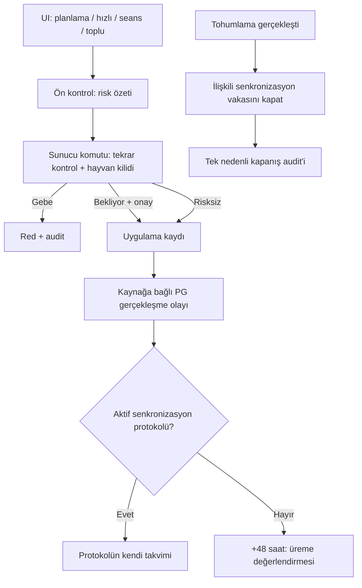

# EgeSüt ERP1 — Ovsynch / PG / Tohumlama Tasarım Review

**Tarih:** 2026-09-23  
**İncelenen sürüm:** `main`, merge `af7d012f4ec57f6bc61e3708bcd355c5d96e72f1`  
**Kaynak taslak:** [`docs/plans/2026-09-23-ovsync-pg-tohumlama-kurallari-design.md`](https://github.com/Meliksahtokur/egesut-erp1/blob/main/docs/plans/2026-09-23-ovsync-pg-tohumlama-kurallari-design.md)  
**Kapsam:** GitHub frontend ve migration kodları; canlı Supabase şema, fonksiyon, tetikleyici, katalog ve cron kayıtlarının salt-okunur incelemesi.  
**Sınır:** Kod çalıştırma, migration uygulama, test verisi yazma ve gerçek klinik kayıt değiştirme yapılmadı. Bu doküman bir *tasarım incelemesidir*, üretim kabul raporu değildir.

## 1. Sonuç

**Genel tasarım: 7/10.** Fikir ve saha ihtiyacına uyumlu; spesifikasyon yazımına başlanabilir, ancak doğrudan implementasyon planına dönüştürülmemeli. Önce klinik güvenlik, yazma yollarının birleştirilmesi, vaka–şablon kimliği ve doğum protokolü otoritesi için kararlar kayıt altına alınmalı.

| Alan | Puan | Gerekçe |
|---|---:|---|
| Problem tanımı / saha ihtiyacı | 9/10 | 121 vakası somut; sonraki seansların açık kalması gerçek bir yaşam döngüsü açığı. |
| İş kuralları ve UX | 8/10 | Kademeli uyarı, toplu özet, ayrı panel ve audit hedefi belirgin. |
| Mevcut kodla uyum | 7/10 | Yeniden kullanılabilir yapı var ama gerçek RPC zinciri ve yazma yüzeyleri taslaktan geniş. |
| Veri bütünlüğü / klinik güvenlik | 5/10 | UI ön kontrolü tek başına yeterli değil; 25 gün ve +48 saat kuralları yanlış genellenebilir. |
| Implementasyon hazırlığı | 5/10 | Transaction, idempotensi, kısmi toplu sonuç, geçmiş kayıt ve rollback eksik. |

### Korunması gerekenler

- Tohumlama, yalnız gerçek senkronizasyon vakasının kalan **planını** sonlandırmalı; mastit/ayak gibi bağımsız vakalara dokunmamalı.
- `Gebe` durumunda PG için standart uygulama ekranından geçilemeyen DB otoriteli güvenlik kapısı bulunmalı; ayrı yetkili klinik istisna akışı bu tasarım dışında tutulmalı.
- `Bekliyor` tohumlama için kullanıcının gerekçeli/onaylı işlem kaydı audit'te iz bırakmalı.
- Son buzağılama `dogum.tarih` üzerinden hesaplanmalı; `hayvanlar.dogum_tarihi` hayvanın kendi doğumudur.
- Saat hassas üreme görevleri panelde ayrı, kalıcı ve görünür bölümde bulunmalı.
- `CASE_CLOSED_BY_TOHUMLAMA` gibi neden kodları ayrı raporlanmalı.

## 2. Kanıtlanmış mevcut durum

| Bileşen | Gözlem | Kaynak |
|---|---|---|
| `tohumlama_kaydet` | Açık `TOHUMLAMA_PLANLI` görevlerini iptal/tamamlandı yapar; `cases` kapanışı yoktur. | [Migration](https://github.com/Meliksahtokur/egesut-erp1/blob/main/supabase/migrations/20260830000010_abort_vwp_penceresi.sql), canlı `pg_get_functiondef`. |
| Planlı tohumlama | `planli_tohumlama_kaydet`, içerden `tohumlama_kaydet` çağırır, sonra seçili görevin iptalini geri çevirip tamamlar. | Canlı `planli_tohumlama_kaydet`. |
| Vaka kapanışı | `close_case_with_remaining` kalan seans/ilaç/gün/görev ve stok hareketlerini işler; log tipi sabit `CASE_CLOSED_EARLY`. | Canlı fonksiyon ve [migration](https://github.com/Meliksahtokur/egesut-erp1/blob/main/supabase/migrations/20260730000001_sablon_tohumlama_opsiyonel_ve_yasam_dongusu.sql). |
| Şablon uygula | `tedavi_sablon_uygula` seansları açar; `tedavi_sablon_tohumlama_gorev_ekle` ayrı RPC'dir. | [forms.js](https://github.com/Meliksahtokur/egesut-erp1/blob/main/js/forms.js#L590-L630), canlı fonksiyonlar. |
| Şablon veri modeli | `cases` üzerinde `source_template_id` yok; Ovsynch şablonunda `gun_ofset=10`, `planned_time=10:00`. | Canlı şema ve şablon verisi. |
| PG katalogu | Dinoprost ve kloprostenol sodyum `drug_classes.class_name='Prostaglandinler'` altında; yalnız dinoprost `etken_kod='PG'`, kloprostenol `NULL`. | Canlı katalog ve `_etken_kod_bul`. |
| Doğum görevleri | Canlı `dogum_kaydet`: D0, D2, **D11**, D25, D53 E vitamini ve D58 kızgınlık takibi. | Canlı `dogum_kaydet`. |
| Scanner | Canlı `protokol_eksik_tara`: D0, D2, D25, **D39**, D53. | Canlı `protokol_eksik_tara`. |
| PG uygulama yolları | `hizli_uygulama`, `seans_tamamla`, `bulk_ilac`, protokol/görev tamamlaması ayrı yollar. | [ui.js](https://github.com/Meliksahtokur/egesut-erp1/blob/main/js/ui.js), canlı fonksiyonlar. |
| Toplu ilaç | `bulk_ilac` hayvan başına `TOPLU_ILAC` audit'i ve stok düşümü yapıyor; standart `uygulama_log` akışını kullanmıyor. | Canlı `bulk_ilac`. |
| Cron | Mevcut bakım/uzlaştırma işleri var; 50. gün Ovsynch job'ı henüz yok. | Canlı `cron.job` snapshot. |

**Örnek olay:** 121 küpeli hayvanın 2026-09-13 tarihli vakası canlı sorguda `active` olarak; 2026-09-17 tarihli Darius tohumlaması `Bekliyor` olarak görüldü. Bu, taslakta anlatılan ana tutarsızlığı destekliyor. Daha sonraki seansların tek tek klinik etkisi bu review'da bağımsız olarak doğrulanmadı; zigot kaybı bir şüphedir, kanıtlanmış sonuç değildir.

## 3. Bulgular — önem sırasıyla

### P0-01 — Güvenlik kontrolü yalnız formda ve tek RPC'de kalamaz

`hizli_uygulama` doğrudan `uygulama_log` yazar; `seans_tamamla` önceden planlanmış seansı uygular; `bulk_ilac` farklı kayıt davranışı gösterir. İlaç planının yaratılması, ilaç uygulanması değildir. `fn_dinle_drug_admin` INSERT anında dinleme yaptığı için planlamayı gerçekleşmiş PG sanan bir trigger hatalı görev üretebilir.

**Gerekli karar:** Tek doğrulayıcı DB fonksiyonu + tüm gerçekleşme yazma yollarında fail-closed enforcement. Planlama ön kontrolü ayrıca gösterilir; uygulama anında yeniden kontrol şarttır. PG'nin bütün giriş yüzeyleri kapsanana kadar kapsam dışı yollar açık bırakılmamalı.

### P0-02 — Protokol dışı PG, kendiliğinden kesin tohumlama emri değildir

Taslakta her uygun PG uygulaması `+48 saat TOHUMLAMA_PLANLI` açıyor. Bu, belli Ovsynch takvimini serbest PG enjeksiyonuna yanlış geneller. Ovsynch-56 örneğinde PG, ikinci GnRH ve zamanlanmış tohumlama ayrı adımlardır; protokol dışı PG ise yeniden üreme/kızgınlık değerlendirmesi gerektirir.

**Gerekli karar:** Protokolün kendi `TOHUMLAMA_PLANLI` görevini değiştirme; bağımsız PG'den `UREME_KONTROL` / PG sonrası değerlendirme oluştur. +48 saat saha organizasyonu için varsayılan değerlendirme zamanı olabilir, kesin aşım emri değildir. Uzman klinik karar ve protokol konfigürasyonu birbirinden ayrılmalı.

### P0-03 — `Bekliyor` güvenliği 25. günde düşmemeli

`son 25 gün` yalnız yüksek görünürlüklü uyarı önceliği olabilir. D26/D31'de hâlâ `Bekliyor` olan hayvan güvenli kabul edilmemeli. PG yapılması da tek başına `Boş` veya kesin kayıp teşhisi değildir.

**Gerekli karar:** Açık döngüyü yaşından bağımsız değerlendiren DB sorgusu; eski gebelik kontrol görevlerinin açıkça geçersizleştirilmesi; klinik sonucun ayrı ve gerekçeli işlemle kaydedilmesi.

### P0-04 — DB yazma yolları ve transaction sözleşmesi

UI'da `pg_uyari_kontrol` çağırıp sonrasında başka RPC'yi koşmak TOCTOU açığı yaratır: iki çağrı arasında gebelik sonucu değişebilir. Toplu işlemde gebelerin bloklanıp risksizlerin devam etmesi ve `Bekliyor` için tek onay istenmesi, server tarafında per-animal sonuçlar gerektirir.

**Gerekli karar:** Preflight sadece bilgi amaçlı; gerçek yazma RPC'si hayvanı kilitleyerek **aynı transaction içinde** yeniden değerlendirir, onay/gerekçe zorunluluğunu kontrol eder, gerçekleşme kaydı + audit + ilgili görevleri birlikte yazar. `blocked`, `requires_ack`, `applied`, `failed` sözleşmesi ve kısmi başarı politikası test edilir. Arayüzden gelen onay id'leri tek başına güvenlik kanıtı değildir.

### P1-01 — `cases` üzerinden senkronizasyon teşhisi tek başına kesin değil

`cases` şablon kimliği taşımıyor; `sablon_hastalik_eslem` bir hastalığı birden fazla şablona bağlayabilir. Hastalık adına göre bütün aktif vakaları kapatmak yanlış vakayı kapatabilir.

**Gerekli karar:** Vaka üzerinde veya immutable ilişki tablosunda `source_template_id`, `protocol_family`, `protocol_snapshot` sakla; eski veride yalnız kesin eşleşmeleri backfill et; bilinmeyeni `UNKNOWN` bırak.

### P1-02 — `close_case_with_remaining` audit ve uygulanmadı semantiği

Canlı fonksiyon her kapatmayı `CASE_CLOSED_EARLY` olarak logluyor. İkinci `CASE_CLOSED_BY_TOHUMLAMA` INSERT'i iki olay yaratır. Fonksiyon bazı iptal görevlerini `tamamlandi=true` yapıyor; bu alan `uygulandı` anlamında yorumlanmamalı.

**Gerekli karar:** Tek kapanış motoru, typed `close_reason` ve tek kapanış audit olayı. `uygulanmadi`, `iptal_nedeni`, stok iadesi ve tamamlanmış işlemlerin dokunulmazlığı değişmezler olmalı. Tohumlamayla kapanan vaka, **gebelik başarısı** diye raporlanmamalı.

### P1-03 — D11/D39 protokol kayması

Canlı doğum RPC'si D11 üretirken scanner D39 arıyor. Taslağın “eski günler aynen korunur” öncülü şu an iki farklı anlama sahip.

**Gerekli karar:** Önce klinik protokol takvimini sahibi doğrulasın. Ardından hem görev üretimi hem scanner tek sürümlü `DOGUM_PROTOKOL` tanımını okusun. Tarihi görevleri sessiz yeniden yazma yok; kontrollü reconciliation/backfill raporu olsun.

### P1-04 — 50. gün için üç yazıcı değil, tek sahipli komut

Gebelik onayında **bir sonraki** doğumun `dogum_id` henüz yoktur; dolayısıyla ilk tohumlama zincirinin oradan ve `ILK-TOH-<anne>-<dogum>` anahtarıyla başlaması çelişkili. `dogum` çoklu doğumda bir olayda iki satır oluşturabilir; `olay_id` değerlendirilmelidir.

**Gerekli karar:** Doğum olayını temel alan protokol instance + unique anahtar; `pg_cron` birincil zamanlayıcı, app refresh reconciliation/okuma, tek atomik `start_first_service_protocol` RPC. Browser Notification ikincil kanaldır; kalıcı DB görevi/panel esas kaynaktır.

### P1-05 — Frontend kapsamı eksik

- `submitInsem` hem `tohumlama_kaydet` hem `planli_tohumlama_kaydet` çağırır; additive sonuç alanı iki yolda da korunmalı.
- `loadTasks`, `updateTaskBadge`, `_showProtokolEkran` farklı filtre/sayaç mantıkları kullanır. `Tohumlamalar` ayrı bölüm kararı hepsine birlikte uygulanmalı.
- `submitBulkCase` ayrı toplu şablon yolu; `_protokolUygulaKaydet` ve `_gorevStokTamamlaSubmit` PG uygulama girişleridir.
- `window.alert` 100 hayvan için okunaksız olabilir; tek erişilebilir, kaydırılabilir özet modalı tercih edilebilir.

### P1-06 — Etken madde sınıflandırma ve sistem koruması

Canlı `drug_classes` içinde `sistem` yok. `class_name='Prostaglandinler'` insan tarafından düzenlenebilir metin; `_etken_kod_bul` içinde dinoprost için `PG`, kloprostenol için `NULL` mevcut ve fallback kullanılıyor. `stok_kategorileri` değeri iki PG'de de `Diğer İlaç`.

**Gerekli karar:** Kanonik PG sınıf kodu/membership veya güvenli merkezi resolver; hem en yeni etkenler hem ilgili ürün/stok bağları kapsanmalı. `sistem` koruması DB tarafında uygulanmalı; UI buton gizlemek yalnız UX. Geniş tablo erişimi ve RPC dışı güncelleme yüzeyleri de değerlendirilmelidir.

### P2 — Saat, geçmiş kayıt, rollback

- `uygulama_log` bugün `tarih: date` ve `created_at: timestamptz` taşır; bunların hangisinin **gerçek uygulanma anı** olduğu kesinleştirilmeli. Sonradan girilen geçmiş kayıt için `created_at` enjeksiyon saati değildir.
- Hedefler `timestamptz` üzerinden hesaplanıp `Europe/Istanbul` yerel görünümüne dönüştürülmeli. Yuvarlama asla erkene çekmemeli.
- Tohumlama geri alınırsa önceden iptal edilmiş tedavi seansları kendiliğinden yeniden **uygulanabilir** hale getirilmemeli; manual review olayı oluşturulmalı.
- PG kaydı geri alınınca yalnız o kayda bağlı, henüz gerçekleşmemiş türev görev iptal edilmeli; audit fiziksel silinmemeli.

## 4. Uygulanacak mimari sınır

## 5. Spec kabul kapıları

1. [ ] Sahip onaylı D11/D39/D50/D60 klinik takvim ve zamanlama modeli.
2. [ ] Planlanan/uygulanan PG ayrımı; **bütün yazma girişleri** envanteri ve kapı kapsamı.
3. [ ] Açık `Bekliyor` döngüsü, `Gebe` hard block ve yetkili istisnanın sınırları.
4. [ ] Vaka–şablon/protokol kimliği, eski kayıt backfill kuralı.
5. [ ] Tek transaction, kilit, unique key, batch partial success ve ack sözleşmesi.
6. [ ] Audit olay tipleri, uygulanmadı/iptal ayrımı ve geri alma davranışı.
7. [ ] UI görev kategorileri, sayım ve kalıcı bildirim sözleşmesi.
8. [ ] Test matrisinde D26+ Bekliyor, ikiz doğum, geçmiş kayıt, eşzamanlı güncelleme, offline retry, ikinci PG, geri alma ve eski vaka bulunması.

**Karar:** Taslağı bırakma; R1'de yukarıdaki kritik kararları işle. Sonra `SPEC.md` → `PLAN.md` → migration / test / frontend sırası uygulanabilir.

## 6. Kaynaklar

### Proje

- [Tasarım, merge af7d012](https://github.com/Meliksahtokur/egesut-erp1/blob/main/docs/plans/2026-09-23-ovsync-pg-tohumlama-kurallari-design.md)
- [Tohumlama RPC migration](https://github.com/Meliksahtokur/egesut-erp1/blob/main/supabase/migrations/20260830000010_abort_vwp_penceresi.sql)
- [Şablon yaşam döngüsü migration](https://github.com/Meliksahtokur/egesut-erp1/blob/main/supabase/migrations/20260730000001_sablon_tohumlama_opsiyonel_ve_yasam_dongusu.sql)
- [Frontend forms.js](https://github.com/Meliksahtokur/egesut-erp1/blob/main/js/forms.js)
- [Frontend ui.js](https://github.com/Meliksahtokur/egesut-erp1/blob/main/js/ui.js)

### Klinik arka plan

- [University of Wisconsin Extension — Synchronization / Ovsynch-56](https://dairy.extension.wisc.edu/files/2023/05/DWT-Synchronization-4-15-2021.pptx.pdf)
- [Carvalho et al., J Dairy Sci 2014 — Ovsynch-56 programı](https://pubmed.ncbi.nlm.nih.gov/25087033/)
- [Merck Veterinary Manual — Pregnancy Determination in Cattle](https://www.merckvetmanual.com/management-and-nutrition/management-of-reproduction-cattle/pregnancy-determination-in-cattle)
- [Merck Veterinary Manual — Embryonic and Fetal Death in Cattle](https://www.merckvetmanual.com/management-and-nutrition/management-of-reproduction-cattle/embryonic-and-fetal-death-abortion-and-abnormal-fetal-development-in-cattle)

*Bu kaynaklar protokol ve risk gerekçelerini destekler; çiftliğe özgü tedavi kararı yetkili veteriner hekim onayına bağlı kalır.*
