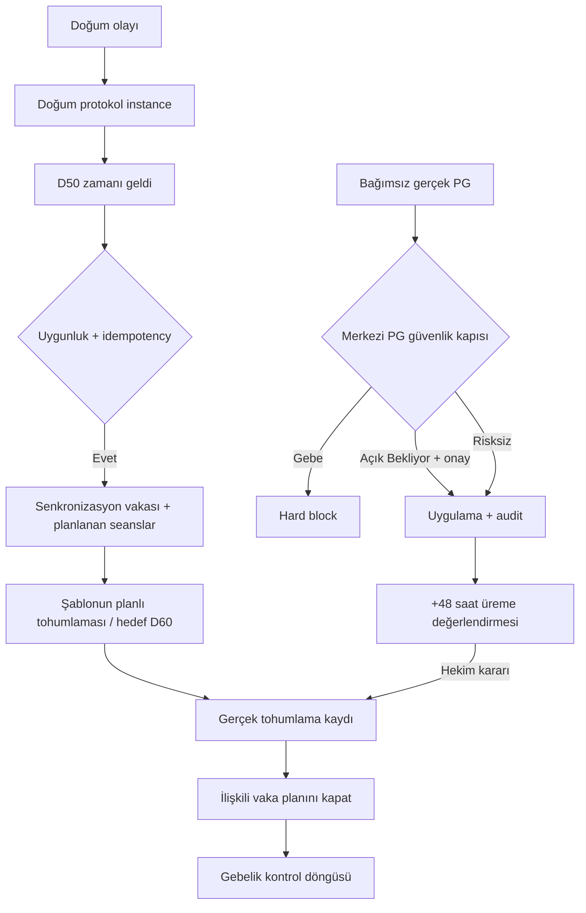

# EgeSüt ERP1 — Ovsynch / PG / Tohumlama Kuralları — Tasarım R1

**Tarih:** 2026-09-23  
**Durum:** Revize taslak — *spec hazırlığı için incelemeye açık; implementasyon onayı değil*  
**Önceki taslak:** [`2026-09-23-ovsync-pg-tohumlama-kurallari-design.md`](https://github.com/Meliksahtokur/egesut-erp1/blob/main/docs/plans/2026-09-23-ovsync-pg-tohumlama-kurallari-design.md)  
**Eşlik eden belge:** [`egesut-ovsync-pg-review-2026-09-23.md`](./egesut-ovsync-pg-review-2026-09-23.md)  
**Hedef:** Beş asli kural korunurken mevcut canlı RPC/şema ile uyuşmazlıklar, klinik güvenlik, atomicity ve yaşam döngüsü açıklıklarının kapatılması.

> **Karar disiplini:** Bu R1'de `KABUL` açık mimari davranışı; `KARAR GEREKLI` sahibin klinik/ürün kararını; `DOGRU-LIVE` canlı kodda gözlenen mevcut durumu ifade eder. Öneri ile çalışan özelliği karıştırmayın. Üretim verisine migration veya klinik kayıt müdahalesi bu taslağın parçası değildir.

## 0. Terimler ve değişmezler

- **PG:** Kanonik PGF2α/prostaglandin sınıfına bağlı ürünün gerçek uygulanması. Şablonda planlanmış ilaç ayrı olaydır.
- **Senkronizasyon vakası:** Kalıcı `protocol_family`/şablon bağı `OVSYNC` veya sahibi tarafından tanımlanmış aynı ailedeki üreme senkronizasyon protokolü. Hastalık adıyla substring eşleşmesi kullanılmaz.
- **Tohumlama gerçekleşti:** Sperm uygulaması kaydı oluştu. **Gebelik başarısı değildir.** Gebelik ancak sonraki kontrol/sonuç akışında kaydedilir.
- **Bekliyor döngü:** `tohumlama.sonuc='Bekliyor'` ve henüz açıkça sonlandırılmamış son tohumlama; 25 gün geçince kendiliğinden risksiz sayılmaz.
- **Görev tamamlandı:** İş akışından çıktı; gerçek ilaç uygulaması anlamına gelmez. `uygulanmadi`, `iptal`, kapanış nedeni ve gerçekleşme ayrı saklanır.
- **Otorite:** Kritik PG kontrolü sunucuda, atomik yazma sınırında tekrar yapılır. UI yalnız ön uyarı verir.



## 1. Kural 1 — Tohumlama, ilgili senkronizasyon vakasının planını sonlandırır

### 1.1 Kapsam

**KABUL:** Yalnız o hayvana ait, aktif ve **kanıtlı senkronizasyon ailesi** vaka(ları). Diğer hastalık vakası kapanmaz. Birden fazla aktif senkronizasyon vakası bulunursa her biri için ilişki ve sonlandırma nedeni ayrı doğrulanır; belirsiz/eski vaka varsayımla kapatılmaz.

### 1.2 Kimlik modeli

**DOGRU-LIVE:** `cases` şu anda `disease_id` saklıyor, uygulanmış şablonu saklamıyor. `tedavi_sablonu`, `sablon_hastalik_eslem`, `tohumlama_plani` mevcut.

**R1 önerisi:** `cases` üzerinde `source_template_id uuid NULL`, `protocol_family text NULL`, `protocol_snapshot jsonb NULL` veya eşdeğer `case_protocol_binding` tablosu. Şablon uygulama anında snapshot yazılır; sonraki şablon düzenlemesi eski vakanın türünü değiştirmez. Eski vakalar kesin bağ/kanıt varsa backfill edilir; `UNKNOWN` vakalar otomatik kapanmaz.

### 1.3 Gerçekleşme sırası

`tohumlama_kaydet` içinde, başarılı tohumlama insert'inden sonra, tek transaction içinde ilgili senkronizasyon vaka plan(lar)ını kapat. `planli_tohumlama_kaydet` zaten bu fonksiyonu çağırır; seçili görevin sonunda `iptal=false,tamamlandi=true` düzeltmesini koru. **İki RPC sözleşmesi ve doğrudan/tohumlama görevinden giriş regresyon testine alınır.**

`close_case_with_remaining` veya iç ortak motor typed `close_reason='TOHUMLAMA'` kabul etmeli. `status='closed'`, `closed_at`, gelecekteki seansların `uygulanmadi=true`, `iptal_nedeni`, kalan görevlerin `iptal=true,tamamlandi=true` alanları birlikte yazılır. Halihazırda gerçekleşmiş uygulamalar **iptal edilmez, stok iadesi yapılmaz**; sadece rezerve edilmiş fakat gerçekleşmemiş kalemlerin stok hareketleri mevcut güvenilir referanslarla uzlaştırılır.

`islem_log` için **tek** kapanış olayı `CASE_CLOSED_BY_TOHUMLAMA`; aynı olay ayrıca `CASE_CLOSED_EARLY` diye yazılmaz. Audit `case_id`, `tohumlama_id`, `close_reason`, `iptal_seans`, `iptal_gorev`, gerçek uygulama sayısı ve zamanını taşır. Bu olay gebelik doğrulaması değildir.

RPC additive sonucu:

```json
{
  "ok": true,
  "tohumlama_id": "...",
  "kapatilan_senkronizasyon_vakalari": [
    {"hayvan_id":"...","kupe_no":"121","case_id":"...","iptal_seans":3,"iptal_gorev":4}
  ]
}
```

Mevcut `tohumlama_id`, `deneme_no`, `inst_id` ve diğer alanlar korunur. Aynı vaka/tohumlama kombinasyonu tekrar işlenirse ikinci kapanış olayı üretilmez.

### 1.4 UI

Tek başarılı işlemde ilişkili vakaların özeti gösterilir. Toplu tohumlamada her hayvan için 100 ayrı `alert` değil, tek kaydırılabilir sonuç özeti; hata/atlanan/kapanan ayrı bölümler. `121` örneğinde kayıt geçmiş tarihli girilmişse gelecekte planlı kalanlar iptal edilir; **geçmişte gerçekleşmiş seanslar geriye dönük uygulanmamış sayılmaz.**

## 2. Kural 2 — PG için gebelik / açık tohumlama güvenlik kapısı

### 2.1 Kimlik ve risk kaynağı

Ürün→`drug_products.drug_class_id`→`drug_classes` kanonik zinciri kullanılır. Canlı durumda dinoprost `etken_kod='PG'`, kloprostenol `NULL` olduğu için yalnız `etken_kod='PG'` kontrolü **yasak**. R1, migration ile `drug_classes.farmakolojik_sinif_kodu='PGF2A'` benzeri kararlı sınıf kodu önerir; her iki mevcut madde backfill edilir, yeni PG maddesi kategoriden seçimle bu kodu alır. Girişte zincir çözümlenemiyorsa PG güvenlik kontrollerini bypass etmek yerine **katalog eşleşmesi düzeltme** istenir.

**GEBE** tespiti yalnız bir istemci badge'ine dayanmaz: yetkili gebelik kaydı / `tohumlama.sonuc='Gebe'` temel alınır; `hayvanlar.tohumlama_durumu` ile çelişki varsa güvenli hata ve uzlaştırma yolu. `Bekliyor` kontrolü 25 günle sonlanmaz.

### 2.2 Risk kademeleri

| Sunucu kararı | Davranış |
|---|---|
| `BLOCK_PREGNANT` | Standart PG uygulaması kayıt dışı kalır; hayvan ve kayıt nedeni gösterilir; `Yine de uygula` yok. Ayrı yetkili klinik istisna akışı R1 dışında. |
| `REQUIRE_ACK_PENDING` | Son `Bekliyor` döngüye ait tohumlama bilgisi, tarih, sperma, deneme, sonuca göre tek zorunlu onay. 25 günden eski `Bekliyor` da değerlendirilir. |
| `ALLOW` | Risk tetikleyicisi yoksa normal akış. |
| `BLOCK_CATALOG_UNRESOLVED` | PG olma ihtimali çözümlenemeyen preparat/katalog bağında işlem güvenle durur; yönetici katalog düzeltir. |

`Vazgeç` hiçbir klinik uygulama/stok düşümü yazmaz. Onaylı `Bekliyor` işleminde kullanıcının tercih ve gerekçesi kayıt edilir; yalnız “PG uygulandı” bilgisi hayvanın kesin `Boş`/`Abort` olduğu anlamına gelmez. Açık 21/35 gün kontrol görevleri döngüye bağlı `TOH-<id>` üzerinden `iptal` edilir; niçin iptal edildiği audit'te görünür. Önceden gerçekleşmiş kontroller tarihi kayıt olarak kalır.

### 2.3 Planlama–uygulama ayrımı ve tek otorite

**Plan oluşturulurken:** UI/servis risk önizlemesi. Henüz klinik uygulama olayı ve PG sonrası görev doğmaz.

**Gerçek uygulama yazılırken:** Yeniden sunucu kontrolü; risk ve hayvan satırı kilitlenerek doğrulanır; uygulama, ilgili stok hareketi, audit, eski döngü görev iptali ve türev olay **aynı transaction** içinde yazılır.

Kapsanacak yüzeyler: `hizli_uygulama`; tedavi seansı `seans_tamamla` ve ilgili gerçekleşme yazarı; `bulk_ilac`; doğum/protokol/görev UI yolları; direct table write/REST yetki politikaları. **Tam kapsam sağlanmadan PG için güvenli koruma tamamlandı denmez.** Uygulama planlama kaydı olan `drug_administrations` INSERT'ine gerçek PG olayı bağlanmaz.

### 2.4 Toplu işlemler

`pg_uyari_kontrol(hayvan_ids[], stok_or_product_id)` *preflight* döndürür. Gerçek toplu uygulama komutu aynı kontrolleri transaction sınırında tekrar yapar. API sonucu önerisi:

```json
{
  "ok": true,
  "applied": [{"hayvan_id":"...","uygulama_id":"..."}],
  "blocked": [{"hayvan_id":"...","code":"BLOCK_PREGNANT"}],
  "requires_ack": [{"hayvan_id":"...","tohumlama_id":"..."}],
  "failed": [{"hayvan_id":"...","code":"..."}]
}
```

**KABUL:** Tek toplu modal, kaydırılabilir hayvan listesi. `BLOCK_PREGNANT` kayıtları asla uygulanmaz; risksizler ve açıkça onaylananlar işlenebilir. Her hayvanın sonucu atomiktir; başarılı ve başarısızlar ayrı raporlanır. Toplu işin iptalinde hiç yazma olmaz. Preflight ile commit arasında gebelik durumu değişirse ilgili hayvan yeniden reddedilir; client onayı sunucu kontrolünün yerine geçmez.

## 3. Kural 3 — Protokol dışı PG sonrasında +48 saat üreme değerlendirmesi

### 3.1 Klinik sınır

**R1 değişikliği:** Eski taslağın “her PG için +48 saat `TOHUMLAMA_PLANLI`” davranışı kaldırıldı. Tanımlı Ovsynch protokolünün planlı tohumlaması kendi şablon takviminden gelir. Bağımsız PG ardından **değerlendirme** işi doğar; gerçek tohumlama ancak klinik karar ve mevcut kayıt akışıyla gerçekleşir.

### 3.2 Tetik koşulları

- Gerçek PG uygulaması başarıyla ve tekil kimlikle kaydedilmiş olmalı; taslak şablon/ilaç planı yeterli değil.
- Son doğum `dogum.tarih` (son **doğum olayı**, ikiz kayıtta tek olay) esas alınır; `hayvanlar.dogum_tarihi` kullanılmaz.
- Postpartum `>=50` gün ürün kapsam kararıdır; daha erken PG zaten var olan doğum/presenkronizasyon protokolüne bırakılır.
- Aktif, kimliği doğrulanmış senkronizasyon vakası veya ona bağlı açık `TEDAVI_SABLON_TOHUMLAMA` varsa bağımsız PG görevi üretilmez.
- Gebelik güvenlik kapısında red edilen uygulama için görev üretilmez.
- Doğum tarihi olmayan düvede otomatik postpartum kriteri kullanılmaz; ayrıca tanımlanmış düve protokolü yoksa manuel değerlendirme.

### 3.3 Tekil olay ve tarih alanları

Uygulamanın kaynağı `uygulama_log`, gerçekleşmiş seans veya normalize edilmiş toplu uygulama olabilir. Tekil `(source_type,source_id)` üzerinde unique kısıtlı **PG gerçekleşme olayı** (`pg_application_event` veya eşdeğer registry) düşünülür. Her kaynak yazımı bu olaya **bir kez** düşer.

`uygulama_zamani` gerçek işlemin `timestamptz` değeridir. Mevcut `uygulama_log.tarih` sadece gün; `created_at` geriye dönük girilen kaydın gerçek enjeksiyon saatini temsil etmeyebilir. Tarihi saati bilinmeyen backfill'den otomatik +48h üretme; `TIME_UNKNOWN` audit/manuel inceleme üret.

### 3.4 Hedef zaman

Varsayılan:

```text
uygulama_zamani + 48 saat
```

**Bu tohumlama emri değil, değerlendirme zamanıdır.**

```text
gorev_tipi  = UREME_KONTROL
kaynak      = PG_DEGERLENDIRME:<uygulama_id>
hedef_tarih = hedefin Europe/Istanbul yerel tarihi
hedef_saat  = hedefin yerel saati
aciklama    = PG sonrası kızgınlık / tohumlama değerlendirmesi
```

Eski `DIGER` tipi geçici uyumluluk alternatifi olabilir; ayrı sayaç ve raporlama için R1 tercihi `UREME_KONTROL`.

09:00–12:00 ve 18:00–21:00 **iş organizasyonu pencereleri** korunur. +48 saat hedefi pencere içindeyse aynı kalır; dışındaysa ilk sonraki pencereye ileri yuvarlanır, asla erkene çekilmez. Sınırlar test edilir: `12:00` pencere dışı kabul ediliyorsa `18:00`; `21:00` sonrasına düşerse ertesi `09:00`. **KARAR GEREKLI:** `12:00` ve `21:00` dahil mi değil mi, işletme kararıyla spec'te tek tanım olmalı.

### 3.5 Çakışma ve çift uygulama

Aynı kaynak olayını yeniden işlemek ikinci görev üretmez. Ayrı iki PG uygulaması klinik/audit veri olarak korunur; son 48 saatteki ikinci PG sessiz silinmez. Mevcut açık değerlendirmenin ne zaman ve hangi gerekçeyle korunduğu/yenilendiği ayrı policy ile tanımlanır; varsayılan R1 **ilk açık görevi koru, ikinci olayı iliştir, yeniden zamanlamayı hekime göster**. Aktif protokol planı varken bağımsız görev yoktur.

### 3.6 Görev kapanışı

`TOHUMLANDI`, `KIZGINLIK_IZLENECEK`, `YENI_PROTOKOL`, `UYGUN_DEGIL`, `MANUEL_IPTAL` sonuçlarından biriyle kapanır. Gerçek tohumlama `tohumlama_kaydet` zincirini çalıştırır; bu görevi tamamlamak sperm veya gebelik kaydı üretmez.

## 4. Kural 4 — İlk tohumlama zinciri: postpartum D50 plan, D60 hedef

### 4.1 Hedef ve ön şart

**Sahibin klinik hedefi:** Postpartum D50'de uygun hayvan için Ovsynch planını **oluşturmak**, D60'da ilk tohumlama hedefini oluşturmak. Plan oluşturmak hormon enjeksiyonunun yapılmış sayılması değildir; her gerçek seans ayrı kaydedilir. D60 kesin hayvan bazlı sonucun değil hedef takvimin adıdır; klinik muafiyet ve hekim müdahalesi korunur.

**KARAR GEREKLI:** Doğum sonrası D11 ve D39 için üretim ile scanner ayrışıyor. R1 bu çelişkiyi sessizce çözmeye kalkmaz: sahibi doğrulanmış klinik takvimi onayladıktan sonra **tek versiyonlu protokol tanımı** görev yazarı ve scanner tarafından ortak okunmalıdır.

### 4.2 Olay ve idempotensi

Doğum kaydının birinci yavru çağrısında doğum olayı/instance kurulur. İkiz doğumda `dogum.olay_id` ortak olduğundan ikinci yavruya ikinci 50/60 gün zinciri açılmaz. Daha önce yalnız `DOGUM-<anne_id>` ile tutulan legacy instance ile yeni doğum döngülerini karıştırmamak için **doğum-olayı bazlı** `kaynak_ref` kullanılır: örn. `ILK-TOH-<olay_id>`. Unique constraint ve hayvan/olay kilidi DB'de.

**Önemli düzeltme:** Gebelik onayı, henüz gerçekleşmemiş *gelecek doğuma ait* `dogum_id` üzerinden D50 başlatamaz. Gebelik onayındaki işlem yalnız mevcut gebelik döngüsü görevlerini düzenler; ilk tohumlama zinciri **doğum olayı yaratıldıktan sonra** başlar.

### 4.3 Zamanlayıcı otoritesi

- **Birincil:** `pg_cron` ile sunucu tarafı, tercihen uygun yerel saatli periyodik tarama.
- **Yedek / görünürlük:** Uygulama açılışı ve refresh eksik/kusurlu instance sorgular; aynı sunucu komutunu gerekirse idempotent çağırır. Client kendi başına vaka/tedavi günlerini tek tek yazmaz.
- **Tek yazıcı:** `start_first_service_protocol(birth_event_id)` veya eşdeğer tek RPC; eligibility, row lock, unique-key kontrolü, vaka, şablon seansları ve planlı tohumlama **tek transaction** içinde.

### 4.4 Uygunluk

Aktif, dişi, postpartum döngüde, gebelik kaydı bulunmayan, doğum olayı geçerli ve daha önce tohumlama/aktif uygun protokol nedeniyle muaf olmayan hayvan. D50 öncesinde gerçek tohumlama varsa 50/60 görevleri idempotent iptal/skip olur. Abort sonrası ayrı üreme durumu ile yeni doğum olayı birbirine karıştırılmaz. Uygunsuz hayvan için neden kodu + audit; sessiz geçiş yok.

### 4.5 Gerçek görev üretimi

Doğum anında D50 **başlatma hedefi** ve D60 **tohumlama hedefi** için kayıtlar, açık tekil protokol instance'a bağlı oluşturulabilir. D50 gelip gerçek Ovsynch vaka/şablonu açıldığında D60 hedefi **şablonun `TOHUMLAMA_PLANLI` göreviyle uzlaştırılır**, iki ayrı açık tohumlama kartı bırakılmaz. Protokol başlatılmazsa pasif D60 hedefi gerçek tohumlama görevüne dönüşmüş sayılmaz; görünür plan eksikliği/manuel inceleme olur.

Canlı Ovsynch şablonundaki `gun_ofset=10`, `planned_time=10:00` başlangıç gününü D50 kabul ederse D60 hedefe karşılık gelir. Başlangıç tarihi/saatinde değişiklik olursa klinik onaylı şablon programı ile hedef saatini uzlaştır; sırf UI penceresi için Ovsynch farmakolojik adımlarını rastgele kaydırma.

### 4.6 Bildirim ve görünürlük

Tek ana veri kaynağı `gorev_log` + kalıcı paneldir. Tarayıcı `Notification API` izinli/açıkken yardımcı bildirim verebilir; tarayıcı kapalıysa garanti iddia edilmez. D50 tetik sonucu: hayvan, vaka, seans planı, D60 hedef ve engel/atlama nedeni açıkça gösterilir.

## 5. Kural 5 — Hormon/PG katalog sistem kayıtları

Mevcut altı etken madde: Gonadorelin, Buserelin asetat, Oksitosin, Progesteron, Dinoprost, Kloprostenol sodyum. Seed migration satırları var ise günceller, yoksa ekler; mevcut ID/FK korunur. `drug_classes.sistem boolean not null default false` önerilir, altı satır `true` yapılır.

`drug_class_guncelle` ve `drug_class_sil` sistem kayıtlarını **açık hata ile** reddeder. İlave DB koruması, doğrudan UPDATE/DELETE yolu ve katalog sınıf kodunun değiştirilmesi de düşünülür; istemcide kalem/sil butonlarının gizlenmesi tek başına koruma sayılmaz. PG tespiti serbest yazılan `stok.kategori` veya yalnız ürün adından yapılmaz; kanonik sınıf üyeliği kullanılır.

Kullanıcı yeni PG etken maddesi eklerse aynı farmakolojik sınıf kodunu kategoriden seçerek alır; ileride ismen eklenen PG'ler de güvenlik kapısına girer. Kataloğu düzenleyenlerin nasıl yeni kod atayabildiği ve yetkilendirme spec'te tanımlanır.

## 6. UI yüzey ve raporlama sözleşmesi

`Tohumlamalar (N)` panelin en üstünde ve kayıt anından itibaren görünür. İçinde gerçek Ovsynch planlı tohumlaması, D50/D60 başlatma-hedefi ve PG sonrası **değerlendirme** farklı ikon/etiketlerle ayrılır; hepsi aynı klinik işlem diye sunulmaz. Gün+saat her zaman gösterilir; gecikme bilgi eki olarak gelir. Genel `Gecikmiş (N)` toplamının değiştirilip değiştirilmeyeceği açık **sayaç sözleşmesi** ile belirlenir; bir görevin iki sayaçta yanlışlıkla iki kez toplanmasına izin verilmez.

Mevcut `loadTasks` bekleyen/geciken filtrelerinde `TOHUMLAMA_PLANLI` bulunuyor. Taslağın “bekleyen listede hiç görünmesin” kararı **R1 ürün kararıdır**, çalışan durum değil. `loadTasks`, `updateTaskBadge`, `loadDash`, `_showProtokolEkran`, `renderTask`, bildirim badge ve görev detay yönlendirmesi birlikte değiştirilmelidir. Görev tıklanınca uygun form (değerlendirme vs tohumlama) açılır; `submitInsem`'in planlı/doğrudan RPC ayrımı bozulmaz.

Toplu uyarı erişilebilir, kaydırılabilir; her hayvanda küpe, tarih, sonuç ve uygulama kararı görünür. `window.alert` kullanımının zorunlu olup olmadığı görsel tasarım kararıdır; toplu sonuç modalı daha kullanılabilir.

## 7. Audit, geri alma ve değişmezlik

Önerilen neden/olaylar: `CASE_CLOSED_BY_TOHUMLAMA`, `PG_APPLICATION_BLOCKED`, `PG_APPLICATION_ACKNOWLEDGED`, `PG_CYCLE_REVIEW_REQUIRED`, `PG_EVALUATION_CREATED`, `FIRST_SERVICE_PROTOCOL_STARTED`, `FIRST_SERVICE_SKIPPED`. Mevcut `CASE_CLOSED_EARLY` başka kapanışlar için kalır.

**Rollback:**

1. Tohumlama kaydı geri alınırsa artık iptal edilmiş ileriki seanslar otomatik tekrar uygulanabilir olmaz. `REVIEW_REQUIRED` açılır; klinisyen açıkça yeniden planlar.
2. PG uygulaması geri alınırsa gerçekleşmemiş kaynak bağlı değerlendirme görevi iptal edilir. Gerçekleşmiş tohumlama/ilaç işlemi, ikinci ayrı karar olmadan geri alınmaz.
3. Stok iadesi yalnız gerçekleşmeyen/rezerve edilen kalemlerin gerçek hareket referanslarıyla; çift iade engellenir.
4. Fiziksel silme yerine audit/snapshot ve iptal sebebi korunur.

## 8. Veri/migration önerisi — spec'te kesinleşecek

| Alan | Önerilen değişiklik | Not |
|---|---|---|
| `cases` | `source_template_id`, `protocol_family`, `protocol_snapshot` | Alternatif immutable ilişki tablosu kabul edilebilir. |
| `drug_classes` | `sistem`, kararlı `farmakolojik_sinif_kodu` | PG üyeliği yalnız etken_kod null/non-null'a bağlı olmasın. |
| `pg_application_event` | `(source_type,source_id)` unique, `animal_id`, `occurred_at`, `classification`, `ack/audit` | Mevcut uygulama satırlarını kopyalamak değil, normalize edilmiş olay kimliği. |
| `gorev_log` | `UREME_KONTROL` tipi ve kaynak konvansiyonu; unique kaynak | Var olan `TOHUMLAMA_PLANLI` korunur. |
| İlk tohumlama instance | Doğum olayına bağlı unique `kaynak_ref` | İkizler tek olay. |
| Merkezi komutlar | PG preflight + gerçek yazma enforcement; ilk servis başlatıcı; typed case closer | İmza ve yetki modeli SPEC.md'de netleştirilecek. |

**Migration disiplini:** İleri uyumlu kolonlar → legacy backfill audit → idempotent yardımcılar/constraint → atomik RPC → frontend → ayrı enable/feature flag. D11/D39 takvimi klinik karar olmadan backfill edilmez. Yazmadan önce canlı fonksiyon tanımları yeniden okunur; yalnız tarihli migration'a güvenilmez.

## 9. Kabul/test matrisi

| ID | Test | Beklenen |
|---|---|---|
| T01 | Aktif Ovsynch vakalı hayvan gerçek tohumlama | Yalnız ilgili vaka kapanır; gelecek seanslar iptal, geçmiş gerçekleşenler korunur. |
| T02 | Mastit + Ovsynch birlikte | Mastit açık kalır. |
| T03 | Eski vaka, şablon kimliği belirsiz | Otomatik kapatılmaz; inceleme işareti. |
| T04 | Planlı tohumlama RPC'si | Seçili görev `iptal=false,tamamlandi=true`; doğru vaka kapanır. |
| T05 | Doğrudan tohumlama RPC'si | Açık planlı görevler iptal; sonuç alanları geriye uyumlu. |
| T06 | `Gebe` + hızlı PG | Uygulama, stok, yeni görev YOK; açık ret. |
| T07 | `Gebe` + seans PG | Aynı DB güvenlik kuralı; stok/uygulama yazılmaz. |
| T08 | `Gebe` + toplu PG | Yalnız gebe satırı blocked, diğerlerinin sonucu ayrı; gerekçeli rapor. |
| T09 | D10/D26/D35 `Bekliyor` | Her yaşta onay şartı, 25 günle bypass yok. |
| T10 | UI preflight sonrası gebe değişikliği | Commit yeniden kontrol eder ve ilgili satırı reddeder. |
| T11 | Kloprostenol ürününde `etken_kod=NULL` | Kanonik PG sınıfından tanınır; bypass yok. |
| T12 | Şablon PG planı eklendi | Gerçek uygulama olayı ve +48h görevi YOK. |
| T13 | Protokol dışı gerçek PG postpartum D50+ | Tek `UREME_KONTROL` değerlendirmesi; doğrudan tohumlama YOK. |
| T14 | Aktif senkronizasyon sırasında PG | Protokolün görevleri korunur; bağımsız değerlendirme YOK. |
| T15 | Aynı uygulama olayı iki kez işlendi | Tek PG event, tek türev görev. |
| T16 | Aynı hayvana iki ayrı PG | İki audit olayı korunur, duplicate görev policy uygulanır. |
| T17 | Gerçek saat bilinmeyen tarihî PG | Uydurma +48h yok; `TIME_UNKNOWN`. |
| T18 | D50 tetik cron + refresh eşzamanlı | Tek vaka, tek şablon planı, tek D60 tohumlama görevi. |
| T19 | İkiz doğum | Tek doğum olayı bazlı ilk servis zinciri. |
| T20 | D50 öncesi tohumlama veya gebelik | 50/60 görevleri iptal/skip; klinik gerekçe görünür. |
| T21 | `close_case_with_remaining` | Yalnız `CASE_CLOSED_BY_TOHUMLAMA`, ikinci erken kapanış log'u yok. |
| T22 | Tohumlama geri al | Seanslar otomatik canlı hale gelmez; review gerekli. |
| T23 | Sistem PG etken maddeyi RPC/REST ile değiştirme | DB düzeyinde açık ret. |
| T24 | Panel, görev listesi, sayaç, offline refresh | Tek anlam, doğru kategori, kalıcı görünürlük; çift sayım yok. |
| T25 | D11/D39 migration uyumluluğu | Sadece sahibi onaylı versiyon uygulanır; eski kayda sessiz tarih kaydırması yok. |

## 10. Spec ve implementasyon planına geçiş kapısı

**Önce şu kararlar sabitlenecek:**

1. D11/D39 üretim/scanner çatışmasının klinik doğrusu, eski planların geçişi.
2. D50/D60'da tam şablon seçimi ve doz/saat programının hekim onayı; +48 saatin değerlendirme olduğu.
3. Tek PG enforcement yolu ve `bulk_ilac` standardizasyon/kapsam kararı.
4. `Bekliyor` döngü semantiği, toplu kısmi başarı, gerekçeli onay ve gebelik çelişkisi yönetimi.
5. İlişkili vaka kimliği, kapanış/audit/geri alma kuralı.
6. UI sayaç, bildirim ve yeni görev tipi kararı.

**Ardından:** `SPEC.md` (DB kontratları, şema, izin, sonuç tipleri, değişmezler) → `PLAN.md` (migration, backfill, test-fixture, frontend sırası, rollback) → aşamalı implementasyon.

## 11. Kaynaklar ve inceleme notu

- [Önceki tasarım](https://github.com/Meliksahtokur/egesut-erp1/blob/main/docs/plans/2026-09-23-ovsync-pg-tohumlama-kurallari-design.md)
- [Canlı kodla karşılaştırılan `forms.js`](https://github.com/Meliksahtokur/egesut-erp1/blob/main/js/forms.js)
- [Canlı kodla karşılaştırılan `ui.js`](https://github.com/Meliksahtokur/egesut-erp1/blob/main/js/ui.js)
- [Tohumlama RPC migration](https://github.com/Meliksahtokur/egesut-erp1/blob/main/supabase/migrations/20260830000010_abort_vwp_penceresi.sql)
- [Şablon yaşam döngüsü migration](https://github.com/Meliksahtokur/egesut-erp1/blob/main/supabase/migrations/20260730000001_sablon_tohumlama_opsiyonel_ve_yasam_dongusu.sql)
- [Wisconsin Extension — Synchronization](https://dairy.extension.wisc.edu/files/2023/05/DWT-Synchronization-4-15-2021.pptx.pdf)
- [J Dairy Sci — Ovsynch-56](https://pubmed.ncbi.nlm.nih.gov/25087033/)
- [Merck Veterinary Manual — Cattle pregnancy determination](https://www.merckvetmanual.com/management-and-nutrition/management-of-reproduction-cattle/pregnancy-determination-in-cattle)

*R1 iş akışı ve yazılım tasarımını tanımlar; hayvana özel tedavi, hormon dozu ve protokol uygulama kararını otomatikleştirme yetkisi vermez. Canlı Supabase okuması 2026-09-23 tarihli snapshot'tır; spec yazılırken yeniden doğrulanmalıdır.*
