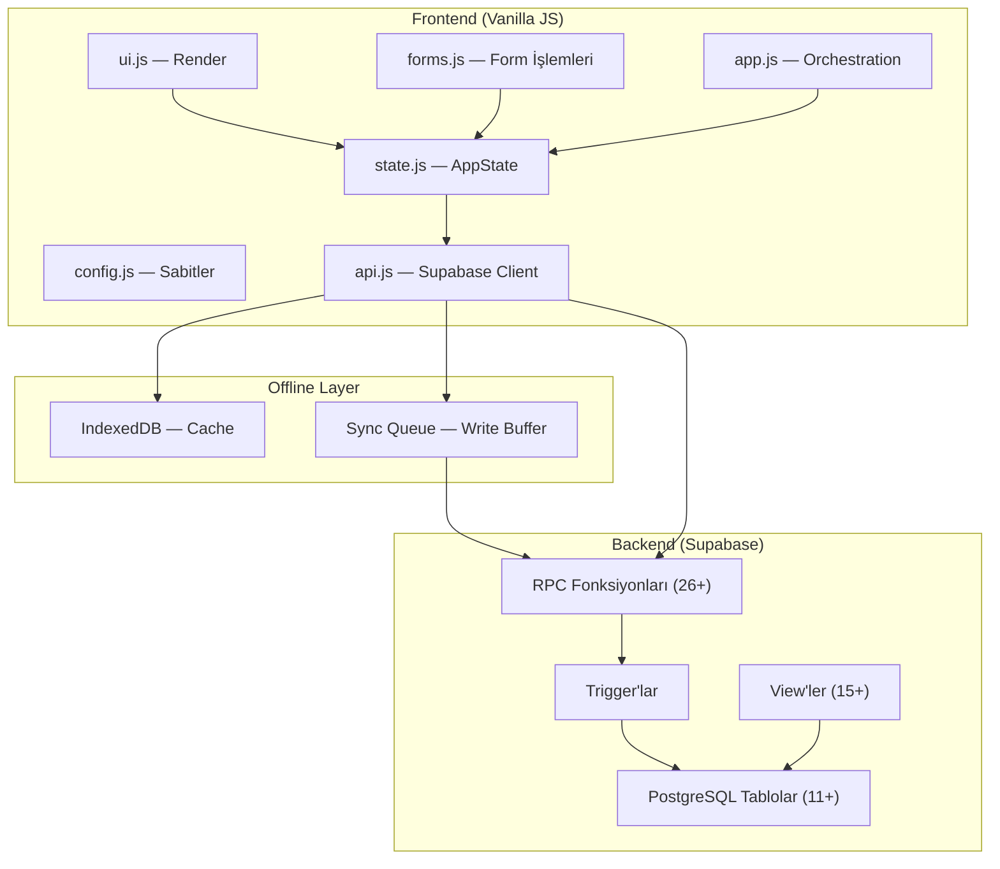

# Code Review Pipeline — Implementation Plan

> **For agentic workers:** REQUIRED SUB-SKILL: Use superpowers:subagent-driven-development (recommended) or superpowers:executing-plans to implement this plan task-by-task. Steps use checkbox (`- [ ]`) syntax for tracking.

**Goal:** EgeSüt ERP kod tabanını 4 araçla (Semgrep + SonarCloud + GitNexus + Repomix+Claude) sıralı tarayarak 5 rapor üretmek ve final sentezde 0-100 sağlık skoru hesaplamak.

**Architecture:** Sıralı / Katmanlı pipeline — her araç bağımsız çalışır, bulguları bir sonrakine bağlam olarak aktarılır. Semgrep güvenlik bulgularını, SonarCloud kalite metriklerini, GitNexus mimari haritayı, Repomix+Claude derin semantik analizi üretir. Son aşamada hepsi sentezlenir.

**Tech Stack:** Semgrep 1.165.0 CLI, SonarCloud MCP (tools-bank), GitNexus MCP (mcp__gitnexus__*), Repomix CLI (`npx repomix`), Claude Sonnet 4.6

---

## Dosya Yapısı

Oluşturulacaklar:
- `research/code-review-2026-06/01-semgrep-guvenlik.md`
- `research/code-review-2026-06/02-sonarcloud-kalite.md`
- `research/code-review-2026-06/03-gitnexus-mimari.md`
- `research/code-review-2026-06/04-repomix-derin-analiz.md`
- `research/code-review-2026-06/05-sentez-final.md`

Mevcut (okunacak ama değiştirilmeyecek):
- `js/*.js`, `js/utils/*.js` — Semgrep + Repomix hedefi
- `supabase/migrations/` — Semgrep SQL kuralları hedefi
- `big-analiz/00-sentez.md` — delta karşılaştırma referansı (Mayıs 2026)

---

## Task 1: Semgrep Güvenlik Taraması

**Files:**
- Create: `research/code-review-2026-06/01-semgrep-guvenlik.md`

- [ ] **Step 1: Semgrep versiyon ve ortam kontrolü**

```bash
cd /root/egesut-erp1
semgrep --version
```

Beklenen: `1.165.0` veya üzeri. Farklıysa devam et — kritik değil.

- [ ] **Step 2: OWASP Top 10 taraması**

```bash
cd /root/egesut-erp1
semgrep --config p/owasp-top-ten js/ --json > /tmp/semgrep-owasp.json 2>&1
echo "Çıkış kodu: $?"
```

Beklenen: JSON çıktı dosyası oluştu. `results` dizisi bulgular içeriyor.

- [ ] **Step 3: JavaScript güvenlik taraması**

```bash
cd /root/egesut-erp1
semgrep --config p/javascript js/ --json > /tmp/semgrep-js.json 2>&1
echo "Çıkış kodu: $?"
```

- [ ] **Step 4: Secrets (hardcoded credential) taraması**

```bash
cd /root/egesut-erp1
semgrep --config p/secrets js/ --json > /tmp/semgrep-secrets.json 2>&1
echo "Çıkış kodu: $?"
```

- [ ] **Step 5: SQL injection taraması (migration dosyaları)**

```bash
cd /root/egesut-erp1
semgrep --config p/sql-injection supabase/migrations/ --json > /tmp/semgrep-sql.json 2>&1
echo "Çıkış kodu: $?"
```

- [ ] **Step 6: Sonuçları birleştir ve özet çıkar**

```bash
# Her dosyadaki bulgu sayısını say
python3 -c "
import json
files = {
  'owasp': '/tmp/semgrep-owasp.json',
  'js': '/tmp/semgrep-js.json',
  'secrets': '/tmp/semgrep-secrets.json',
  'sql': '/tmp/semgrep-sql.json'
}
for name, path in files.items():
    try:
        data = json.load(open(path))
        results = data.get('results', [])
        errors = data.get('errors', [])
        print(f'{name}: {len(results)} bulgu, {len(errors)} hata')
        for r in results[:3]:
            print(f'  - {r[\"path\"]}:{r[\"start\"][\"line\"]} [{r[\"extra\"][\"severity\"]}] {r[\"check_id\"].split(\".\")[-1]}')
    except Exception as e:
        print(f'{name}: HATA - {e}')
"
```

- [ ] **Step 7: Rapor dosyasını yaz**

Aşağıdaki şablonu kullanarak `research/code-review-2026-06/01-semgrep-guvenlik.md` oluştur. Her tabloyu gerçek bulgularla doldur:

```markdown
# Aşama 1 — Semgrep Güvenlik Taraması

**Tarih:** 2026-06-07
**Araç:** Semgrep CE [VERSİYON]
**Komutlar:**
- `semgrep --config p/owasp-top-ten js/`
- `semgrep --config p/javascript js/`
- `semgrep --config p/secrets js/`
- `semgrep --config p/sql-injection supabase/migrations/`

---

## Özet

| Önem | Sayı |
|------|------|
| ERROR (Kritik) | N |
| WARNING (Orta) | N |
| INFO (Düşük) | N |
| **Toplam** | **N** |

---

## Kritik Bulgular (ERROR)

| # | Dosya:Satır | Kural | Açıklama |
|---|-------------|-------|----------|
| 1 | js/api.js:11 | secrets.hardcoded-credentials | ... |

## Orta Bulgular (WARNING)

| # | Dosya:Satır | Kural | Açıklama |
|---|-------------|-------|----------|

## Düşük Bulgular (INFO)

| # | Dosya:Satır | Kural | Açıklama |
|---|-------------|-------|----------|

---

## Güvenlik Skoru (0-100)

Hesaplama:
- Başlangıç: 100
- Her ERROR: -15
- Her WARNING: -5
- Her INFO: -1

**Güvenlik Skoru: XX/100**

---

## Sonraki Aşamaya Bağlam

Semgrep'in işaretlediği kritik dosyalar (SonarCloud aşamasında çapraz kontrol yapılacak):
- [liste]
```

- [ ] **Step 8: Commit**

```bash
cd /root/egesut-erp1
git add research/code-review-2026-06/01-semgrep-guvenlik.md
git commit -m "research: semgrep güvenlik taraması raporu (Aşama 1)"
```

---

## Task 2: SonarCloud Kalite Analizi

**Files:**
- Create: `research/code-review-2026-06/02-sonarcloud-kalite.md`

Not: SonarCloud'un son analiz verilerini MCP üzerinden çeker. Projeyi yeniden push etmek gerekmez — mevcut Cloud verisi kullanılır.

- [ ] **Step 1: Quality Gate durumunu al**

MCP aracını çağır:
```
mcp__tools-bank__sonar_quality_gate({
  "projectKey": "Meliksahtokur_egesut-erp1"
})
```

Beklenen: `status: "OK"` veya `"ERROR"`, koşul listesi.

- [ ] **Step 2: Aktif issue listesini al**

```
mcp__tools-bank__sonar_issues({
  "projectKey": "Meliksahtokur_egesut-erp1",
  "severities": "BLOCKER,CRITICAL,MAJOR",
  "ps": 50
})
```

Beklenen: `issues` dizisi — her issue `severity`, `component`, `line`, `message` içeriyor.

- [ ] **Step 3: Güvenlik hotspot'larını al**

```
mcp__tools-bank__sonar_hotspots({
  "projectKey": "Meliksahtokur_egesut-erp1"
})
```

- [ ] **Step 4: Kod duplikasyonunu al**

```
mcp__tools-bank__sonar_duplications({
  "projectKey": "Meliksahtokur_egesut-erp1"
})
```

- [ ] **Step 5: Coverage ve temel metrikleri al**

```
mcp__tools-bank__sonar_measures({
  "projectKey": "Meliksahtokur_egesut-erp1",
  "metricKeys": "coverage,code_smells,bugs,vulnerabilities,duplicated_lines_density,cognitive_complexity,ncloc"
})
```

- [ ] **Step 6: Semgrep bulguları ile örtüşme kontrolü**

Semgrep'te bulunan kritik dosyaları (Task 1 Step 7'deki liste) SonarCloud issue'larıyla karşılaştır. Her iki araçta da işaretlenen dosyalar raporun "Yüksek Güven Bulgular" bölümüne girer.

- [ ] **Step 7: Raporu yaz**

```markdown
# Aşama 2 — SonarCloud Kalite Analizi

**Tarih:** 2026-06-07
**Proje:** Meliksahtokur_egesut-erp1
**Son Analiz:** [SonarCloud'dan gelen tarih]

---

## Quality Gate

**Durum:** OK / ERROR

| Koşul | Değer | Eşik | Durum |
|-------|-------|------|-------|

---

## Metrikler

| Metrik | Değer |
|--------|-------|
| Satır Sayısı (ncloc) | |
| Bug | |
| Vulnerability | |
| Code Smell | |
| Coverage | % |
| Duplikasyon | % |
| Cognitive Complexity | |

---

## Kritik Issue'lar (BLOCKER + CRITICAL)

| # | Dosya:Satır | Tip | Mesaj |
|---|-------------|-----|-------|

## Güvenlik Hotspot'ları

| # | Dosya:Satır | Kategori | Açıklama |
|---|-------------|----------|----------|

---

## Semgrep ↔ SonarCloud Örtüşme

| Dosya | Semgrep | SonarCloud | Önem |
|-------|---------|------------|------|

---

## Kalite Skoru (0-100)

Hesaplama:
- Quality Gate OK → +40 puan taban
- Quality Gate ERROR → +10 puan taban
- Bug sayısı: her biri -3 (max -30)
- Vulnerability: her biri -5 (max -20)
- Coverage >50%: +10; >30%: +5; <30%: 0
- Duplikasyon <5%: +10; <15%: +5; >15%: 0

**Kalite Skoru: XX/100**

---

## Sonraki Aşamaya Bağlam

SonarCloud'da yüksek complexity işaretlenen fonksiyonlar (GitNexus impact analizi yapılacak):
- [liste]
```

- [ ] **Step 8: Commit**

```bash
cd /root/egesut-erp1
git add research/code-review-2026-06/02-sonarcloud-kalite.md
git commit -m "research: sonarcloud kalite analizi raporu (Aşama 2)"
```

---

## Task 3: GitNexus Mimari Analizi

**Files:**
- Create: `research/code-review-2026-06/03-gitnexus-mimari.md`

- [ ] **Step 1: Index tazeliğini kontrol et**

```
mcp__gitnexus__list_repos({})
```

Beklenen: `egesut-erp1` reposu listede. Son index tarihini not et. 2 günden eskiyse: `npx gitnexus analyze` çalıştır.

- [ ] **Step 2: Genel mimari sorgula**

```
mcp__gitnexus__query({
  "query": "mimari katmanlar, veri akışı, ana modüller",
  "repoName": "egesut-erp1"
})
```

- [ ] **Step 3: Execution flow haritasını al**

```
mcp__gitnexus__route_map({
  "repoName": "egesut-erp1"
})
```

- [ ] **Step 4: Kritik semboller için context al**

Aşağıdaki kritik sembollerin her biri için `gitnexus_context` çağır:
- `pullTables` — tüm veri yükleme zinciri
- `rpcOptimistic` — offline-first RPC wrapper
- `loadTasks` — görev yükleme
- `write` — IndexedDB write path
- `AppState` — merkezi state yönetimi

```
mcp__gitnexus__context({
  "name": "pullTables",
  "repoName": "egesut-erp1"
})
```

(Her sembol için tekrarla)

- [ ] **Step 5: Riskli semboller için blast radius analizi**

Task 2'de SonarCloud'dan gelen yüksek complexity fonksiyonları + Task 1'den gelen kritik dosyalardaki fonksiyonlar için impact analizi:

```
mcp__gitnexus__impact({
  "target": "FONKSIYON_ADI",
  "direction": "upstream",
  "repoName": "egesut-erp1"
})
```

HIGH veya CRITICAL çıkan her sembolü kaydet.

- [ ] **Step 6: Raporu yaz — Mermaid diyagramı dahil**

```markdown
# Aşama 3 — GitNexus Mimari Analizi

**Tarih:** 2026-06-07
**Index:** [tarih], [sembol sayısı] sembol, [ilişki sayısı] ilişki

---

## Mimari Katmanlar



[Gerçek diyagramı GitNexus route_map çıktısıyla güncelle]

---

## Execution Flow Haritası

| Flow | Giriş Noktası | Kritik Semboller | Çıkış |
|------|---------------|------------------|-------|

---

## Kritik Sembol Analizi

| Sembol | Dosya | Caller Sayısı | Blast Radius | Risk |
|--------|-------|---------------|--------------|------|
| pullTables | js/app.js | N | N fonksiyon | LOW/MED/HIGH |
| rpcOptimistic | js/api.js | N | N fonksiyon | |
| loadTasks | js/ui.js | N | N fonksiyon | |
| write | js/app.js | N | N fonksiyon | |
| AppState | js/state.js | N | N fonksiyon | |

---

## Yüksek Risk Semboller (HIGH/CRITICAL Blast Radius)

| Sembol | Neden Riskli | Öneri |
|--------|-------------|-------|

---

## Mimari Sağlık Skoru (0-100)

Hesaplama:
- CRITICAL blast radius sembol: her biri -10 (max -30)
- HIGH blast radius sembol: her biri -5 (max -20)
- Circular dependency tespit: -15
- Execution flow başına ortalama sembol sayısı >20: -10
- Taban: 100

**Mimari Sağlık Skoru: XX/100**

---

## Sonraki Aşamaya Bağlam

GitNexus'un işaretlediği mimari sorunlar (Repomix+Claude ile derinlemesine incelenecek):
- [liste]
```

- [ ] **Step 7: Commit**

```bash
cd /root/egesut-erp1
git add research/code-review-2026-06/03-gitnexus-mimari.md
git commit -m "research: gitnexus mimari analizi raporu (Aşama 3)"
```

---

## Task 4: Repomix + Claude Derin Analizi

**Files:**
- Create: `research/code-review-2026-06/04-repomix-derin-analiz.md`

Not: Repomix MCP sunucusu devre dışı. CLI kullanılacak: `npx repomix`

- [ ] **Step 1: Repomix ile kodu pack et**

```bash
cd /root/egesut-erp1
npx repomix
```

Beklenen: `repomix-output.xml` oluştu. Dosya boyutunu kontrol et:

```bash
wc -c repomix-output.xml
wc -l repomix-output.xml
```

Beklenen: ~500-1500 KB. 2MB'ı aşarsa `repomix.config.js`'te `supabase/migrations/` kısmını kaldır ve tekrar çalıştır.

- [ ] **Step 2: Önceki 3 aşamanın bulgularını özetle**

`research/code-review-2026-06/01-semgrep-guvenlik.md`, `02-sonarcloud-kalite.md`, `03-gitnexus-mimari.md` dosyalarını oku. Aşağıdaki bağlam özetini hazırla (bu step'in çıktısı sonraki step'e girdi olacak):

```
BAĞLAM ÖZETI:
- Semgrep kritik bulgular: [liste]
- SonarCloud kritik issue'lar: [liste]
- GitNexus yüksek risk semboller: [liste]
- Önceki analizlerde kaçırılmış olabilecek alanlar: [tahmin]
```

- [ ] **Step 3: Claude ile derin analiz yap**

`repomix-output.xml` içeriğini ve Step 2'deki bağlam özetini kullanarak aşağıdaki 5 soruyu yanıtla. Her soru için koda doğrudan referans ver (dosya:satır):

**Soru 1 — Mantık Hataları:**
"Tohumlama state machine (tohumlama_kaydet, tohumlama_sonuc, tohumlama_geri_al), stok ledger (stok_hareket), ve protokol_instance lifecycle'ında önceki araçların yakalayamayacağı mantık hataları var mı?"

**Soru 2 — Domain Kuralı İhlalleri:**
"EgeSüt domain kuralları (hayvan aktiflik koşulu, tohumlama sırası zorunluluğu, stok hareket immutability) frontend veya RPC katmanında ihlal ediliyor mu?"

**Soru 3 — Teknik Borç Önceliklendirme:**
"`big-analiz/00-sentez.md`'deki teknik borç listesiyle karşılaştır. Hangisi daha kötüleşti, hangisi çözüldü, yeni neler eklendi?"

**Soru 4 — Offline-First Güvenilirlik:**
"IndexedDB sync queue ve `rpcOptimistic` mekanizmasında, çevrimdışı → çevrimiçi geçişte veri kaybı veya duplikat oluşturabilecek senaryolar var mı?"

**Soru 5 — Refactor Fırsatları:**
"`ui.js` (2800+ satır) ve `forms.js` için somut bölme önerileri neler? Hangi sorumluluklara ayrılabilir?"

- [ ] **Step 4: Teknik Borç Skoru hesapla**

Aşağıdaki kriterleri kullan:

```
Taban: 100
- Her kritik mantık hatası: -10
- Her domain kuralı ihlali: -8
- Offline güvenilirlik açığı: -10
- ui.js >2000 satır monolith: -5
- forms.js >1500 satır monolith: -3
- Test coverage <%10: -5
```

- [ ] **Step 5: Raporu yaz**

```markdown
# Aşama 4 — Repomix + Claude Derin Analizi

**Tarih:** 2026-06-07
**Pack boyutu:** [repomix-output.xml satır/KB]
**Bağlam:** Aşama 1-3 bulguları + tam kaynak kodu

---

## Önceki Aşama Bulguları — Özet

| Araç | Kritik Bulgu Sayısı | En Önemli |
|------|---------------------|-----------|
| Semgrep | N | |
| SonarCloud | N | |
| GitNexus | N | |

---

## Mantık Hataları

| # | Alan | Dosya:Satır | Açıklama | Önem |
|---|------|-------------|----------|------|

## Domain Kuralı İhlalleri

| # | Kural | Dosya:Satır | İhlal | Önem |
|---|-------|-------------|-------|------|

## Teknik Borç Delta (Mayıs 2026 → Haziran 2026)

| Sorun | Mayıs Durumu | Haziran Durumu | Değişim |
|-------|-------------|----------------|---------|

## Offline-First Güvenilirlik

| Senaryo | Risk | Dosya:Satır | Açıklama |
|---------|------|-------------|----------|

## Refactor Önerileri

### ui.js Bölme Önerisi
[Somut sorumluluk ayrımı ve önerilen dosya adları]

### forms.js Bölme Önerisi
[Somut sorumluluk ayrımı ve önerilen dosya adları]

---

## Teknik Borç Skoru (0-100)

**Teknik Borç Skoru: XX/100**

---

## Sonraki Aşamaya Bağlam

Tüm aşamaların birleşik kritik bulgu listesi (sentez aşamasına hazır):
- [liste]
```

- [ ] **Step 6: Geçici dosyayı temizle**

```bash
cd /root/egesut-erp1
rm -f repomix-output.xml
```

- [ ] **Step 7: Commit**

```bash
cd /root/egesut-erp1
git add research/code-review-2026-06/04-repomix-derin-analiz.md
git commit -m "research: repomix+claude derin analiz raporu (Aşama 4)"
```

---

## Task 5: Final Sentez

**Files:**
- Create: `research/code-review-2026-06/05-sentez-final.md`

- [ ] **Step 1: 4 aşamanın skorlarını topla**

Aşağıdaki dosyalardan "Skor" satırlarını oku:
- `01-semgrep-guvenlik.md` → Güvenlik Skoru
- `02-sonarcloud-kalite.md` → Kalite Skoru
- `03-gitnexus-mimari.md` → Mimari Sağlık Skoru
- `04-repomix-derin-analiz.md` → Teknik Borç Skoru

- [ ] **Step 2: Ağırlıklı ortalama hesapla**

```
Proje Sağlık Skoru =
  (Güvenlik Skoru × 0.30) +
  (Kalite Skoru × 0.30) +
  (Mimari Sağlık Skoru × 0.20) +
  (Teknik Borç Skoru × 0.20)
```

- [ ] **Step 3: Tüm kritik bulgulardan birleşik öncelik listesi yap**

4 rapordaki tüm kritik/yüksek öncelikli bulguları tek tabloda topla. Her bulgu için kaynak araç, konum, önem belirt. Çakışanları birleştir (Semgrep + SonarCloud aynı satırı işaretlediyse tek satır).

- [ ] **Step 4: Aksiyon planı oluştur**

Kritik bulgular listesinden 3 kategori çıkar:

**Quick Wins (1-2 saat):**
Semgrep/SonarCloud'un gösterdiği, tek satır/fonksiyon değişikliğiyle kapanabilecek bulgular.

**Orta Vadeli (1-2 hafta):**
GitNexus'un işaretlediği yüksek blast radius refactorlar, domain kuralı ihlalleri.

**Uzun Vadeli (1+ ay):**
ui.js/forms.js bölme, offline güvenilirlik mimarisi, RLS sıkılaştırma.

- [ ] **Step 5: Mayıs 2026 big-analiz ile delta karşılaştır**

`big-analiz/00-sentez.md`'yi oku. Kritik bulgular tablosundan:
- ✅ Çözülen sorunlar (big-analiz'de vardı, artık yok)
- 🔴 Hâlâ açık sorunlar (big-analiz'de de vardı)
- 🆕 Yeni sorunlar (bu analizde ilk kez çıktı)

- [ ] **Step 6: Raporu yaz**

```markdown
# EgeSüt ERP — Kapsamlı Kod Review Sentezi

**Tarih:** 2026-06-07
**Pipeline:** Semgrep 1.165.0 + SonarCloud + GitNexus + Repomix+Claude
**Referans:** big-analiz/00-sentez.md (2026-05-23) ile delta

---

## Proje Sağlık Skoru

| Boyut | Ağırlık | Skor | Katkı |
|-------|---------|------|-------|
| Güvenlik (Semgrep + SonarCloud) | %30 | XX | XX×0.30 |
| Kalite (SonarCloud) | %30 | XX | XX×0.30 |
| Mimari Sağlık (GitNexus) | %20 | XX | XX×0.20 |
| Teknik Borç (Repomix+Claude) | %20 | XX | XX×0.20 |
| **TOPLAM** | **%100** | | **XX/100** |

> Mayıs 2026 referans skoru: [eğer hesaplanabiliyorsa]

---

## Kritik Bulgular — Birleşik Tablo

| # | Öncelik | Kaynak | Dosya:Satır | Açıklama | Durum |
|---|---------|--------|-------------|----------|-------|

---

## Mimari Harita

[03-gitnexus-mimari.md'dan Mermaid diyagramı buraya kopyalanır]

---

## Teknik Borç Delta (Mayıs → Haziran 2026)

| Sorun | Mayıs | Haziran | Değişim |
|-------|-------|---------|---------|
| ✅ Çözülen | | | |
| 🔴 Hâlâ Açık | | | |
| 🆕 Yeni | | | |

---

## Aksiyon Planı

### Quick Wins (1-2 saat)

| # | Görev | Dosya:Satır | Araç |
|---|-------|-------------|------|

### Orta Vadeli (1-2 hafta)

| # | Görev | Etki | Kaynak |
|---|-------|------|--------|

### Uzun Vadeli (1+ ay)

| # | Görev | Neden Önemli | İlk Adım |
|---|-------|-------------|----------|

---

## Sonuç

[2-3 cümle: projenin genel sağlık değerlendirmesi, en acil konular, önerilen öncelik]
```

- [ ] **Step 7: Commit + push**

```bash
cd /root/egesut-erp1
git add research/code-review-2026-06/05-sentez-final.md
git commit -m "research: final sentez raporu tamamlandı — code review pipeline"
git push origin main
```

---

## Özet

| Task | Çıktı | Araç |
|------|-------|------|
| 1 | `01-semgrep-guvenlik.md` | Semgrep CLI |
| 2 | `02-sonarcloud-kalite.md` | SonarCloud MCP |
| 3 | `03-gitnexus-mimari.md` | GitNexus MCP |
| 4 | `04-repomix-derin-analiz.md` | Repomix CLI + Claude |
| 5 | `05-sentez-final.md` | Manuel sentez |
