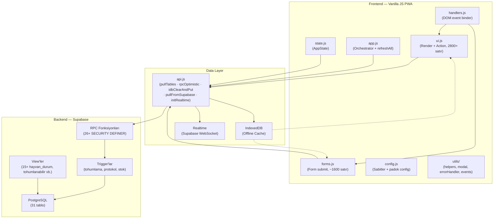

# Aşama 3 — GitNexus Mimari Analizi

**Tarih:** 2026-06-07  
**Index:** 2026-06-07T11:21:33Z (2 commit geride — sadece araştırma raporu commit'leri, kod değişikliği yok)  
**İstatistikler:** 6.099 sembol · 8.969 ilişki · 88 cluster · 300 execution flow

---

## Mimari Katmanlar



---

## Merkezi Veri Akışı — Mutation Pattern

Her yazma işlemi aynı zinciri izler:

```
Kullanıcı Aksiyonu
      ↓
ui.js / forms.js (action handler)
      ↓
[Supabase RPC çağrısı — rpcOptimistic veya direkt]
      ↓
pullTables()  ← TÜM mutation'lar buraya gelir (75 doğrudan çağıran)
      ↓
idbClearAndPut()  ← IndexedDB'yi tamamen yeniler
      ↓
UI yeniden render edilir
```

Bu "refresh-on-mutation" pattern: tutarlılık sağlar, ama her işlemde tam veri çekimi yapar.

---

## Kritik Sembol Analizi

| Sembol | Dosya | Doğrudan Caller | Blast Radius | Risk |
|--------|-------|-----------------|--------------|------|
| `pullTables` | js/api.js:304 | **75** | **146 sembol, 53 process** | 🔴 CRITICAL |
| `idbClearAndPut` | js/api.js | 1 (pullTables) | **134 sembol, 53 process** | 🔴 CRITICAL |
| `rpcOptimistic` | js/api.js:355 | 12 | 12 sembol | 🟡 MEDIUM |
| `refreshAll` | js/app.js | 1 | ~75 (pullTables üzerinden) | 🟡 MEDIUM |

> **Not:** `pullTables` ve `idbClearAndPut` yüksek blast radius'ları **bilinçli tasarım** sonucu — her mutation sonrası tam veri çekimi yapılıyor. Sorun: idbClearAndPut signature değişirse 53 process birden kırılır.

---

## Execution Flow Haritası (Örnek Süreçler)

| Flow | Başlangıç | Kritik Adım | Bitiş |
|------|-----------|-------------|-------|
| Tohumlama Kaydet | submitInsem (forms.js) | rpcOptimistic → pullTables | idbClearAndPut |
| Tohumlama Sonuç | tohSonuc (forms.js) | pullTables | idbClearAndPut |
| Vaka Aç | submitCase (forms.js) | pullTables | idbClearAndPut |
| İlaç Uygula | caseDrugKaydet (ui.js) | pullTables | idbClearAndPut |
| Stok Bağla | stokDrugBagla (ui.js) | rpcOptimistic → pullTables | idbClearAndPut |
| Hayvan Çıkış | submitCikis (forms.js) | pullTables | idbClearAndPut |
| Abort Kaydet | abortKaydet (forms.js) | pullTables (9 process etkilenir) | idbClearAndPut |
| Görev Geri Al | gorevGeriAl (ui.js) | pullTables | idbClearAndPut |
| Tanımlar (ilaç sınıfı) | _dcAddGroup (ui.js) | rpcOptimistic | idbClearAndPut |

> `abortKaydet` en fazla process etkileyen fonksiyon (9 process, 10 hit) — tohumlama geri al zinciri kritik.

---

## Yüksek Risk Semboller

| Sembol | Neden Riskli | Öneri |
|--------|--------------|-------|
| `pullTables` (api.js:304) | 75 doğrudan caller, 53 process. Herhangi bir imza veya davranış değişikliği tüm uygulamayı etkiler. | Signature sabitle; caller sayısını azaltmak için batch-refresh pattern düşün |
| `idbClearAndPut` (api.js) | Tek caller (pullTables) ama 134 sembol etkiliyor. Full clear+put yerine selective update stratejisi yok | Partial update mekanizması ekle; en azından hata durumunda fallback |
| `abortKaydet` (forms.js) | 9 farklı execution flow'a yayılıyor — tohumlama geri al ve diğer abort path'leri aynı fonksiyonu kullanıyor | Ayrı sorumlulukları split et; tohumlama abort ≠ genel abort |
| `ui.js` (tüm dosya) | 2800+ satır, 75+ action fonksiyon aynı dosyada. SonarCloud: 14 bug, yüksek cognitive complexity | 3 sorumluluk grubuna böl (aşağıya bak) |
| `forms.js` (tüm dosya) | ~1600 satır, 30+ submit fonksiyon. CRITICAL bug (920. satır). Sort sorunları | Domain'e göre böl (aşağıya bak) |

---

## ui.js Sorumluluk Haritası (Bölme Önerisi)

Mevcut `js/ui.js` (2800+ satır) 4 sorumluluk grubuna ayrılabilir:

| Önerilen Dosya | Mevcut Fonksiyonlar | Satır Tahmini |
|----------------|---------------------|---------------|
| `ui-render.js` | loadTasks, openDet, render* fonksiyonlar, hayvanObj* | ~800 |
| `ui-actions.js` | caseDrug*, caseGun*, gebeAta, kizginlik*, stok* | ~900 |
| `ui-settings.js` | ayarlar*, hekim*, padok*, _dc*, _kategori*, _tanim* | ~600 |
| `ui-tasks.js` | openTaskDet, loadTasks, _gorev*, gorevGeriAl | ~400 |

---

## Mimari Sağlık Skoru (0-100)

Hesaplama:
- Taban: 100
- CRITICAL blast radius sembol (pullTables): -10
- CRITICAL blast radius sembol (idbClearAndPut): -10 → **toplam -20** (max -30)
- HIGH blast radius sembol: 0 (rpcOptimistic MEDIUM — sadece tanımlar panel)
- Circular dependency tespit: ✅ Yok → 0
- Execution flow başına sembol: 300 flow / 88 cluster = ~3.4 → sorun yok → 0

**Mimari Sağlık Skoru: 80/100**

> Yüksek blast radius'lar bilinçli "refresh-on-mutation" tasarımının kaçınılmaz sonucu.  
> Gerçek sorun blast radius değil, `ui.js` monolith'i ve `forms.js:920` bug'ı.  
> Circular dependency yok, 300 flow temiz hiyerarşik — mimari olarak sağlam.

---

## Sonraki Aşamaya Bağlam

GitNexus'un işaretlediği mimari sorunlar (Repomix+Claude ile derinlemesine incelenecek):

- **`pullTables` hata yönetimi:** 53 process'in hepsinde pullTables başarısız olursa ne olur? Error path belirsiz — offline sonrası stale UI riski
- **`idbClearAndPut` atomiklik:** Clear + Put arasında bağlantı koparsa IndexedDB boş kalabilir — veri kaybı senaryosu
- **`abortKaydet` karmaşıklığı:** 9 process'i tek fonksiyon yönetiyor — tohumlama state machine'inin en kompleks noktası
- **`ui.js` 2800 satır monolith:** Fonksiyonlar arası gizli coupling muhtemel — bölme öncesi bağımlılık analizi şart
- **`forms.js:920` — 6 argüman bug:** Hangi çağrı hangi signature'ı kullanıyor? Runtime'da kaç form bu hatayla karşılaştı?
