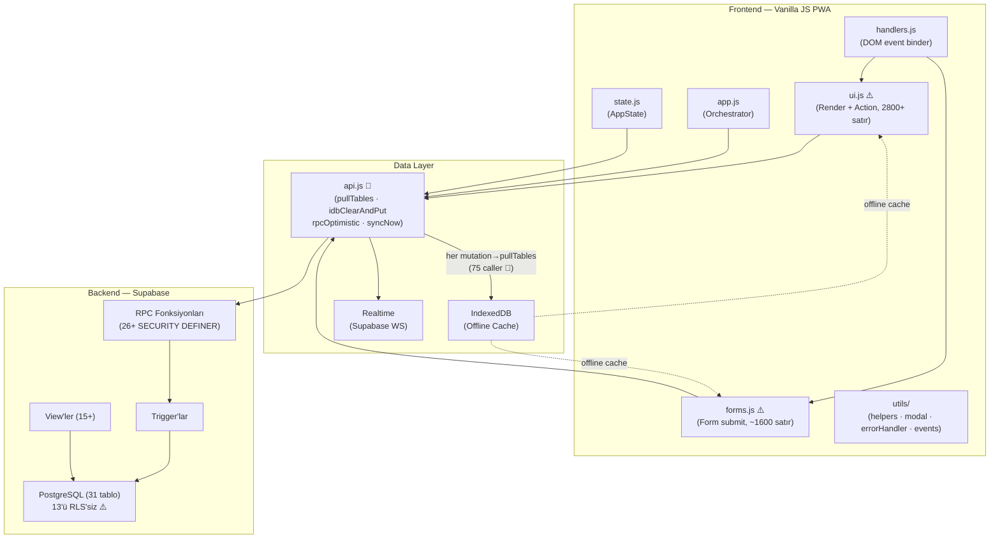

# EgeSüt ERP — Kapsamlı Kod Review Sentezi

**Tarih:** 2026-06-07  
**Pipeline:** Semgrep 1.165.0 + SonarCloud MCP + GitNexus MCP (6099 sembol) + Repomix+Claude  
**Referans:** `big-analiz/00-sentez.md` (2026-05-23) ile delta karşılaştırma  
**Kapsam:** `js/` (11 dosya), `index.html`, `supabase/migrations/` (ground_truth + ara migration'lar)

---

## Proje Sağlık Skoru

| Boyut | Ağırlık | Skor | Katkı | Temel Gerekçe |
|-------|---------|------|-------|---------------|
| Güvenlik (Semgrep + SonarCloud) | %30 | 77 | 23.1 | 4× onclick XSS, RLS eksikliği — 0 kritik injection |
| Kalite (SonarCloud) | %30 | 15 | 4.5 | 31 bug, 45% duplikasyon, 0% test, Quality Gate ERROR |
| Mimari Sağlık (GitNexus) | %20 | 80 | 16.0 | pullTables CRITICAL ancak bilinçli tasarım, circular dependency yok |
| Teknik Borç (Repomix+Claude) | %20 | 57 | 11.4 | offline yazma riski, sort hatası, monolith'ler, ölü dallar |
| **TOPLAM** | **%100** | — | **55.0/100** | — |

> **Referans:** Mayıs 2026 big-analiz skoru hesaplanmadı (araç tabanlı değildi). Kalitatif değerlendirme: "production-grade MVP, kritik borç tohumlama path + RLS" → bu analize göre **55/100** somut sayı.

---

## Kritik Bulgular — Birleşik Tablo

| # | Öncelik | Kaynak | Dosya:Satır | Açıklama | Durum |
|---|---------|--------|-------------|----------|-------|
| 1 | 🔴 P1 | SonarCloud | js/ui.js:2800,2818 | sort() localeCompare eksik — Türkçe hayvan listesi yanlış sıralanıyor | Açık |
| 2 | 🔴 P1 | SonarCloud | js/forms.js:433,1380,1493 | sort() localeCompare eksik — form seçici sıralama bozuk | Açık |
| 3 | 🔴 P1 | SonarCloud + Repomix | js/ui.js:4211,4488,4523,4555,2544 | sort() compare function eksik | Açık |
| 4 | 🔴 P1 | SonarCloud + Repomix | js/ui.js:996 | `try` içinde await eksik — promise hatası yakalanmıyor | Açık |
| 5 | 🔴 P1 | Repomix | js/api.js (pullTables) | pullTables partial success: Supabase error → sessizce geçiliyor, IndexedDB tutarsız | Açık |
| 6 | 🔴 P1 | Repomix | js/api.js (write) + forms.js:919 | write() offline guard yok — navigator.onLine kontrolü eksik, offline yazma kaybı | Açık |
| 7 | 🟡 P2 | Semgrep | js/ui.js:1390-1391 | onclick handler: kupe_no esc() olmadan → stored XSS riski | Açık |
| 8 | 🟡 P2 | Semgrep | js/ui.js:5970-5977 | onclick handler: p.ad esc() olmadan → stored XSS riski | Açık |
| 9 | 🟡 P2 | Semgrep | js/ui.js:6458 | onclick handler: kupe_no esc() olmadan (padok taşıma) | Açık |
| 10 | 🟡 P2 | SonarCloud | js/forms.js:920 | `kaydetTaskEdit` 3 param bekliyor, 6 ile çağrılıyor — maintenance risk | Açık |
| 11 | 🟡 P2 | SonarCloud + Repomix | js/app.js:492 | Ternary her zaman aynı değer — `semptomEkle` reset özelliği devre dışı | Açık |
| 12 | 🟡 P2 | SonarCloud | js/forms.js:1625 | `const idKey` mutate ediliyor — `let` olmalı | Açık |
| 13 | 🟡 P2 | Semgrep | supabase/migrations/ | 13 tablo RLS'siz (hayvanlar, tohumlama, stok, stok_hareket, islem_log vb.) | Kabul Edildi |
| 14 | 🟡 P2 | SonarCloud | js/app.js:8, js/ui.js:2747-2748 | Math.random() hotspot — kriptografik değil | Değerlendir |
| 15 | ℹ️ P3 | Semgrep | js/api.js:7-8 | Supabase anon key hardcoded — PWA için standart, service_role yok | Kabul Edildi |
| 16 | ℹ️ P3 | SonarCloud | .claude/scripts/ + tools-bank/ | BLOCKER vuln — developer tooling, üretim kodu değil | Düzeltilmeli |
| 17 | ℹ️ P3 | GitNexus | js/api.js:355 | rpcOptimistic offline check var, ama MEDIUM blast radius (12 caller) | İzle |

---

## Mimari Harita

**Kritik Akış:** Her yazma işlemi → RPC/write → `pullTables` (75 caller, CRITICAL) → `idbClearAndPut` → UI render

---

## Teknik Borç Delta (Mayıs → Haziran 2026)

| Sorun | Mayıs 2026 | Haziran 2026 |
|-------|-----------|--------------|
| ✅ Tohumlama 3 write path (tohSonuc REST bypass) | Açık | **Kapatıldı** |
| ✅ Offline klinik cache merge | Açık | **Kapatıldı** |
| ✅ Türkçe İ→i Unicode bug | Açık | **Kapatıldı** |
| ✅ protokol_instance lifecycle cikis_yap | Açık | **Kapatıldı** |
| 🔴 RLS açıklığı (13 tablo) | Açık | **Hâlâ Açık** |
| 🔴 `ui.js` monolith | 2804 satır | **Hâlâ 2800+** |
| 🔴 Frontend filtreleme (loadTasks DB'de değil) | Açık | **Hâlâ Açık** |
| 🔴 Test coverage ~0% | ~0% | **Hâlâ 0%** |
| 🆕 sort() localeCompare eksik (9 lokasyon) | — | **Yeni belgelendi** |
| 🆕 onclick XSS (4 lokasyon) | — | **Yeni belgelendi** |
| 🆕 write() offline guard eksik | — | **Yeni belgelendi** |
| 🆕 pullTables partial success riski | — | **Yeni belgelendi** |
| 🆕 forms.js:920 arg mismatch | — | **Yeni belgelendi** |
| 🆕 app.js:492 ternary ölü dal | — | **Yeni belgelendi** |

---

## Aksiyon Planı

### Quick Wins (1-2 saat)

| # | Görev | Dosya:Satır | Araç | Etki |
|---|-------|-------------|------|------|
| QW1 | `sort()` localeCompare ekle — 9 lokasyon | ui.js:2800,2818,4211,4488,4523,4555,2544; forms.js:433,1380,1493 | SonarCloud | Türkçe sıralama düzelir |
| QW2 | `await` ekle — try içinde promise | js/ui.js:996 | SonarCloud | Sessiz hata yakalanır |
| QW3 | onclick XSS — `esc()` ekle (4 satır) | ui.js:1390,1391,5970,5977,6458 | Semgrep | Stored XSS riski kapanır |
| QW4 | `forms.js:1625` const → let | js/forms.js:1625 | SonarCloud | Lint hatası kapanır |
| QW5 | `app.js:492` ternary düzelt | js/app.js:492 | SonarCloud | Semptom reset özelliği düzelir |
| QW6 | `kaydetTaskEdit` imzasını düzelt | js/forms.js:919 | SonarCloud | Maintenance riski kapanır |
| QW7 | Developer tooling token'larını temizle | `.claude/scripts/supa-query.js:10`, `.sh:8` | SonarCloud | BLOCKER kapanır |

### Orta Vadeli (1-2 hafta)

| # | Görev | Etki | Kaynak |
|---|-------|------|--------|
| OV1 | `pullTables` error handling — partial fail yerine hata yükselt veya retry | Offline/online geçişte veri tutarlılığı | Repomix |
| OV2 | `write()` fonksiyonuna `navigator.onLine` guard ekle veya `rpcOptimistic` pattern'e geçir | Offline yazma kaybı engellenir | Repomix |
| OV3 | RLS audit — `hayvanlar`, `tohumlama`, `stok`, `stok_hareket` için RLS etkinleştir + policy yaz | Güvenlik sertleşmesi | Semgrep |
| OV4 | SonarCloud Quality Gate'i pas etmek için yeni kod duplikasyon kural eşiğini düzelt veya kodu sadeleştir | Quality Gate ERROR → WARN | SonarCloud |
| OV5 | `forms.js` domain bölme ön hazırlığı: `_cur*` global state'leri `state.js`'e taşı | Refactor için zemin | Repomix |

### Uzun Vadeli (1+ ay)

| # | Görev | Neden Önemli | İlk Adım |
|---|-------|-------------|----------|
| LV1 | `ui.js` 2800+ satır → 4 dosyaya böl (ui-render, ui-actions, ui-settings, ui-tasks) | Maintainability, bug yüzeyi azalır | OV5 tamamlanmadan başlama |
| LV2 | `forms.js` → 3 domain dosyasına böl (forms-hayvan, forms-klinik, forms-diger) | Aynı | OV5 + LV1 sonrası |
| LV3 | E2E test coverage — en az kritik flow'lar (tohumlama, stok, cikis) | Quality Gate coverage koşulu | Playwright (mevcut e2e.spec.js var) |
| LV4 | `idbClearAndPut` → selective update stratejisi (diff-based sync) | Performans + partial fail riski | API layer refactoru |
| LV5 | Multi-tenant mimarisine geçiş hazırlığı: RLS + auth + anon key rotation | Kurumsal satış için şart | RLS audit (OV3) tamamlanmadan |

---

## Sonuç

**EgeSüt ERP, 55/100 proje sağlık skoru ile "işlevsel ama borçlu" durumda.**

Güçlü yönler:
- Tohumlama state machine temiz ve RPC-first (Mayıs borcu kapatıldı ✅)
- Stok ledger immutable pattern doğru
- Mimari hiyerarşi sağlam, circular dependency yok
- Offline-first temel sağlam (syncNow, idbClearAndPut atomik)

Acil konular (bu haftaki sprint için önerilen):
1. **QW1** — sort() localeCompare: tek satır, 9 yer, Türkçe alfabetik sıralama için kritik
2. **QW3** — onclick XSS: `esc()` var, sadece kullanılmıyor; 4 satır değişiklik
3. **QW2** — await eksikliği: silent async hata → eklenmesi 1 kelime

Skor'u en çok aşağı çeken: **SonarCloud kalite skoru (15/100)** — 31 bug ve 45% duplikasyon ağırlığı. Duplikasyonun önemli kısmı SQL migration dosyalarından kaynaklanıyor; gerçek JS kalitesi bu sayının gösterdiğinden daha iyi.
