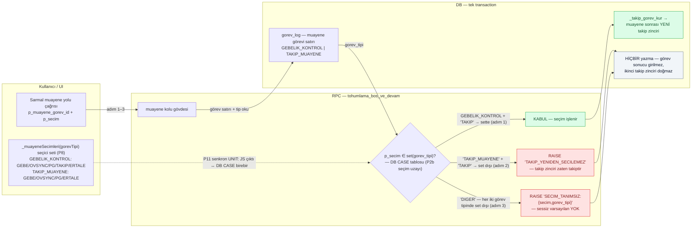
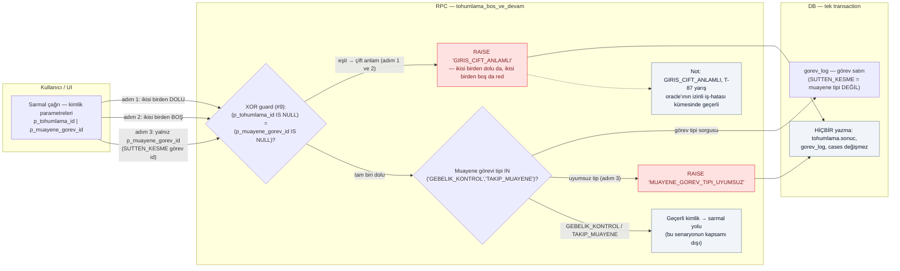
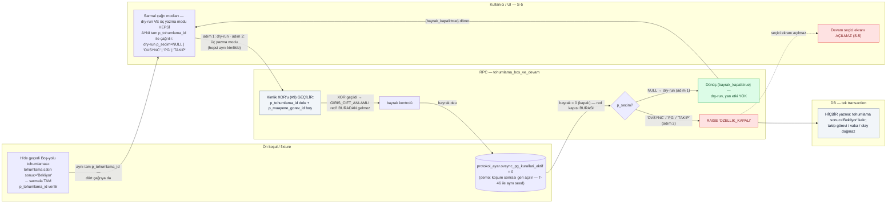

# T-95 / T-96 / T-97 senaryo akış diyagramları

Kaynaklar (birebir kaplama; uydurma davranış yok):
- Katalog: `docs/plans/2026-09-28-ovsync-takip-ekrani/test-senaryolari.md` §S (T-95, T-96, T-97)
- Sözleşmeler: `docs/plans/2026-09-28-ovsync-takip-ekrani/plan.md` P2b — seçim uzayı (#3/K15+D3), XOR guard (#9), bayrak kapalı (#6 + §10g MK9-K)
- Stil: aynı plan.md A1/A2 akış haritaları (flowchart LR, katman ayrımı bu dosyada alt graflarla)

Renk sınıfları: `pass` = beklenen kabul/dönüş yolu · `red` = hata kodlu red yolu · `safe` = yazma-yok kanıtı / kapsam-dışı not.

---

## T-95 — Sarmal seçim tablosu guard'ı: TAKIP_MUAYENE'de TAKIP red + tablo-dışı seçim red

**Kaplama notu:** Adım 1 (GEBELIK_KONTROL + `TAKIP`) → `t95_ok` → `t95_takip` (kabul dalı); adım 2 (TAKIP_MUAYENE + `TAKIP`) → `t95_red1`; adım 3 (`DIGER`, iki tip) → `t95_red2`. BEKLENEN'deki UNIT satırı `t95_js` ↔ `t95_set` kesikli kenarıdır. Ters kanıt: ikinci zincir doğmaması `t95_yok`, sessiz OVSYNC'e çökmemesi `t95_red2`, UI seti ayrışmaması P11 kenarı.

---

## T-96 — Sarmal giriş kimliği guard'ları: XOR (`GIRIS_CIFT_ANLAMLI`) + muayene-tip (`MUAYENE_GOREV_TIPI_UYUMSUZ`)

**Kaplama notu:** Adım 1 ve 2 (ikisi dolu / ikisi boş) XOR'da eşit çıkar → `t96_red_xor`; adım 3 (SUTTEN_KESME id) XOR'u geçer, tip kararında `t96_red_tip`'e düşer (`t96_gorev` sorgusu). BEKLENEN'deki "hiçbir yazma" satırı `t96_dokun`, "T-87 oracle izinli küme" cümlesi `t96_t87` not düğümü. Ters kanıt: kimlik-belirsiz çağrıda sessiz default yok (`t96_red_xor`), muayene-olmayan id ile işlem yok (`t96_red_tip`).

---

## T-97 — Bayrak kapalıyken sarmal YAZMA modları → `OZELLIK_KAPALI` (hiçbir yazma yok)

**Kaplama notu:** Katalog ön koşulu `t97_fix` fixture düğümündedir (Boş-yolu tohumlaması `sonuc='Bekliyor'` → sarmala TAM `p_tohumlama_id` verilir); `t97_fix → t97_ui` kenarı ve `t97_ui` etiketi, dry-run (adım 1) VE üç yazma modunun (adım 2) HEPSİNİN AYNI tam `p_tohumlama_id` ile çağrıldığını gösterir. Bu kimlikle kimlik XOR'u (#9) geçilir (`t97_xor`) — red `GIRIS_CIFT_ANLAMLI` beklenMEZ; red bayrak kapısından gelir: `t97_ayar` (bayrak=0 okunur) → `t97_kar` → `t97_red` (`RAISE 'OZELLIK_KAPALI'`). Adım 1 `t97_dry` dönüşüyle biter (yan etki YOK); BEKLENEN'in "sonuc='Bekliyor' kalır, takip görevi/vaka/olay doğmaz" satırı `t97_yok`, "devam seçici ekranı açılmaz (S-5)" satırı `t97_secici` (T-46 yalnız okuma yolu + ekrandır; bu diyagram onun YAZMA dalıdır).
