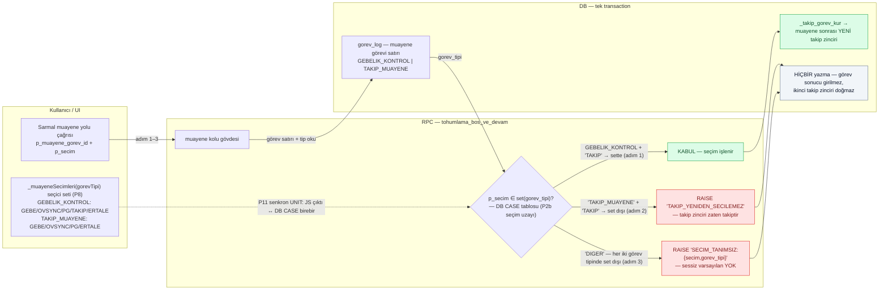
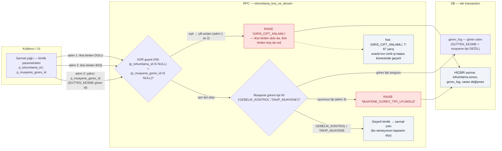
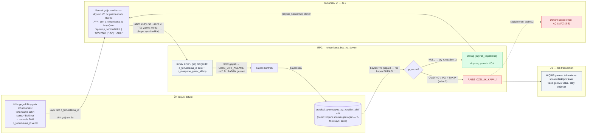
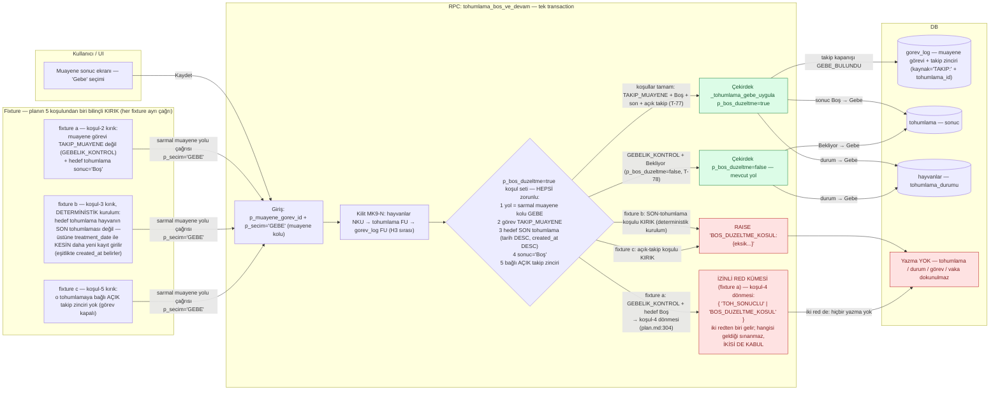
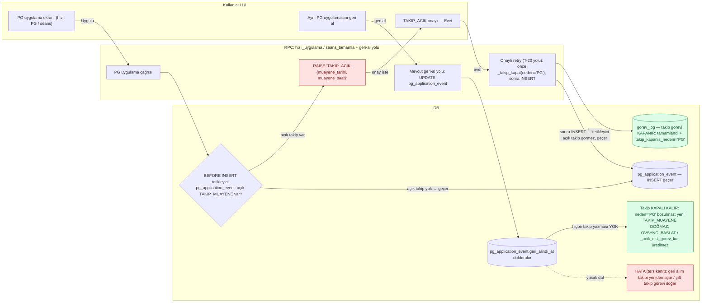
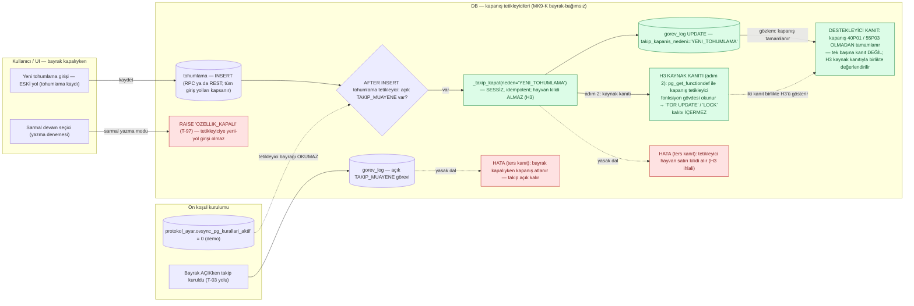

# Katalog v3 — yeni senaryo akış diyagramları (T-95..T-100) — v2 — katalog düzeltmeleriyle hizalı

Kaynak: iki inbuild subagent teslimi (2026-09-30 08:22) + katalog düzeltme turu (2026-09-30, diyagram-fix: T-97/T-98/T-100 blokları `diyagram-review-DONE.md` §4 bulgularına ve düzeltilmiş katalog satır ~811-841 hizalandı). Bloklar mmdc ile render-doğrulamalı (SVG üretimi OK).

# T-95 / T-96 / T-97 senaryo akış diyagramları

Kaynaklar (birebir kaplama; uydurma davranış yok):
- Katalog: `docs/plans/2026-09-28-ovsync-takip-ekrani/test-senaryolari.md` §S (T-95, T-96, T-97)
- Sözleşmeler: `docs/plans/2026-09-28-ovsync-takip-ekrani/plan.md` P2b — seçim uzayı (#3/K15+D3), XOR guard (#9), bayrak kapalı (#6 + §10g MK9-K)
- Stil: aynı plan.md A1/A2 akış haritaları (flowchart LR, katman ayrımı bu dosyada alt graflarla)

Renk sınıfları: `pass` = beklenen kabul/dönüş yolu · `red` = hata kodlu red yolu · `safe` = yazma-yok kanıtı / kapsam-dışı not.

---

## T-95 — Sarmal seçim tablosu guard'ı: TAKIP_MUAYENE'de TAKIP red + tablo-dışı seçim red

**Kaplama notu:** Adım 1 (GEBELIK_KONTROL + `TAKIP`) → `t95_ok` → `t95_takip` (kabul dalı); adım 2 (TAKIP_MUAYENE + `TAKIP`) → `t95_red1`; adım 3 (`DIGER`, iki tip) → `t95_red2`. BEKLENEN'deki UNIT satırı `t95_js` ↔ `t95_set` kesikli kenarıdır. Ters kanıt: ikinci zincir doğmaması `t95_yok`, sessiz OVSYNC'e çökmemesi `t95_red2`, UI seti ayrışmaması P11 kenarı.

---

## T-96 — Sarmal giriş kimliği guard'ları: XOR (`GIRIS_CIFT_ANLAMLI`) + muayene-tip (`MUAYENE_GOREV_TIPI_UYUMSUZ`)

**Kaplama notu:** Adım 1 ve 2 (ikisi dolu / ikisi boş) XOR'da eşit çıkar → `t96_red_xor`; adım 3 (SUTTEN_KESME id) XOR'u geçer, tip kararında `t96_red_tip`'e düşer (`t96_gorev` sorgusu). BEKLENEN'deki "hiçbir yazma" satırı `t96_dokun`, "T-87 oracle izinli küme" cümlesi `t96_t87` not düğümü. Ters kanıt: kimlik-belirsiz çağrıda sessiz default yok (`t96_red_xor`), muayene-olmayan id ile işlem yok (`t96_red_tip`).

---

## T-97 — Bayrak kapalıyken sarmal YAZMA modları → `OZELLIK_KAPALI` (hiçbir yazma yok)

**Kaplama notu:** Katalog ön koşulu `t97_fix` fixture düğümündedir (Boş-yolu tohumlaması `sonuc='Bekliyor'` → sarmala TAM `p_tohumlama_id` verilir); `t97_fix → t97_ui` kenarı ve `t97_ui` etiketi, dry-run (adım 1) VE üç yazma modunun (adım 2) HEPSİNİN AYNI tam `p_tohumlama_id` ile çağrıldığını gösterir. Bu kimlikle kimlik XOR'u (#9) geçilir (`t97_xor`) — red `GIRIS_CIFT_ANLAMLI` beklenMEZ; red bayrak kapısından gelir: `t97_ayar` (bayrak=0 okunur) → `t97_kar` → `t97_red` (`RAISE 'OZELLIK_KAPALI'`). Adım 1 `t97_dry` dönüşüyle biter (yan etki YOK); BEKLENEN'in "sonuc='Bekliyor' kalır, takip görevi/vaka/olay doğmaz" satırı `t97_yok`, "devam seçici ekranı açılmaz (S-5)" satırı `t97_secici` (T-46 yalnız okuma yolu + ekrandır; bu diyagram onun YAZMA dalıdır).

---

# T-98 / T-99 / T-100 — Mermaid akış diyagramları

Kaynak: `docs/plans/2026-09-28-ovsync-takip-ekrani/test-senaryolari.md` (T-98 satır 819-825, T-99 satır 827-833, T-100 satır 835-841); dayanak `docs/plans/2026-09-28-ovsync-takip-ekrani/plan.md` P2b koşul seti (satır 304) + P3a (satır 385-392). Stil: plan A1/A2 akış haritaları. Sadece katalog/planın söylediği davranış çizildi; fazlası uydurulmadı.

---

## T-98 — `BOS_DUZELTME_KOSUL`: Boş-düzeltme koşul seti sağlanmazsa red

**Kaplama notu:** Üç fixture düğümü (`t98_fa`/`t98_fb`/`t98_fc`) katalog ön koşulundaki üç kırık koşulu taşır; her fixture sarmal muayene yolu `p_secim='GEBE'` ile AYRI çağrılır (`t98_fa/fb/fc → t98_r1 → t98_r2 → t98_k`). Fixture (a)'nın kenarı tek `BOS_DUZELTME_KOSUL` düğümüne DEĞİL, izinli red kümesi düğümü `t98_izinli`'ye bağlanır: koşul-4 dönmesi (`GEBELIK_KONTROL` + hedef Boş) `{TOH_SONUCLU, BOS_DUZELTME_KOSUL}` kümesinden iki redten birini verir, hangisi geldiği sınanmaz, İKİSİ DE KABUL (plan.md:304). Fixture (b) düğümü "son değil" ifadesinin yerini DETERMİNİSTİK kuruluma bıraktı: hedefin üstüne `treatment_date` ile KESİN daha yeni kayıt girilir, eşitlikte `created_at` belirler — koşul-3 kırığı belirsizliğe yer bırakmadan kurulur; (b) ve (c) `t98_red`'e (`BOS_DUZELTME_KOSUL`) akar. Kontrast meşru yollar: T-77 Boş-düzeltme `t98_t77`, T-78 mevcut Bekliyor yolu `t98_t78`; tüm redlerde yazma yokluğu `t98_now` (`t98_izinli` de oraya akar — iki red de tohumlamaya dokunmaz).

---

## T-99 — PG geri alımı takibi YENİDEN AÇMAZ (kapanış kalıcı)

**Kaplama notu:** Adım 1 (PG uygula → TAKIP_ACIK → evet) `t99_u1 → t99_r1 → t99_t1 → t99_r2 → t99_u2 → t99_r3 → t99_d1 → t99_d2` zinciri; Adım 2 (geri al) `t99_u3 → t99_r4 → t99_d3`. BEKLENEN'in üç maddesi (kapalı kalır / görev doğmaz / ürün üretilmez) `t99_kal` tek düğümde; ters kanıt kesikli `t99_x` yasak dalı.

---

## T-100 — Kapanış tetikleyicileri bayraktan bağımsız (MK9-K): bayrak KAPALIyken de çalışır

**Kaplama notu:** Adım 1 (bayrak kapalıyken eski yoldan yeni tohumlama) `t100_u1 → t100_i1 → t100_t1 → t100_t2 → t100_d1`; "tetikleyici bayrağı okumaz" kesikli `t100_f0 → t100_t1` kenarı, H3 "hayvan kilidi almaz" `t100_t2` etiketi, takip_kapanis_nedeni `t100_d1`. Adım 2 — katalogdaki H3 kaynak kanıtı — `t100_h3`: `pg_get_functiondef` ile kapanış tetikleyici fonksiyon gövdesi okunur, gövde `FOR UPDATE`/`LOCK` kalıbını İÇERMEZ (birincil kanıt; `t100_t2 → t100_h3` kenarı). `t100_ok` DESTEKLEYİCİ kanıt olarak yeniden etiketlendi: 40P01/55P03 yokluğu gözlemi tek başına kanıt değildir, `t100_h3` ile birlikte değerlendirilir (kesikli kenar). BEKLENEN'in sarmal dalı `t100_u2 → t100_s2` (OZELLIK_KAPALI); ters kanıt kesikli `t100_x1` / `t100_x2` yasak dalları.
