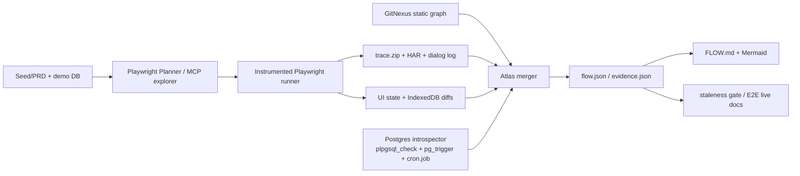

# SENTEZ — egeSüt için kalıcı UI Flow Atlas

**Tarih:** 2026-09-29  
**Kapsam:** Vanilla JS modal SPA + Supabase RPC/PostgreSQL + pg_cron/trigger + IndexedDB offline-first + Playwright + GitNexus

## Yönetici özeti

1. **Ana yol:** Playwright Test Agents/Playwright MCP ile akışı keşfet; ama “gerçek bilgi kaynağı” olarak agent anlatımını değil **Playwright trace + HAR + event kayıtlarını** sakla. Playwright trace, test aksiyonlarını DOM snapshot, ekran görüntüsü, console ve network ile aynı zaman çizgisinde gösteriyor; bu tam olarak “tıklama → istek” bağını kanıtlamak için güçlü. [S01][S04]
2. **Network/debug doğrulaması:** Chrome DevTools MCP v1.10.1 (23 Eylül 2026) aktif, Apache-2.0 ve network request inspection sunuyor. Playwright'ın eksiğini “derin DevTools sorgusu” ile kapatır. [S06][S07]
3. **Backend:** `plpgsql_check` fonksiyonun kullandığı relation/function listesini çıkarabiliyor; `pg_trigger` trigger→function bağını, `pg_cron` tabloları ise zamanlanmış işi ve çalıştırma geçmişini veriyor. Dynamic SQL statik analizde eksik kalır; bunu runtime log/trace ile tamamlamak gerekir. [S15][S16][S17][S18]
4. **Crawljax:** Tam aranan kavramı — SPA'yı gezerek state-flow graph üretmeyi — doğrudan yapıyor. Fakat son yayımlanmış 5.2.3 sürümü 1 Haziran 2023; Chrome uyumluluğu ile ilgili 2024'te açık issue mevcut. Bu yüzden **ana üretim bağımlılığı değil, pilot/algoritma referansı** olmalı. [S10][S11][S12]
5. **LLM browser ajanları:** browser-use ve Stagehand aktif ve yerel tarayıcıyı destekliyor; keşif için faydalılar fakat deterministik “atlas üreticisi” değiller. browser-use MCP hakkında 2026'da startup/CDP ve Codex annotation sorunları rapor edildi. [S08][S09][S23][S24]
6. **Akış atlası tek Markdown dosyası olmamalı:** kanonik veri `flow.json`/`flow.yaml` + evidence dosyaları; Markdown/Mermaid bunlardan türetilmeli.
7. **Bayatlık çözümü:** her kritik akış bir Playwright E2E “canlı belge” olsun; atlas düğümlerinde `last_verified_commit`, `source_globs`, `evidence_refs` tutulsun. İlgili dosyalar değişip test/atlas yeniden doğrulanmazsa akış `STALE` olsun.
8. **Offline-first özel şart:** yalnız HAR yeterli değil; her kullanıcı aksiyonundan önce/sonra IndexedDB snapshot/diff kaydedilmeli. Playwright `storageState({ indexedDB: true })` destekliyor. [S05]
9. **`confirm()` kaçakları:** Playwright dialog eventlerini açıkça kaydet. Playwright dialogları listener yoksa otomatik dismiss edebildiği için “gözükmeyen” confirm iş mantığını kaçırmak mümkündür. [S26]
10. **İlk pilot:** “tohumlama → 21/35/40 gün gebelik görevi üreticileri → sonuç → Ovsynch/PG” akışı üzerinde 1 gün. Başarı ölçütü: aynı görev tipinin tüm üreticilerini runtime + DB + statik graph üzerinden tek atlas sayfasında göstermek.

## Önerilen mimari



### Neden bu mimari?

- **Keşif LLM'ye bırakılabilir; kanıt bırakılamaz.** Planner/MCP akışı bulmaya yardım eder, fakat her edge'in runtime artefaktı olmalıdır.
- **UI “state” URL değildir.** Modal, bottom-sheet, dialog ve offline veri durumları state fingerprint'ine dahil edilmelidir.
- **Supabase RPC HTTP'de görünür.** `/rest/v1/rpc/<fn>` çağrıları network izinden RPC node'una bağlanabilir; statik JS tarafında `supabase.rpc('fn')` ile GitNexus edge'i karşılaştırılır.
- **DB tarafı iki yöntem ister:** katalog/statik dependency + gerçek çalıştırma kanıtı. `plpgsql_check` yalnız statik yazılan komutları işler; dynamic `EXECUTE` eksik kalabilir. [S15]

## Akış atlası veri modeli

Öneri: `atlas/flows/repro-insemination-pregcheck/flow.yaml` kanonik; `FLOW.md` bunun render'ı.

```yaml
flow_id: repro.insemination_to_pregcheck
version: 1
status: VERIFIED
last_verified:
  commit: <git-sha>
  at: 2026-09-29T...
  environment: demo
  run_id: pw-...
entry:
  screen: animal-card
nodes:
  - id: ui.insemination.submit
    kind: ui_action
    selector_hint: "button:has-text('Kaydet')"
    evidence: [trace:step-12, screenshot:12.png]
  - id: rpc.save_insemination
    kind: supabase_rpc
    evidence: [har:req-84]
  - id: db.pregcheck_task_35d
    kind: db_effect
    evidence: [sql:query-17]
edges:
  - from: ui.insemination.submit
    to: rpc.save_insemination
    relation: triggers
    confidence: confirmed-runtime
source_globs:
  - public/ui.js
  - public/forms.js
  - supabase/migrations/*.sql
```

## Beş uygulanabilir senaryo

| Senaryo | Ne kullanır | Güçlü taraf | Zayıf taraf | Bu proje için |
|---|---|---|---|---|
| A — **Trace-first** | Playwright Agents + trace/HAR + DB introspector | En az yeni bağımlılık, deterministik evidence | Otomatik full crawl sınırlı | **Başlangıç seçeneği** |
| B — **Crawljax-assisted** | Crawljax state graph + Playwright evidence | Otomatik state keşfi fikri güçlü | Eski sürüm/Chrome riski | Pilot / fikir alma |
| C — **LLM explorer swarm** | browser-use/Stagehand/OpenBrowser + Playwright recorder | Bilinmeyen akışlarda yaratıcı keşif | Maliyet ve nondeterminism | Gece keşif işi, ana doğrulama değil |
| D — **MBT after discovery** | Atlas → GraphWalker model → Playwright executor | Akış kapsamını sistematik yürütür | Modeli kendi keşfetmez | Atlas olgunlaşınca iyi |
| E — **Telemetry-heavy** | OTel/browser instrumentation + backend spans | uçtan uca korelasyon | Uygulamaya instrumentation yükü | Kritik belirsiz akışlarda opsiyonel |

## Adayların kısa hükmü

| Aday | Uygunluk | Rol |
|---|---|---|
| Playwright Test Agents | Yüksek | Akış keşfi → Markdown plan → test üretimi |
| Playwright MCP | Yüksek | Ajanın canlı tarayıcıyla etkileşimi |
| Chrome DevTools MCP | Yüksek | Network/console/debug doğrulaması |
| Playwright trace/HAR | **Çok yüksek** | Kanonik runtime evidence |
| plpgsql_check + PG katalogları | **Çok yüksek** | RPC→relation/trigger/cron graph |
| browser-use | Orta | Otonom keşif, ikinci görüş |
| Stagehand | Orta | AI action/observe/extract, yerel tarayıcı |
| OpenBrowser | Orta | Açık kaynak otonom keşif alternatifi |
| Crawljax | Orta-yüksek kavramsal, düşük operasyonel | State-flow graph prototipi |
| GraphWalker | Orta | Keşiften sonra model-based coverage |
| agentic-test-explorer | Deneysel | Hazır agentic exploratory testing fikri |

## 1 günlük pilot

**Hedef:** aynı “gebelik kontrol görevi”ni üreten bütün üreticileri bulmak.

1. Demo DB snapshot'ı sabitle; storageState + IndexedDB dahil başlangıç state'i oluştur.
2. `npx playwright init-agents --loop=claude` veya Codex varyantıyla planner'a tek akışı ver. [S01]
3. Üretilen testte `test.step()` sınırlarını kullanıcı aksiyonlarıyla hizala.
4. Trace `screenshots + snapshots + network` açık; ayrıca HAR ve `page.on('dialog')` logu yaz.
5. `/rest/v1/rpc/*` POST'larını parse ederek `rpc_name + payload_hash + step_id` çıkar.
6. Her step öncesi/sonrası IndexedDB snapshot digest çıkar.
7. İlgili RPC'lerde `plpgsql_show_dependency_tb`, trigger kataloğu ve `cron.job` sorgularını çalıştır.
8. GitNexus'tan aynı RPC'ye giden statik call path'i çek.
9. Birleştirici script `flow.json`, `FLOW.md`, `flow.mmd` üretsin.
10. Akışta +21/+35/+40 gibi tüm görev üreticileri görünmüyorsa pilot başarısız sayılsın.

**Başarı kriterleri:**
- En az bir UI action → RPC → table/trigger/cron zinciri runtime evidence ile bağlanmış.
- Aynı görev tipini üreten ikinci/üçüncü üretici bulunabiliyor veya “bulunamadı” kanıtı sunuluyor.
- `confirm()` / modal / retry gibi ara halka trace'te ayrı step/event.
- Atlas bir sonraki ajan tarafından kod okumadan sorgulanabilir JSON içeriyor.
- İlgili source glob değiştiğinde atlas stale oluyor.

## Kritik riskler

- **State explosion:** dynamic DOM/text/timestamp farkları aynı ekranı yeni state sanabilir. State canonicalization şart. Crawljax literatürü de bu problemi vurgular. [S13]
- **Accessibility-tree kör noktaları:** Playwright MCP'nin erişilebilirlik snapshot'ında bazı elementlerin eksikliği ve modal overlay sorunları rapor edilmiş. [S21][S22]
- **Service worker / offline davranış:** HAR interception, Service Worker'dan geçen istekleri kaçırabilir; primary exploration'da SW'yi kapatmak davranışı bozabilir. [S04]
- **Dynamic SQL:** `plpgsql_check` dependency listesi `EXECUTE` gibi dynamic SQL'i tam çıkarmaz. [S15]
- **Agent nondeterminism:** browser-use/Stagehand gibi ajanlar keşifte iyi olabilir ama “hangi state'ler tamamlandı?” için deterministik coverage metrikleri kendiliğinden sağlamaz.
- **Veri patlaması:** trace/HAR/screenshot/IndexedDB her step'te büyük olabilir; evidence retention ve hash/dedup gerekir.

## Net karar

**Önce yeni bir crawler framework kurma.** Mevcut Playwright yatırımını “evidence recorder + atlas emitter” seviyesine çıkar. Playwright Test Agents keşif ve test taslağı; Chrome DevTools MCP ikinci seviye debugger; GitNexus statik zincir; `plpgsql_check` + PG katalogları backend lineage olsun. Crawljax'ı 2–4 saatlik ayrı bir proof-of-concept ile yalnız state graph keşif kalitesine karşı benchmark et. Bu yol en az yeni altyapıyla doğrudan sizin kaçırdığınız sınıftaki hataya — “aynı işi üreten ikinci üretici” — odaklanıyor.
