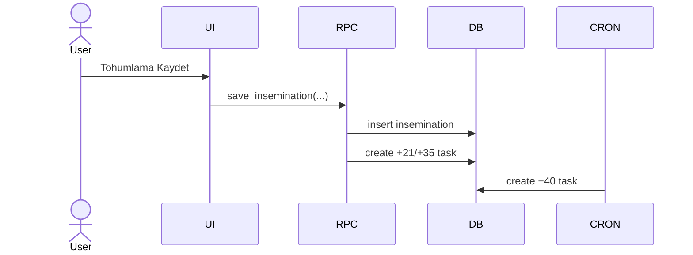

# PART-04 — Runtime trace, HAR ve “tıklama → istek” eşleme

## Playwright trace neden merkezde olmalı?

**CONFIRMED:** Trace Viewer, her action için DOM snapshot, screenshot, source location; ayrıca network ve console kayıtlarını aynı timeline üzerinde gösteriyor. Bir action seçildiğinde o action zaman aralığındaki network request'leri filtreleyebiliyor. [S04]

Bu özellik sizin “hangi tıklama hangi RPC'yi tetikledi?” sorunuzun hazır temelidir.

### Önerilen event envelope

Her kullanıcı aksiyonunu `test.step()` ile sar:

```json
{
  "step_id": "repro.insemination.save#12",
  "action": "click",
  "ui_target": "save-insemination",
  "started_at": "...",
  "dialogs": [],
  "network_request_ids": ["req-84"],
  "idb_before": "sha256:...",
  "idb_after": "sha256:...",
  "screenshot": "12-after.png"
}
```

Network recorder, request timestamp'ını aktif step interval'iyle eşler. Supabase için özel parser:

```text
POST /rest/v1/rpc/<rpc_name>
Authorization: REDACT
body -> stable JSON hash + allowlisted domain fields
```

Üretim verisi yok; demo request payload'larında dahi token ve hassas alanlar redact edilmelidir.

## HAR

**CONFIRMED:** Playwright browser context `recordHar` destekler; full HAR request/response header, content ve timing taşıyabilir. `routeFromHAR` replay için kullanılabilir. [S34][S35]

Ama önemli sınır:
- Playwright, Service Worker tarafından intercepted request'leri HAR routing ile servis etmeyebilir; docs `serviceWorkers:'block'` öneriyor. [S35]
- Sizin uygulama offline-first olduğundan SW'yi block etmek gerçek davranışı değiştirebilir.

**Karar:** primary discovery run'da app'in gerçek SW/offline davranışını koru. HAR'ı “network evidence” olarak kaydet ama replay testi ayrı mod olsun.

## IndexedDB

**CONFIRMED:** Playwright `storageState({ indexedDB: true })` ile IndexedDB snapshot'ını dahil edebilir. [S05]

Offline flow için her step'te full DB dump pahalı olabilir. Öneri:
- kritik object store'ların deterministic serialize + hash'i,
- değişiklik varsa diff JSON,
- belli checkpoint'lerde full snapshot.

Bu sayede edge sadece `click -> RPC` değil, `click -> IDB write -> later sync RPC` olarak tutulabilir.

## Dialog / confirm() kanıtı

**CONFIRMED:** Playwright `alert`, `confirm`, `prompt`, `beforeunload` dialoglarını event olarak yakalar; listener yoksa otomatik dismiss davranışı vardır. [S26]

Bu proje için listener zorunlu:

```text
dialog_open(type, message_hash, step_id)
dialog_decision(accept|dismiss, reason)
```

Mesajın tam metni domain kanıtı gerekiyorsa demo ortamında saklanabilir; genel atlas için normalized hash + kısa label yeterli.

## Otomatik Mermaid sequence

Hazır, güvenilir ve güncel “HAR → doğru domain sequence diagram” aracı bulmak yerine emitter yazmak daha az riskli. Çünkü ham HAR yalnız HTTP seviyesini bilir; `UI handler`, `trigger`, `cron` gibi domain node'larını içermez.

Emitter'ın girdisi birleşik event stream olmalı:

```text
UI step -> JS source edge -> RPC request -> DB static dependency -> trigger -> cron job -> observed task row
```

Mermaid sadece presentation layer:


